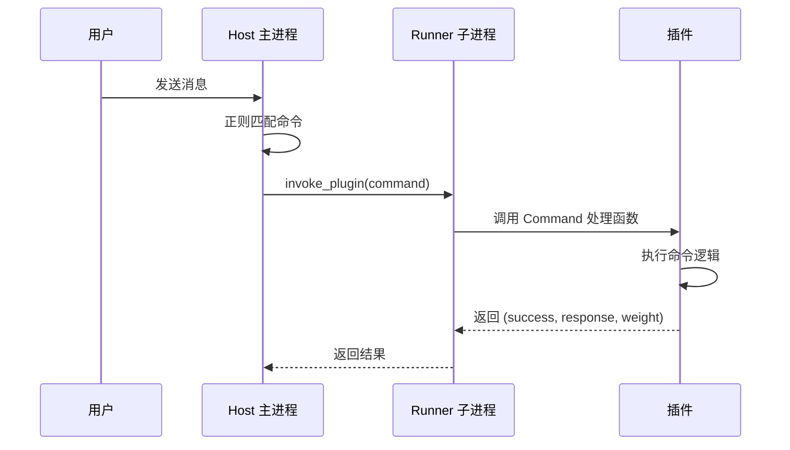

# Command 组件

`@Command` 是基于正则匹配的命令组件。当用户发送的消息匹配到某个 Command 的正则模式时，MaiBot 会调度执行对应的 Command 处理函数。

## 装饰器签名

```python
from maibot_sdk import Command

@Command(
    name: str,                    # 命令名称（必填）
    description: str = "",        # 命令描述
    pattern: str = "",            # 正则匹配模式
    aliases: list[str] | None = None,  # 命令别名列表
    **metadata,                   # 额外元数据
)
```

### 参数说明

| 参数 | 类型 | 说明 |
|------|------|------|
| `name` | `str` | 命令名称，需在插件内唯一 |
| `description` | `str` | 命令描述 |
| `pattern` | `str` | 正则匹配模式字符串。当用户消息匹配此模式时，触发该命令 |
| `aliases` | `list[str] \| None` | 命令别名列表，提供额外的触发方式 |

## 基本用法

```python
from maibot_sdk import MaiBotPlugin, Command


class MyPlugin(MaiBotPlugin):
    @Command("hello", pattern=r"^/hello")
    async def handle_hello(self, **kwargs):
        await self.ctx.send.text("Hello!", kwargs["stream_id"])
        return True, "Hello!", 2
```

### 带别名的命令

```python
@Command("greet", pattern=r"^/greet", aliases=["/hi", "/hey"])
async def handle_greet(self, **kwargs):
    await self.ctx.send.text("你好！", kwargs["stream_id"])
    return True, "你好！", 2
```

使用 `/greet`、`/hi` 或 `/hey` 均可触发此命令。

### 带正则捕获组的命令

```python
import re

@Command("echo", pattern=r"^/echo\s+(?P<text>.+)$")
async def handle_echo(self, **kwargs):
    matched = kwargs.get("matched_groups", {})
    text = matched.get("text", "").strip()
    stream_id = kwargs["stream_id"]
    await self.ctx.send.text(f"Echo: {text}", stream_id)
    return True, f"Echo: {text}", 1
```

## 处理函数参数

Command 处理函数接收 `**kwargs`，其中包含以下参数：

| 参数 | 类型 | 说明 |
|------|------|------|
| `stream_id` | `str` | 当前聊天流 ID，用于发送消息 |
| `matched_groups` | `dict` | 正则命名捕获组的匹配结果 |
| `raw_message` | `str` | 用户发送的原始消息文本 |
| `message` | `dict` | 完整的消息对象 |

### 返回值

Command 处理函数必须返回三元组：

```python
return success, response, weight
```

| 字段 | 类型 | 说明 |
|------|------|------|
| `success` | `bool` | 命令是否成功执行 |
| `response` | `str` | 命令执行结果的文本描述 |
| `weight` | `int` | 命令优先级权重，数值越高优先级越高 |

```python
# 命令成功执行
return True, "操作成功", 2

# 命令执行失败
return False, "参数错误", 1
```

## 正则模式编写指南

### 推荐模式

```python
# 精确匹配 /hello
pattern=r"^/hello$"

# 匹配 /hello 加可选参数
pattern=r"^/hello(?P<name>.+)?$"

# 匹配 /echo 加必填参数
pattern=r"^/echo\s+(?P<text>.+)$"

# 匹配 /set 加键值对
pattern=r"^/set\s+(?P<key>\w+)\s+(?P<value>.+)$"
```

### 使用命名捕获组

推荐使用 `(?P<name>...)` 命名捕获组，可以通过 `kwargs["matched_groups"]` 按名称访问匹配结果：

```python
@Command("ban", pattern=r"^/ban\s+(?P<user>\w+)(?:\s+(?P<reason>.+))?$")
async def handle_ban(self, **kwargs):
    matched = kwargs.get("matched_groups", {})
    user = matched.get("user", "")
    reason = matched.get("reason", "无原因")
    await self.ctx.send.text(f"已封禁 {user}，原因：{reason}", kwargs["stream_id"])
    return True, f"已封禁 {user}", 2
```

## 命令执行流程



## 命令相关 Hook

命令执行前后有内置 Hook 点可供 `@HookHandler` 订阅：

- `chat.command.before_execute`：命令执行前触发，可中止或改写参数
- `chat.command.after_execute`：命令执行后触发，可改写返回结果

## 完整示例

```python
from maibot_sdk import MaiBotPlugin, Command, Tool
from maibot_sdk.types import ToolParameterInfo, ToolParamType


class AdminPlugin(MaiBotPlugin):
    async def on_load(self) -> None:
        self.ctx.logger.info("管理插件已加载")

    async def on_unload(self) -> None:
        pass

    async def on_config_update(self, scope: str, config_data: dict, version: str) -> None:
        pass

    @Command("status", pattern=r"^/status$")
    async def handle_status(self, **kwargs):
        """查看系统状态"""
        stream_id = kwargs["stream_id"]
        await self.ctx.send.text("系统运行正常 ✅", stream_id)
        return True, "系统运行正常", 1

    @Command("echo", pattern=r"^/echo\s+(?P<text>.+)$")
    async def handle_echo(self, **kwargs):
        """回显消息"""
        matched = kwargs.get("matched_groups", {})
        text = matched.get("text", "").strip()
        stream_id = kwargs["stream_id"]
        await self.ctx.send.text(text, stream_id)
        return True, text, 1

    @Command("help", pattern=r"^/help$", aliases=["/帮助"])
    async def handle_help(self, **kwargs):
        """显示帮助信息"""
        stream_id = kwargs["stream_id"]
        help_text = "可用命令：\n/status - 查看状态\n/echo <text> - 回显消息\n/help - 显示帮助"
        await self.ctx.send.text(help_text, stream_id)
        return True, "帮助信息已发送", 1


def create_plugin():
    return AdminPlugin()
```
