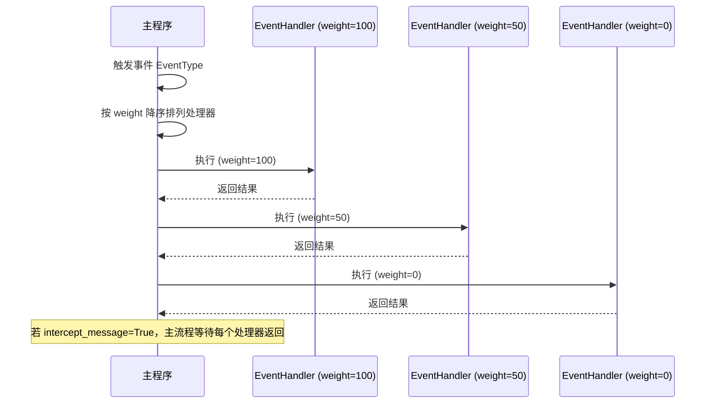

# 事件处理器

`@EventHandler` 是用于订阅消息和工作流事件的组件装饰器。与 `@HookHandler` 的命名 Hook 点机制不同，`@EventHandler` 基于固定的 `EventType` 枚举值订阅事件，适合在消息处理流程的特定阶段进行拦截或观察。

## 装饰器签名

```python
from maibot_sdk import EventHandler
from maibot_sdk.types import EventType

@EventHandler(
    name: str,                                      # 组件名称（必填）
    description: str = "",                          # 组件描述
    event_type: EventType = EventType.ON_MESSAGE,   # 订阅的事件类型
    intercept_message: bool = False,                # 是否阻塞消息链
    weight: int = 0,                                # 权重，越高越先执行
    **metadata,                                     # 额外元数据
)
```

## EventType 事件类型

| 枚举值 | 说明 |
|--------|------|
| `UNKNOWN` | 未知事件 |
| `ON_START` | 插件启动 |
| `ON_STOP` | 插件停止 |
| `ON_MESSAGE_PRE_PROCESS` | 消息预处理阶段（过滤、拦截的最佳时机） |
| `ON_MESSAGE` | 消息处理阶段 |
| `ON_PLAN` | 规划阶段 |
| `POST_LLM` | LLM 调用后（响应已生成） |
| `AFTER_LLM` | LLM 调用完成后 |
| `POST_SEND_PRE_PROCESS` | 发送预处理阶段 |
| `POST_SEND` | 消息发送后 |
| `AFTER_SEND` | 消息发送完成后 |

## intercept_message 参数

`intercept_message` 控制 EventHandler 是否以阻塞方式参与消息处理链：

| 值 | 行为 |
|----|------|
| `False`（默认） | 异步 fire-and-forget，不影响消息主流程 |
| `True` | 同步阻塞，主程序等待处理器返回后才继续 |

设为 `True` 时，处理器可以拦截、修改甚至阻止消息的后续处理。

## weight 权重

多个 EventHandler 订阅同一 `EventType` 时，`weight` 决定执行顺序：

- **值越高越先执行**
- 默认值为 `0`
- 与旧系统的 `weight` 语义一致

## 基本用法

### ON_START：插件初始化

```python
from maibot_sdk import MaiBotPlugin, EventHandler
from maibot_sdk.types import EventType


class StartupPlugin(MaiBotPlugin):
    async def on_load(self) -> None:
        self.ctx.logger.info("插件已加载")

    async def on_unload(self) -> None:
        self.ctx.logger.info("插件已卸载")

    async def on_config_update(self, scope: str, config_data: dict, version: str) -> None:
        pass

    @EventHandler(
        "on_startup",
        description="插件启动时初始化资源",
        event_type=EventType.ON_START,
    )
    async def handle_startup(self, **kwargs):
        self.ctx.logger.info("启动事件触发，开始初始化")
        # 在这里执行启动时需要的初始化逻辑
```

### ON_MESSAGE_PRE_PROCESS：消息过滤

```python
from maibot_sdk import MaiBotPlugin, EventHandler
from maibot_sdk.types import EventType


class MessageFilterPlugin(MaiBotPlugin):
    async def on_load(self) -> None:
        self.ctx.logger.info("消息过滤插件已加载")

    async def on_unload(self) -> None:
        self.ctx.logger.info("消息过滤插件已卸载")

    async def on_config_update(self, scope: str, config_data: dict, version: str) -> None:
        pass

    @EventHandler(
        "spam_filter",
        description="过滤垃圾消息",
        event_type=EventType.ON_MESSAGE_PRE_PROCESS,
        intercept_message=True,   # 阻塞模式，可以拦截消息
        weight=100,               # 高权重，优先执行
    )
    async def filter_spam(self, message, **kwargs):
        raw_message = message.get("raw_message", "")
        user_id = message.get("user_info", {}).get("user_id", "")

        # 检测垃圾消息
        if self._is_spam(raw_message, user_id):
            self.ctx.logger.info("拦截垃圾消息: user=%s, text=%s", user_id, raw_message)
            return {"intercepted": True, "reason": "spam"}

        # 放行消息
        return {"intercepted": False}

    def _is_spam(self, text: str, user_id: str) -> bool:
        # 简单的垃圾消息检测逻辑
        spam_keywords = ["广告", "加群", "免费"]
        return any(kw in text for kw in spam_keywords)
```

### ON_MESSAGE：消息观察

```python
from maibot_sdk import MaiBotPlugin, EventHandler
from maibot_sdk.types import EventType


class MessageObserverPlugin(MaiBotPlugin):
    async def on_load(self) -> None:
        self._message_count = 0

    async def on_unload(self) -> None:
        self.ctx.logger.info("总消息数: %d", self._message_count)

    async def on_config_update(self, scope: str, config_data: dict, version: str) -> None:
        pass

    @EventHandler(
        "message_counter",
        description="统计消息数量",
        event_type=EventType.ON_MESSAGE,
    )
    async def count_message(self, message, **kwargs):
        self._message_count += 1
        self.ctx.logger.debug("收到第 %d 条消息", self._message_count)
```

### AFTER_LLM：LLM 响应后处理

```python
from maibot_sdk import MaiBotPlugin, EventHandler
from maibot_sdk.types import EventType


class LLMPostProcessor(MaiBotPlugin):
    async def on_load(self) -> None:
        self.ctx.logger.info("LLM 后处理插件已加载")

    async def on_unload(self) -> None:
        self.ctx.logger.info("LLM 后处理插件已卸载")

    async def on_config_update(self, scope: str, config_data: dict, version: str) -> None:
        pass

    @EventHandler(
        "llm_response_logger",
        description="记录 LLM 响应",
        event_type=EventType.AFTER_LLM,
        weight=50,
    )
    async def log_llm_response(self, **kwargs):
        response = kwargs.get("response", "")
        self.ctx.logger.info("LLM 响应: %s", response[:200])
```

### POST_SEND：发送后回调

```python
from maibot_sdk import MaiBotPlugin, EventHandler
from maibot_sdk.types import EventType


class SendAuditPlugin(MaiBotPlugin):
    async def on_load(self) -> None:
        self.ctx.logger.info("发送审计插件已加载")

    async def on_unload(self) -> None:
        self.ctx.logger.info("发送审计插件已卸载")

    async def on_config_update(self, scope: str, config_data: dict, version: str) -> None:
        pass

    @EventHandler(
        "send_audit",
        description="审计所有发送的消息",
        event_type=EventType.POST_SEND,
    )
    async def audit_send(self, **kwargs):
        message = kwargs.get("message", {})
        self.ctx.logger.info(
            "消息已发送: stream_id=%s",
            message.get("stream_id", "unknown"),
        )
```

## 与 HookHandler 的区别

| 特性 | @EventHandler | @HookHandler |
|------|--------------|-------------|
| 订阅方式 | `EventType` 枚举值 | 命名 Hook 点字符串 |
| 粒度 | 固定事件类型，数量有限 | 自定义 Hook 名称，可无限扩展 |
| 拦截方式 | `intercept_message=True` | `mode=HookMode.BLOCKING` |
| 优先级 | `weight` 数值权重 | `order` 三档枚举 + 全局排序 |
| 异常策略 | 无专用参数 | `error_policy` 控制 |
| 适用场景 | 消息流程的固定阶段 | 主程序定义的任意扩展点 |

一般原则：
- 如果需要在消息流程的**固定阶段**（如收到消息、LLM 返回后）执行逻辑，使用 `@EventHandler`
- 如果需要订阅主程序定义的**特定命名 Hook 点**（如 `heart_fc.heart_flow_cycle_start`），使用 `@HookHandler`

## 事件处理流程


