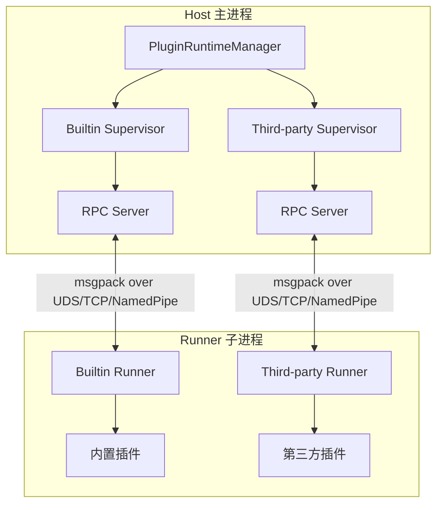

# 插件开发指南

MaiBot 的插件系统采用 Host/Runner IPC 架构，插件代码运行在独立的子进程中，通过 msgpack 编码的 RPC 协议与主进程通信。本节介绍插件系统的架构原理、开发流程和核心概念。

## 架构概览



### Host（主进程侧）

- **PluginRuntimeManager**：单例管理器，管理 Builtin 和 Third-party 两个 Supervisor
- **PluginSupervisor**：负责 Runner 子进程的启动、停止、健康检查和插件热重载
- **ComponentRegistry**：组件注册表，管理所有插件声明的 Tool、Command 等组件
- **HookDispatcher**：Hook 分发器，将命名 Hook 调用分发到对应 Supervisor

### Runner（子进程侧）

- 每种 Supervisor 各自管理一个独立的 Runner 子进程
- 通过 `PluginLoader` 发现和加载插件
- 通过 `RPCClient` 与 Host 通信
- 在插件加载后注入 `PluginContext`，再调用 `on_load()` 生命周期方法

### 通信协议

- **编解码**：使用 msgpack 格式进行二进制序列化（`MsgPackCodec`）
- **传输层**：支持 Unix Domain Socket、TCP、Named Pipe 三种传输方式
- **RPC 模型**：
  - Host → Runner：通过 `invoke_plugin()` 调用插件组件（Tool、Command 等）
  - Runner → Host：插件通过 `self.ctx` 的能力代理发起 RPC 回调（如 `ctx.send.text()`、`ctx.db.query()`）

## 快速开始

### 1. 安装 SDK

```bash
pip install maibot-plugin-sdk
```

::: tip 注意
安装包名为 `maibot-plugin-sdk`，但代码中导入时使用 `maibot_sdk`：
```python
from maibot_sdk import MaiBotPlugin, Command, Tool
```
:::

### 2. 创建插件目录

```
plugins/
└── my-plugin/
    ├── _manifest.json
    ├── plugin.py
    └── config.toml          # 可选
```

### 3. 编写 Manifest

在 `_manifest.json` 中声明插件元信息（完整字段说明见 [Manifest 系统](./manifest.md)）：

```json
{
  "manifest_version": 2,
  "id": "com.example.my-plugin",
  "version": "1.0.0",
  "name": "我的插件",
  "description": "一个示例插件",
  "author": {
    "name": "开发者",
    "url": "https://github.com/developer"
  },
  "license": "MIT",
  "urls": {
    "repository": "https://github.com/developer/my-plugin"
  },
  "host_application": {
    "min_version": "1.0.0",
    "max_version": "1.99.99"
  },
  "sdk": {
    "min_version": "1.0.0",
    "max_version": "2.99.99"
  },
  "capabilities": ["send_message"],
  "i18n": {
    "default_locale": "zh-CN"
  }
}
```

### 4. 编写插件代码

在 `plugin.py` 中继承 `MaiBotPlugin`，用装饰器声明组件，并实现三个生命周期方法：

```python
from maibot_sdk import MaiBotPlugin, Command, Tool
from maibot_sdk.types import ToolParameterInfo, ToolParamType


class MyPlugin(MaiBotPlugin):
    async def on_load(self) -> None:
        self.ctx.logger.info("插件已加载")

    async def on_unload(self) -> None:
        self.ctx.logger.info("插件已卸载")

    async def on_config_update(self, scope: str, config_data: dict, version: str) -> None:
        if scope == "self":
            self.ctx.logger.info("插件配置已更新: version=%s", version)

    @Tool(
        "greet",
        brief_description="向用户打招呼",
        detailed_description="参数说明：\n- stream_id：string，必填。当前聊天流 ID。",
        parameters=[
            ToolParameterInfo(
                name="stream_id",
                param_type=ToolParamType.STRING,
                description="当前聊天流 ID",
                required=True,
            ),
        ],
    )
    async def handle_greet(self, stream_id: str, **kwargs):
        await self.ctx.send.text("你好！", stream_id)
        return {"success": True, "message": "已回复"}

    @Command("hello", pattern=r"^/hello")
    async def handle_hello(self, **kwargs):
        await self.ctx.send.text("Hello!", kwargs["stream_id"])
        return True, "Hello!", 2


def create_plugin():
    return MyPlugin()
```

::: warning 必须实现三个生命周期方法
SDK 要求所有插件实现 `on_load()`、`on_unload()` 和 `on_config_update()` 三个方法，否则 Runner 会拒绝加载。详见 [生命周期](./lifecycle.md)。
:::

### 5. 安装与运行

将插件目录放入 `plugins/` 文件夹，启动 MaiBot 后插件会自动被发现和加载。也可以通过 WebUI 进行插件管理。

## 核心概念

### 插件基类

所有插件必须继承 `MaiBotPlugin`，通过类属性和装饰器声明插件能力：

```python
from maibot_sdk import MaiBotPlugin, Tool, Command, CONFIG_RELOAD_SCOPE_SELF
from typing import ClassVar


class MyPlugin(MaiBotPlugin):
    # 订阅全局配置热重载（仅 "bot" 和 "model" 两个值有效）
    config_reload_subscriptions: ClassVar[tuple[str, ...]] = ("bot", "model")

    @Tool("my_tool", brief_description="示例工具")
    async def handle_tool(self, **kwargs):
        ...

    @Command("my_cmd", pattern=r"^/my_cmd")
    async def handle_cmd(self, **kwargs):
        ...


def create_plugin():
    return MyPlugin()
```

### 组件装饰器

SDK 提供 7 种组件装饰器，全部从 `maibot_sdk` 顶层导入：

| 装饰器 | 用途 | 说明 |
|--------|------|------|
| `@Tool` | LLM 工具/函数调用 | LLM 可调用的工具，最常用的组件类型 |
| `@Command` | 斜杠命令 | 用户通过正则匹配触发的命令 |
| `@HookHandler` | 命名 Hook 处理器 | 订阅特定 Hook 点，支持 blocking/observe 模式 |
| `@EventHandler` | 消息/工作流事件 | 监听消息、LLM 生成等生命周期事件 |
| `@API` | 插件间 API | 暴露可被其他插件调用的 API |
| `@MessageGateway` | 平台适配器 | 将外部平台（QQ、Discord 等）接入 MaiBot |
| `@Action` | 兼容旧插件 | 内部自动转换为 `@Tool`，新插件应直接使用 `@Tool` |

### 能力代理

通过 `self.ctx` 访问 15 种能力代理，所有调用自动通过 RPC 转发到 Host：

```python
# 上下文访问
self.ctx              # PluginContext 实例
self.ctx.logger       # logging.Logger，名称为 "plugin.<plugin_id>"

# 能力代理
self.ctx.api          # 插件 API 查询、调用与动态同步
self.ctx.gateway      # 消息网关路由与运行时状态上报
self.ctx.send         # 发送文本、图片、表情、转发、混合消息
self.ctx.db           # 数据库增删改查计数
self.ctx.llm          # LLM 文本生成与工具调用
self.ctx.config       # 插件配置读取
self.ctx.emoji        # 表情包管理
self.ctx.message      # 历史消息查询
self.ctx.frequency    # 发言频率控制
self.ctx.component    # 插件与组件管理
self.ctx.chat         # 聊天流查询
self.ctx.person       # 用户信息查询
self.ctx.render       # 将 HTML 渲染为 PNG 图片
self.ctx.knowledge    # LPMM 知识库搜索
self.ctx.tool         # LLM 工具定义查询
```

### 配置模型

插件可通过 `PluginConfigBase` 声明强类型配置，Runner 会自动生成默认配置和 WebUI Schema：

```python
from maibot_sdk import MaiBotPlugin, PluginConfigBase, Field


class MyPluginConfig(PluginConfigBase):
    enabled: bool = Field(default=True, description="是否启用插件")
    greeting: str = Field(default="你好！", description="默认问候语")


class MyPlugin(MaiBotPlugin):
    config_model = MyPluginConfig

    async def on_load(self) -> None:
        # 通过 self.config 访问强类型配置
        self.ctx.logger.info("当前问候语: %s", self.config.greeting)
        # 通过 self.get_plugin_config_data() 访问原始 dict
        raw = self.get_plugin_config_data()
```

- 声明 `config_model` 后，`self.config` 返回强类型配置实例
- 未声明时调用 `self.config` 会抛出 `RuntimeError`
- `self.get_plugin_config_data()` 始终可用，返回原始配置字典
- 配置来源为插件目录下的 `config.toml`

## 目录结构约定

```
my-plugin/
├── _manifest.json       # 必需：插件清单
├── plugin.py            # 必需：插件入口，包含 create_plugin()
├── config.toml          # 可选：插件配置
├── i18n/                # 可选：国际化资源
│   ├── zh-CN.json
│   └── en-US.json
└── assets/              # 可选：静态资源
```

## 内置插件与第三方插件

MaiBot 维护两个独立的 Runner 子进程：

- **内置插件**：位于 `src/plugins/built_in/`，运行在 Builtin Supervisor 下
- **第三方插件**：位于 `plugins/`，运行在 Third-party Supervisor 下

两者使用相同的通信协议和组件注册机制。Supervisor 之间的启动顺序由跨 Supervisor 依赖关系决定，如果检测到循环依赖则拒绝启动。

## 下一步

- [Manifest 系统](./manifest.md)：了解 `_manifest.json` 的完整字段定义与校验规则
- [生命周期](./lifecycle.md)：学习插件加载、卸载与配置热重载的生命周期方法
- [Hook 系统](./hooks.md)：学习如何使用 @HookHandler 拦截和改写消息
- [Tool 组件](./tools.md)：学习如何开发 LLM 可调用的工具组件
- [Command 组件](./commands.md)：学习如何开发斜杠命令组件
- [Action 组件](./actions.md)：了解兼容旧系统的 @Action 装饰器
- [配置管理](./config.md)：学习如何声明和使用插件配置
- [API 参考](./api-reference.md)：查阅完整的插件 SDK API
