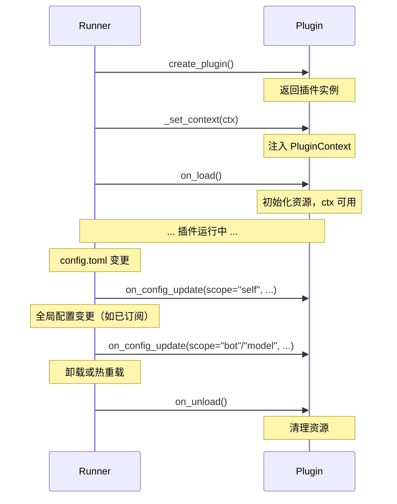

# 生命周期

MaiBot 插件有三个生命周期方法：`on_load()`、`on_unload()` 和 `on_config_update()`。SDK 强制要求所有插件实现这三个方法，否则 Runner 会拒绝加载。

## create_plugin() 工厂函数

每个插件的 `plugin.py` 必须导出一个顶层 `create_plugin()` 函数，返回插件实例：

```python
from maibot_sdk import MaiBotPlugin


class MyPlugin(MaiBotPlugin):
    async def on_load(self) -> None:
        ...

    async def on_unload(self) -> None:
        ...

    async def on_config_update(self, scope: str, config_data: dict, version: str) -> None:
        ...


def create_plugin():
    return MyPlugin()
```

Runner 加载插件时：

1. 导入 `plugin.py` 模块
2. 调用 `create_plugin()` 获取插件实例
3. 注入 `PluginContext`（此时 `self.ctx` 可用）
4. 调用 `on_load()`

## on_load()

插件加载完成后的回调。Runner 在注入 `PluginContext` 并完成 capability bootstrap **之后**才调用此方法，因此可以在 `on_load()` 中直接使用 `self.ctx` 的所有能力代理。

```python
async def on_load(self) -> None:
    """Called after plugin loaded. Initialize resources here.

    Runner has already injected PluginContext before calling this,
    so self.ctx is available.
    """
```

**典型用途：**

- 初始化插件内部状态
- 调用 `self.ctx.gateway.update_state()` 上报消息网关状态
- 调用 `self.register_dynamic_api()` 注册动态 API 并 `await self.sync_dynamic_apis()`
- 读取配置并初始化资源

**示例：**

```python
from maibot_sdk import MaiBotPlugin, PluginConfigBase, Field


class MyConfig(PluginConfigBase):
    greeting: str = Field(default="你好！", description="默认问候语")


class MyPlugin(MaiBotPlugin):
    config_model = MyConfig

    async def on_load(self) -> None:
        # self.ctx 已经注入，可以直接使用
        self.ctx.logger.info("插件已加载，当前问候语: %s", self.config.greeting)

        # 可以在这里注册动态 API
        self.register_dynamic_api(
            "my_api",
            self._handle_api,
            description="示例 API",
            version="1",
            public=True,
        )
        await self.sync_dynamic_apis()

    async def _handle_api(self, **kwargs):
        return {"status": "ok"}
```

## on_unload()

插件卸载前的回调。在此方法中释放插件持有的所有资源。

```python
async def on_unload(self) -> None:
    """Called before plugin unloaded. Cleanup resources."""
```

**典型用途：**

- 关闭网络连接、文件句柄
- 上报网关离线状态（`self.ctx.gateway.update_state(..., ready=False)`）
- 注销动态 API
- 保存持久化数据

**示例：**

```python
class MyPlugin(MaiBotPlugin):
    async def on_unload(self) -> None:
        self.ctx.logger.info("插件正在卸载")

        # 上报消息网关离线
        await self.ctx.gateway.update_state(
            gateway_name="my_gateway",
            ready=False,
        )

        # 清空动态 API
        self.clear_dynamic_apis()
        await self.sync_dynamic_apis(offline_reason="插件已卸载")
```

::: warning 注意
`on_unload()` 中仍然可以使用 `self.ctx`，但应尽快完成清理工作，不要执行耗时操作。
:::

## on_config_update()

配置热重载回调。当插件配置或已订阅的全局配置发生变化时，Runner 会调用此方法。

```python
async def on_config_update(
    self,
    scope: str,
    config_data: dict[str, Any],
    version: str,
) -> None:
    """Called when config hot-reloads.

    Args:
        scope: 配置变更范围，取值为 "self"、"bot" 或 "model"。
        config_data: 当前范围对应的最新配置数据。
        version: 配置版本号。
    """
```

### scope 取值

| scope | 常量 | 含义 | 触发条件 |
|-------|------|------|----------|
| `"self"` | `CONFIG_RELOAD_SCOPE_SELF` | 插件自身配置 | 插件目录下的 `config.toml` 变化时**始终触发**，无需订阅 |
| `"bot"` | `ON_BOT_CONFIG_RELOAD` | 全局 Bot 配置 | 需要通过 `config_reload_subscriptions` 订阅 |
| `"model"` | `ON_MODEL_CONFIG_RELOAD` | LLM 模型配置 | 需要通过 `config_reload_subscriptions` 订阅 |

::: important
- `scope == "self"` 的回调**始终触发**，不需要额外订阅
- `scope == "bot"` 和 `scope == "model"` 只有在 `config_reload_subscriptions` 中声明后才会触发
:::

### 示例

```python
from maibot_sdk import MaiBotPlugin, CONFIG_RELOAD_SCOPE_SELF, ON_BOT_CONFIG_RELOAD, ON_MODEL_CONFIG_RELOAD
from typing import ClassVar


class MyPlugin(MaiBotPlugin):
    # 订阅 bot 和 model 两种全局配置的热重载
    config_reload_subscriptions: ClassVar[tuple[str, ...]] = ("bot", "model")

    async def on_load(self) -> None:
        self.ctx.logger.info("插件已加载")

    async def on_unload(self) -> None:
        self.ctx.logger.info("插件已卸载")

    async def on_config_update(self, scope: str, config_data: dict, version: str) -> None:
        if scope == CONFIG_RELOAD_SCOPE_SELF:
            # 插件自身配置变化，self.config 会自动更新
            self.ctx.logger.info("插件配置已更新: version=%s", version)
        elif scope == ON_BOT_CONFIG_RELOAD:
            # 全局 Bot 配置变化
            bot_name = config_data.get("bot_name", "未知")
            self.ctx.logger.info("Bot 配置已更新: bot_name=%s, version=%s", bot_name, version)
        elif scope == ON_MODEL_CONFIG_RELOAD:
            # LLM 模型配置变化
            model_name = config_data.get("model_name", "未知")
            self.ctx.logger.info("模型配置已更新: model=%s, version=%s", model_name, version)
```

## config_reload_subscriptions

类变量，声明插件需要订阅的全局配置热重载范围。仅支持 `"bot"` 和 `"model"` 两个值：

```python
from typing import ClassVar


class MyPlugin(MaiBotPlugin):
    # 订阅两种全局配置
    config_reload_subscriptions: ClassVar[tuple[str, ...]] = ("bot", "model")

    # 仅订阅 Bot 配置
    # config_reload_subscriptions: ClassVar[tuple[str, ...]] = ("bot",)

    # 仅订阅 Model 配置
    # config_reload_subscriptions: ClassVar[tuple[str, ...]] = ("model",)

    # 不订阅任何全局配置（默认值）
    # config_reload_subscriptions: ClassVar[tuple[str, ...]] = ()
```

**规则：**

- 默认值为空元组 `()`，即不订阅任何全局配置
- `"self"` 范围**始终触发**回调，不需要也不能在此声明
- 仅 `"bot"` 和 `"model"` 是有效的订阅值
- 声明不支持的值会在 `get_config_reload_subscriptions()` 中抛出 `ValueError`
- 不能直接传入字符串（如 `config_reload_subscriptions = "bot"`），必须使用可迭代集合

## 完整生命周期示例

以下是一个包含所有生命周期方法的完整插件示例：

```python
from typing import Any, ClassVar

from maibot_sdk import (
    CONFIG_RELOAD_SCOPE_SELF,
    Command,
    MaiBotPlugin,
    ON_BOT_CONFIG_RELOAD,
    ON_MODEL_CONFIG_RELOAD,
    Tool,
)
from maibot_sdk.types import ToolParameterInfo, ToolParamType


class GreeterPlugin(MaiBotPlugin):
    """问候插件 —— 演示完整的插件生命周期。"""

    # 订阅全局配置热重载
    config_reload_subscriptions: ClassVar[tuple[str, ...]] = ("bot", "model")

    async def on_load(self) -> None:
        """插件加载时初始化。"""
        self.ctx.logger.info("GreeterPlugin 已加载")
        # self.ctx 在此已经可用，可以直接调用能力代理
        raw_config = self.get_plugin_config_data()
        self.ctx.logger.info("当前配置: %s", raw_config)

    async def on_unload(self) -> None:
        """插件卸载时清理资源。"""
        self.ctx.logger.info("GreeterPlugin 正在卸载")

    async def on_config_update(self, scope: str, config_data: dict[str, Any], version: str) -> None:
        """处理配置热更新。"""
        if scope == CONFIG_RELOAD_SCOPE_SELF:
            self.ctx.logger.info("插件配置已更新: version=%s", version)
        elif scope == ON_BOT_CONFIG_RELOAD:
            self.ctx.logger.info("Bot 配置已更新: version=%s", version)
        elif scope == ON_MODEL_CONFIG_RELOAD:
            self.ctx.logger.info("Model 配置已更新: version=%s", version)

    @Tool(
        "greet",
        brief_description="向用户打招呼",
        detailed_description="参数说明：\n- stream_id：string，必填。当前聊天流 ID。",
        parameters=[
            ToolParameterInfo(
                name="stream_id",
                param_type=ToolParamType.STRING,
                description="当前聊天流 ID",
                required=True,
            ),
        ],
    )
    async def handle_greet(self, stream_id: str, **kwargs):
        await self.ctx.send.text("你好！", stream_id)
        return {"success": True, "message": "已回复"}

    @Command("hello", pattern=r"^/hello")
    async def handle_hello(self, **kwargs):
        await self.ctx.send.text("Hello!", kwargs["stream_id"])
        return True, "Hello!", 2


def create_plugin():
    return GreeterPlugin()
```

## 生命周期时序


