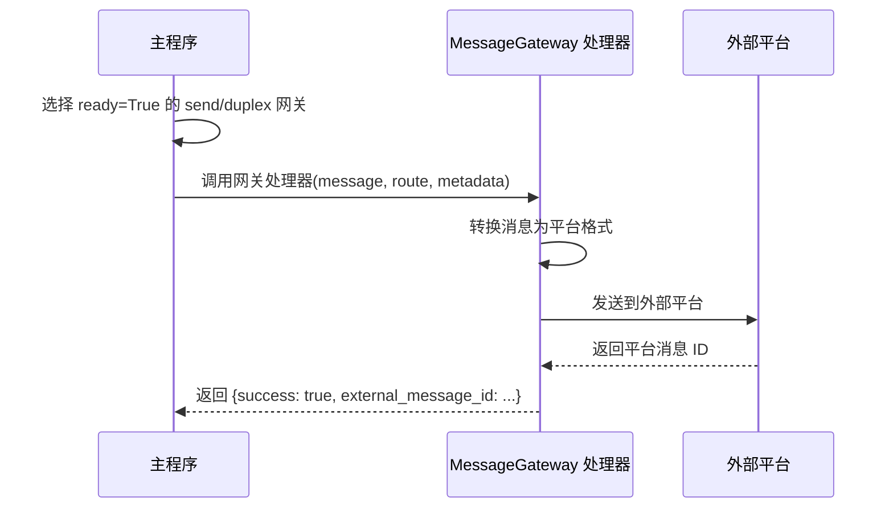
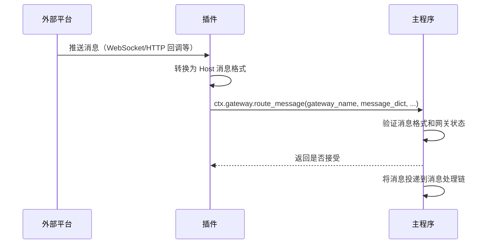
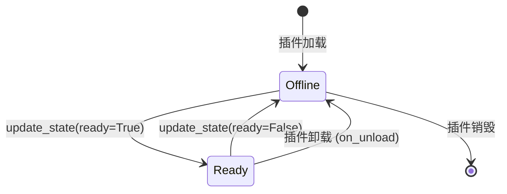

# 消息网关

`@MessageGateway` 装饰器用于声明消息网关组件，实现 MaiBot 与外部消息平台（如 QQ、Discord 等）的双向消息路由。消息网关是平台适配器的核心组件，负责出站消息发送和入站消息注入。

## 装饰器签名

```python
from maibot_sdk import MessageGateway

@MessageGateway(
    route_type: str,             # 路由类型：send / receive / duplex（必填）
    *,
    name: str = "",              # 组件名，留空时使用方法名
    description: str = "",       # 组件描述
    platform: str = "",          # 平台名称（如 qq、discord）
    protocol: str = "",          # 协议或接入方言名称
    account_id: str = "",        # 账号 ID / self_id
    scope: str = "",             # 路由作用域
    **metadata,                  # 额外元数据
)
```

## 路由类型

| route_type | 枚举值 | 方向 | 说明 |
|------------|--------|------|------|
| `"send"` | `MessageGatewayRouteType.SEND` | 出站 | Host → 插件 → 外部平台 |
| `"receive"` | `MessageGatewayRouteType.RECEIVE` | 入站 | 外部平台 → 插件 → Host |
| `"duplex"` | `MessageGatewayRouteType.DUPLEX` | 双向 | 同时支持出站和入站 |

::: tip 别名支持
`route_type` 也接受 `"recv"` 作为 `"receive"` 的别名。
:::

## ctx.gateway 能力代理

| 方法 | 说明 |
|------|------|
| `await self.ctx.gateway.route_message(gateway_name, message_dict, route_metadata=None, ...)` | 注入入站消息到 Host |
| `await self.ctx.gateway.update_state(gateway_name, ready, platform="", account_id="", scope="", metadata=None)` | 上报网关状态 |

### 状态管理

- 只有 `ready=True` 的网关才会被主程序选中进行消息路由
- `route_type="send"` 或 `"duplex"` 且 `ready=True` 的网关可被 Platform IO 选中处理出站消息
- `route_type="receive"` 或 `"duplex"` 且 `ready=True` 的网关可通过 `ctx.gateway.route_message()` 注入入站消息
- 插件应在链路可用时上报 `ready=True`，在断开或卸载时上报 `ready=False`

## 完整适配器示例

以下是一个完整的 QQ 平台适配器示例，基于 NapCat 协议实现双向消息路由：

```python
from typing import Any

from maibot_sdk import MaiBotPlugin, MessageGateway


class NapCatGatewayPlugin(MaiBotPlugin):
    async def on_load(self) -> None:
        # 上报网关就绪状态
        await self.ctx.gateway.update_state(
            gateway_name="napcat_gateway",
            ready=True,
            platform="qq",
            account_id="10001",
            scope="primary",
            metadata={"protocol": "napcat"},
        )
        self.ctx.logger.info("NapCat 网关已就绪")

    async def on_unload(self) -> None:
        # 上报网关离线
        await self.ctx.gateway.update_state(
            gateway_name="napcat_gateway",
            ready=False,
        )
        self.ctx.logger.info("NapCat 网关已下线")

    async def on_config_update(self, scope: str, config_data: dict, version: str) -> None:
        pass

    @MessageGateway(
        route_type="duplex",
        name="napcat_gateway",
        platform="qq",
        protocol="napcat",
        account_id="10001",
        scope="primary",
    )
    async def send_to_platform(
        self,
        message: dict[str, Any],
        route: dict[str, Any] | None = None,
        metadata: dict[str, Any] | None = None,
        **kwargs: Any,
    ) -> dict[str, Any]:
        """出站：将 Host 消息转发到外部平台。"""
        # 将 Host MessageDict 转换为平台格式并发送
        platform_msg = self._convert_to_platform_format(message)
        result = await self._send_to_napcat(platform_msg)
        return {"success": True, "external_message_id": result.get("message_id")}

    async def handle_inbound(self, payload: dict[str, Any]) -> None:
        """入站：将外部平台消息注入 Host。

        此方法由外部平台回调触发（如 WebSocket 推送），
        不是组件装饰器方法，但演示了入站消息的注入流程。
        """
        accepted = await self.ctx.gateway.route_message(
            gateway_name="napcat_gateway",
            message_dict={
                "message_id": payload["message_id"],
                "platform": "qq",
                "message_info": {
                    "user_info": {
                        "user_id": payload["user_id"],
                        "user_nickname": payload["nickname"],
                    },
                    "additional_config": {},
                },
                "raw_message": payload["message"],
            },
            route_metadata={
                "self_id": "10001",
                "connection_id": "primary",
            },
            external_message_id=payload["message_id"],
            dedupe_key=payload["message_id"],
        )
        if not accepted:
            self.ctx.logger.warning(
                "Host 未接收入站消息: %s", payload["message_id"]
            )

    def _convert_to_platform_format(
        self, message: dict[str, Any]
    ) -> dict[str, Any]:
        """将 Host 消息格式转换为平台格式。"""
        return {
            "action": "send_msg",
            "params": {
                "message_type": "group",
                "group_id": message.get("group_id"),
                "message": message.get("raw_message", ""),
            },
        }

    async def _send_to_napcat(
        self, platform_msg: dict[str, Any]
    ) -> dict[str, Any]:
        """发送消息到 NapCat API。"""
        # 实际实现中这里会调用 NapCat 的 HTTP/WebSocket API
        return {"message_id": "platform-msg-1"}


def create_plugin():
    return NapCatGatewayPlugin()
```

## 仅入站网关示例

如果只需要向 MaiBot 注入消息（如 Webhook 监听），可以使用 `route_type="receive"`：

```python
from typing import Any

from maibot_sdk import MaiBotPlugin, MessageGateway


class WebhookReceiverPlugin(MaiBotPlugin):
    async def on_load(self) -> None:
        await self.ctx.gateway.update_state(
            gateway_name="webhook_receiver",
            ready=True,
            platform="webhook",
            scope="default",
        )

    async def on_unload(self) -> None:
        await self.ctx.gateway.update_state(
            gateway_name="webhook_receiver",
            ready=False,
        )

    async def on_config_update(self, scope: str, config_data: dict, version: str) -> None:
        pass

    @MessageGateway(
        route_type="receive",
        name="webhook_receiver",
        platform="webhook",
    )
    async def handle_outbound(self, message: dict[str, Any], **kwargs: Any) -> dict[str, Any]:
        """仅入站网关，出站方向不会收到消息。"""
        # receive 类型网关不会被选中处理出站消息
        # 此处理器不会被调用，但必须声明
        return {"success": True}

    async def inject_webhook_message(self, payload: dict[str, Any]) -> None:
        """接收 Webhook 回调并注入消息。"""
        accepted = await self.ctx.gateway.route_message(
            gateway_name="webhook_receiver",
            message_dict={
                "message_id": payload["id"],
                "platform": "webhook",
                "message_info": {
                    "user_info": {
                        "user_id": payload.get("sender", "unknown"),
                        "user_nickname": payload.get("sender_name", "unknown"),
                    },
                    "additional_config": {},
                },
                "raw_message": payload.get("content", ""),
            },
        )
        if accepted:
            self.ctx.logger.info("Webhook 消息已注入")


def create_plugin():
    return WebhookReceiverPlugin()
```

## 网关处理器参数

`@MessageGateway` 装饰的处理器方法接收以下参数：

| 参数 | 类型 | 说明 |
|------|------|------|
| `self` | `MaiBotPlugin` | 插件实例 |
| `message` | `dict[str, Any]` | Host 传出的消息字典（出站方向） |
| `route` | `dict[str, Any] \| None` | 路由信息 |
| `metadata` | `dict[str, Any] \| None` | 路由元数据 |
| `**kwargs` | `Any` | 其他参数 |

处理器返回值为 `dict[str, Any]`，应至少包含 `success` 字段表示发送是否成功。

## 消息路由流程

### 出站流程（Host → 外部平台）



### 入站流程（外部平台 → Host）



## 网关生命周期



::: important
- 插件在 `on_load()` 中应调用 `ctx.gateway.update_state(ready=True)` 上报就绪状态
- 插件在 `on_unload()` 中应调用 `ctx.gateway.update_state(ready=False)` 上报离线状态
- 只有 `ready=True` 的网关才会参与消息路由
:::

## 平台字段说明

| 字段 | 说明 | 示例 |
|------|------|------|
| `platform` | 目标平台名称 | `"qq"`、`"discord"`、`"webhook"` |
| `protocol` | 协议或实现名称 | `"napcat"`、`"go-cqhttp"`、`"discord.py"` |
| `account_id` | 机器人账号 ID | `"10001"`、`"bot#1234"` |
| `scope` | 路由作用域 | `"primary"`、`"default"` |

`platform`、`protocol`、`account_id`、`scope` 也可以在运行时通过 `ctx.gateway.update_state()` 动态上报，无需在装饰器中固定。
