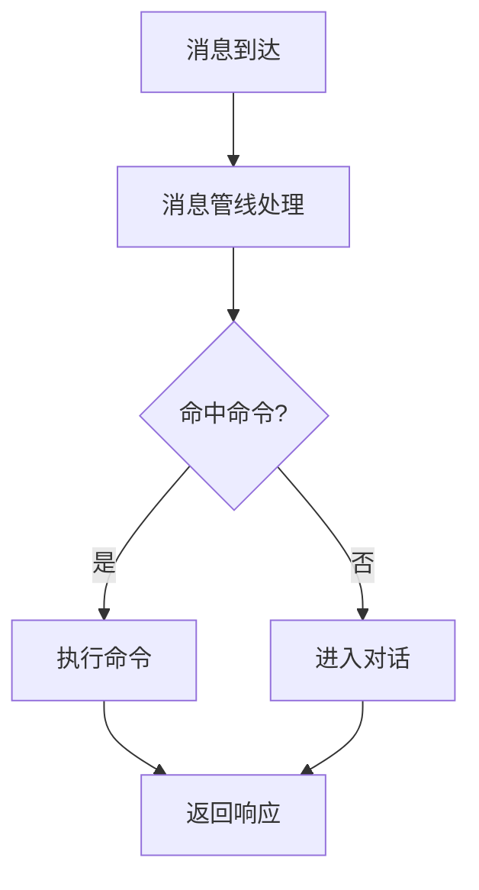

# Markdown Features

Writer's note: This page covers the **non-native VitePress** plugin features used on this site; these features require you to write specific syntax in Markdown to trigger them. For VitePress-native features such as custom containers (`::: tip` / `::: warning`, etc.) and code block line highlighting, see the [VitePress official documentation](https://vitepress.dev/guide/markdown). Snippet import is also enabled on this site — see "Snippet Import" below.

This page follows the hard rules in [Contributing to the Docs Site](./): **content pages must not use Markdown tables** — use definition lists or the `::: fields` container instead; index pages may use tables as needed.

## Mermaid Diagrams

Use ` ```mermaid ` fenced code blocks to insert flowcharts, sequence diagrams, class diagrams, and more. This site supports them via the `vitepress-plugin-mermaid` plugin. Also supports ` ```mmd ` (no rendering, source-only display, for teaching examples).

Supported diagram types: flowchart, sequenceDiagram, classDiagram, stateDiagram, erDiagram, gantt, pie, gitGraph, and others.

**Usage example:**

````markdown

````

**Rendered effect:**


> This plugin is actually used in the development docs covering the message pipeline, the database, and the runtime.

## Update Timeline

Use `::: timeline <date>` ... `:::` containers to create timeline layouts. This site supports them via the `vitepress-markdown-timeline` plugin. Date format: `YYYY-MM-DD`. Content inside uses Markdown bullet lists.

**Usage example:**

```
::: timeline 2026-07-09
- [1.0.12] 优化 Planner 到 Replyer 的信息传递
- WebUI：增强麦麦观察离线记录，支持自定义 API 模型列表
- 首次配置会引导用户把启动时临时 Token 更换为固定 Token
:::
```

**Rendered effect:** [See timeline rendering →](/en/changelog/)

> This plugin is actually used in `zh/changelog/index.md`.

## Code Group Icons

This site uses the `vitepress-plugin-group-icons` plugin to automatically display icons on `::: code-group` tab labels. Writers have **three** ways to trigger icons.

### 1. Built-in Keyword Auto-Match

When the label text contains specific keywords, the corresponding icon appears automatically. Common keywords include:

- **Package managers** — pnpm, npm, yarn, bun, deno
- **Frameworks** — vue, react, svelte, angular, next, nuxt, astro, solid
- **Tools** — vite, rollup, webpack, esbuild, eslint, tailwind
- **Others** — tsconfig, gitignore, .env, prisma, gradle
- **File extensions** — when the label text contains a filename (e.g. `vite.config.ts`, `package.json`, `main.py`), the extension is auto-matched: .ts, .js, .py, .json, .yml, .toml, .rs, .go, .html, .css, .scss, .lua, .swift, and dozens more

> See the [vitepress-plugin-group-icons official documentation](https://vp.yuy1n.io/features.html) for the full list of built-in labels.

### 2. Repository Custom Keywords

The following keywords have also been configured for auto-matching (defined in the `customIcon` of `.vitepress/config.mts`). Whenever a label contains these keywords, the corresponding icon appears automatically:

- **`git`** — vscode-icons:file-type-git icon
- **`uv`** — vscode-icons:file-type-python icon
- **`pip`** — vscode-icons:file-type-python icon

### 3. Inline Named Icons in Labels

Embed `~iconify-id~` syntax inside code-group labels to explicitly specify icons. Format: `[label text ~iconify-icon-name~]`. Icon names come from [Iconify](https://icon-sets.iconify.design/) (e.g. `vscode-icons:file-type-git`, `logos:docker-icon`).

**Combined usage example:**

````markdown
::: code-group

```bash [稳定版（推荐）~vscode-icons:file-type-git~]
git clone https://github.com/Mai-with-u/MaiBot.git
cd MaiBot
```

```bash [开发版（尝鲜）~vscode-icons:file-type-git~]
git clone -b dev https://github.com/Mai-with-u/MaiBot.git
cd MaiBot
```

```bash [pip 安装依赖]
# 标签含 "pip" 自动出现 Python 图标（本仓库自定义关键词）
pip install -r requirements.txt
```

```bash [uv 安装依赖]
# 标签含 "uv" 自动出现 Python 图标（本仓库自定义关键词）
uv sync
```

:::
````

**Rendered effect:**

::: code-group

```bash [stable ~vscode-icons:file-type-git~]
git clone https://github.com/Mai-with-u/MaiBot.git
```

```bash [uv install]
uv sync
```

```bash [pip install]
pip install -r requirements.txt
```

:::

> The `[uv install]` and `[pip install]` tabs in the rendered example above intentionally omit icons to demonstrate keyword auto-matching; real content pages must follow S2 and write icons explicitly.

## Mandatory Code-Group Style and No-Wrap Rules

Site convention: **every standalone code block with a language annotation must be placed inside a single-tab `::: code-group`**, with an explicit `~vscode-icons:<id>~` inline icon on the label, instead of relying on keyword matching. S1–S5 below describe the mandatory style and the no-wrap rules.

### S1 Standalone Code Blocks Must Be Wrapped in a Code Group

Even if a code group holds only one block, it must still be wrapped in `::: code-group` and given an inline icon on the label:

````markdown
::: code-group

```toml [TOML ~vscode-icons:file-type-toml~]
[bot]
platform = "qq"
```

:::
````

Bare language fences without a code group (` ```toml `, ` ```python `, ` ```bash `, etc.) are forbidden.

### S2 Labels Must Carry an Explicit Inline Icon

Code-group labels must be written as `[label text ~iconify-icon-name~]`, with the icon given explicitly. **Do not rely on automatic keyword matching**:

- ❌ ` ```toml [Config] ` — no icon
- ✅ ` ```toml [Config ~vscode-icons:file-type-toml~] ` — explicit icon

Get icon names from [Iconify](https://icon-sets.iconify.design/). Common ones: `vscode-icons:file-type-toml`, `vscode-icons:file-type-python`, `vscode-icons:file-type-json`, `vscode-icons:file-type-shell`, `vscode-icons:file-type-git`, `logos:docker-icon`.

### S3 Unlabeled Display Blocks Must Not Be Wrapped

A bare fence with no language annotation (` ``` ` with no language) is for **plain text content** such as directory trees, log output, process steps, and ASCII art. It is not code, needs no code group, and should be left as is:

````markdown
```
my-plugin/
├── _manifest.json
└── plugin.py
```
````

### S4 mermaid / mmd Must Not Be Wrapped

Mermaid diagrams (` ```mermaid `) render charts, and ` ```mmd ` displays Mermaid source for teaching. Both must stay standalone fences; **never** wrap them in a code group, or they will fail to render or lose their display semantics.

### S5 Code Groups Need at Least One Block and Must Not Nest

A `::: code-group` must contain one or more ` ``` ` fences, and **a code group must not be nested inside another code group**. Group multiple blocks under the same logical topic and keep labels short.

### en Mirror Convention

When translating into English, code-group structure, icon IDs, and code content must be **exactly the same** as the Chinese version (terminology may be translated; code, fields, and icons must not). Label text may be translated, but `~vscode-icons:<id>~` icons must be kept as is.

## Endpoint Card `::: endpoint`

Use it when writing API / protocol references. The card title **becomes a real `<h3>`**: it shows up in the "On this page" outline and gets an auto-generated anchor, derived from `method + path` (`POST /api/x` → `#post-api-x`).

**Usage example:**

````markdown
::: endpoint POST /api/webui/auth/verify
Verifies the token and logs in; on success it writes a cookie.

::: fields
- **token** — `string`, required. The token to verify.
:::
:::
````

**Rendered effect:**

::: endpoint POST /api/webui/auth/verify
Verifies the token and logs in; on success it writes a cookie.

::: fields
- **token** — `string`, required. The token to verify.
:::
:::

Rules:

- Write the info string as `method path`. The method must be one of `GET` / `POST` / `PUT` / `PATCH` / `DELETE` / `OPTIONS` / `HEAD` / `WS`, and it is color-coded automatically;
- Writing a single run of text also works (e.g. `::: endpoint Outbound Receipt`), which turns it into a plain section card;
- **The card body can nest `::: fields`, `::: tip`, and `::: code-group`** — this site's custom containers support nesting, unlike VitePress-native containers;
- Every card needs its own closing `:::`. If you leave one out, the build reports the exact line number.

## Field List `::: fields`

Use it for dense "name — description" lists such as API fields, parameters, and config options; it replaces the forbidden table. Inside the container you write an ordinary list, and each item just needs to start with `**name**`.

**Usage example:**

````markdown
::: fields
- **`stream_id`** — Chat stream ID, required.
- **`count`** — Number of items to return, default `20`.
:::
````

**Rendered effect:**

::: fields
- **`stream_id`** — Chat stream ID, required.
- **`count`** — Number of items to return, default `20`.
:::

To mark an entry as "required / optional", use `<Badge>` directly in the item:

::: fields
- **`token`** <Badge type="danger" text="Required" /> — The token to verify.
- **`remember`** <Badge type="tip" text="Optional" /> — Whether to extend the expiry, default `false`.
:::

## Numbered Steps `::: steps`

Tutorial pages use it to wrap an ordered list, and the numbers render as circular badges. **Wrap a single `<ol>` only**; write the step bodies as regular Markdown.

**Usage example:**

````markdown
::: steps
1. Install dependencies.
2. Edit the config.

   ```toml [bot_config.toml ~vscode-icons:file-type-toml~]
   [bot]
   platform = "qq"
   ```

3. Start it.
:::
````

**Rendered effect:**

::: steps
1. Install dependencies.
2. Edit the config.

   ```toml [bot_config.toml ~vscode-icons:file-type-toml~]
   [bot]
   platform = "qq"
   ```

3. Start it.
:::

## Snippet Import

Use `<<<` to embed real files from the repository into the docs, so that example code and docs don't have to be maintained twice. `@/` means the **site root** (not the directory the current file lives in).

**Usage example:**

````markdown
::: code-group

<<< @/zh/examples/adapter-minimal/adapter.py#bridge [bridge section ~vscode-icons:file-type-python~]

:::
````

Rules:

- The title goes **last**: `<<< @/path/file.py{1,3-5} [title ~icon~]` (line numbers first, title second — reversing the order makes the title part of the filename);
- `#region-name` imports only the fragment between `# region name` and `# endregion name` in the file;
- `{1,3-5}` highlights line numbers;
- A wrong file path fails the build, on purpose — it doubles as an existence check for example code.

## Registered Vue Components

The following Vue components are registered in the theme and can be used directly in Markdown as HTML tags. Component source code lives in the `.vitepress/theme/components/` directory, registered via `app.component()` in `.vitepress/theme/index.ts`.

### IntegrationRoutes Integration Route Cards

Integration route cards, meant for overview or landing pages: the copy switches between Chinese and English based on the current language, and the data (title, link, audience) is maintained in `.vitepress/theme/utils/integration-routes.ts`. No page uses it right now — enable it when you need it.

- **`only`** (optional, default `''`) — Comma-separated route keys; only those routes are shown, e.g. `only="adapter,plugin"`

````html
<IntegrationRoutes />
````

**Rendered effect:**

<IntegrationRoutes only="adapter,plugin,model" />

### xgplayer Video Player

- **`url`** (required) — Video URL
- **`poster`** (optional, default `''`) — Cover image URL
- **`width`** (optional, default `'100%'`) — Player width
- **`height`** (optional, default `'auto'`) — Player height

````html
<xgplayer url="https://litev4.github.io/rickroll/rickroll.mp4" width="100%" height="auto" />
````

**Rendered effect:**

<xgplayer url="https://litev4.github.io/rickroll/rickroll.mp4" width="100%" height="auto" />

### Bilibili iframe Embedding

In addition to the xgplayer component, you can also embed videos from third-party platforms like Bilibili using `<iframe>`:

````html
<iframe 
style="width:100%; aspect-ratio:16/9; margin-top: 2em;" 
src="//player.bilibili.com/player.html?bvid=BV1amAneGE3P" 
frameborder="0" 
allow="accelerometer; autoplay; clipboard-write; encrypted-media; gyroscope; picture-in-picture; web-share" 
allowfullscreen>
</iframe>
````

**Rendered effect:**

<iframe 
style="width:100%; aspect-ratio:16/9; margin-top: 2em;" 
src="//player.bilibili.com/player.html?bvid=BV1amAneGE3P" 
frameborder="0" 
allow="accelerometer; autoplay; clipboard-write; encrypted-media; gyroscope; picture-in-picture; web-share" 
allowfullscreen>
</iframe>

### Linkcard Link Card

::: tip Usage preference
**Standalone or block-level external links should always use a Linkcard** — e.g. adapter repositories, the plugin site, official docs, and community links. Only inline references inside a sentence (e.g. "install it following the official docs") may remain plain Markdown links. Cards are block-level, so don't put one inside a sentence.
:::

- **`url`** (required) — Link URL
- **`title`** (required) — Card title
- **`description`** (required) — Card description
- **`logo`** (optional, default `''`) — Left-side logo image URL

````html
<Linkcard url="https://github.com/Mai-with-u/MaiBot" title="MaiBot" description="一个智能 QQ 群聊天机器人" logo="/title_img/mai.png" />
````

**Rendered effect:**

<Linkcard url="https://github.com/Mai-with-u/MaiBot" title="MaiBot" description="一个智能 QQ 群聊天机器人" logo="/title_img/mai.png" />

