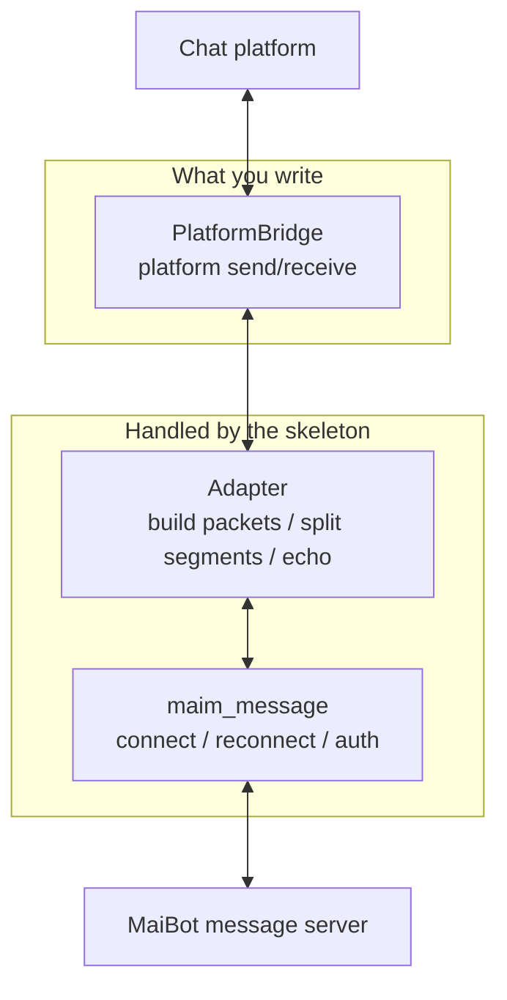

# Writing an Adapter

**Connecting a new platform takes only three methods.** Everything else — connecting to MaiBot, reconnecting after a drop, authentication, message formatting — is handled by the official `maim_message` library and a skeleton of about a hundred lines. This page gets it running from scratch.

Prerequisites:

- **Python 3.10+**, with `pip install maim_message` working;
- A **platform SDK that can send and receive messages** (the platform's official library, an OneBot implementation, or your own protocol stack);
- A **MaiBot instance that is already running**, plus its message server address and token.

::: tip Decide which service you are connecting to first
This page uses the **legacy message server** (enabled by default, `ws://127.0.0.1:8000/ws`). If you are connecting to the API server (`enable_api_server`) instead, the connection parameters become `x-apikey` / `x-platform`, and every packet needs an extra envelope on the outside — for the differences, see [Message Protocol Reference](./protocol.md).
:::

## What the Skeleton Handles



`PlatformBridge` has only three methods: send text, send image, receive events. The skeleton assembles events into MaiBot's unified format, splits replies into segments, and echoes the platform's real message ID back to MaiBot.

## Build It

::: steps
1. Install the dependency.

   ::: code-group

   ```bash [pip ~vscode-icons:file-type-python~]
   pip install maim_message
   ```

   :::

   MaiBot enforces a minimum version: anything below `0.6.2` makes it refuse to start the message service. The version it currently pairs with is `0.6.8`.

2. Create the directory.

   ```
   my-adapter/
   ├── adapter.py       # Skeleton: connection, routing, echo
   ├── bridge.py        # Your platform send/receive implementation
   └── requirements.txt
   ```

3. Implement the three platform-side methods. Only care about calls into the platform SDK — do not touch MaiBot's format here.

   <<< @/zh/examples/adapter-minimal/adapter.py#bridge [bridge section ~vscode-icons:file-type-python~]

   - **`send_text`** — return the platform-side message ID after sending; if you cannot get one, return an empty string and the echo is skipped automatically.
   - **`send_image`** — inbound images are base64; most platforms need them written to disk or uploaded before they can be sent.
   - **`poll_events`** — collect platform events into a list of dictionaries; the field conventions are in the next step.

4. Assemble the inbound packet. This is the easiest place in the whole page to trip up: MaiBot uses **assertions** rather than friendly validation for required fields, and one missing field loses the whole message.

   <<< @/zh/examples/adapter-minimal/adapter.py#inbound [inbound assembly ~vscode-icons:file-type-python~]

   Three hard requirements:

   - **`user_info.user_id` and `user_info.user_nickname` must be non-empty strings**; group messages also need `group_info.group_id` and `group_info.group_name`;
   - **`message_id` and `time` must be present**, and `time` is a float in seconds;
   - **the `data` of a text segment must be a string** — cast numeric IDs with `str()` first.

   Fill in two more fields while you are at it, so outbound replies can find their way:

   ::: fields
   - **`additional_config.platform_io_account_id`** — the account identifier of this adapter instance; it is what tells multiple accounts on the same platform apart.
   - **`additional_config.platform_io_target_user_id`** — the recipient of private-chat replies.
   :::

5. Handle outbound segments. Most of the body MaiBot pushes over is a `seglist`; translate it one `type` at a time. Log and skip segment types you do not recognize — do not let the whole adapter crash.

   <<< @/zh/examples/adapter-minimal/adapter.py#outbound [outbound handling ~vscode-icons:file-type-python~]

6. Echo back the real message ID. After a successful send, echo the ID the platform returned to MaiBot; only then does it know "which message on the platform this reply is", so that recalls, quotes, and reply chains can attach to it.

   ::: code-group

   ```python [Echo ~vscode-icons:file-type-python~]
   await client.send_custom_message(
       "message_id_echo",
       {"type": "echo", "echo": mmc_message_id, "actual_id": platform_message_id},
   )
   ```

   :::

   Here `client` is `maim_message.MessageClient`: `send_custom_message(message_type_name, message)` takes **2 arguments**, and `platform` comes from the connection identity, so it is not passed. The 3-argument `send_custom_message(platform, message_type_name, message)` is a method of the server-side `MessageServer` and is not used by adapters. For the legacy service the type name is exactly `message_id_echo`; **on the API server it must be `custom_message_id_echo`** (the API client adds the `custom_` prefix automatically).

7. Start it and connect.

   ::: code-group

   ```python [Main flow ~vscode-icons:file-type-python~]
   async def run(self) -> None:
       await self.client.connect(url=MAIBOT_WS_URL, platform=PLATFORM, token=MAIBOT_TOKEN or None)
       # run() blocks and brings its own exponential-backoff reconnection; run it concurrently with the event loop
       await asyncio.gather(self.poll_loop(), self.client.run())
   ```

   :::

   `connect()` only stores the connection parameters — the connection is actually established inside `run()`; **do not forget to run your own event-receiving loop concurrently**.
:::

## Full Code

Below is the finished result, assembled from every step above. Copy it out, fill in the three `PlatformBridge` methods, and change the four constants at the top to run it.

::: code-group

<<< @/zh/examples/adapter-minimal/adapter.py [adapter.py ~vscode-icons:file-type-python~]

:::

## What to Change on the MaiBot Side

The default configuration listens on the local machine only. When the adapter and MaiBot are not on the same machine (or not in the same container network), edit `config/bot_config.toml`:

::: code-group

```toml [bot_config.toml ~vscode-icons:file-type-toml~]
[maim_message]
ws_server_host = "0.0.0.0"   # Change 127.0.0.1 to 0.0.0.0 so external clients can connect
ws_server_port = 8000
auth_token = ["换成一段足够长的随机串"]   # Non-empty enables authentication; the adapter must send exactly the same value
```

:::

::: warning The auth value is compared verbatim
`auth_token` is compared as a **whole string** against the `authorization` header, with no `Bearer` prefix parsing. One extra `Bearer ` on the adapter side and you are disconnected with close code 1008.
:::

## Multiple Accounts and Access Scope

- **Multiple accounts on one platform**: on the legacy service a `platform` can have only one connection, and a second one kicks the first out. For multiple accounts, either put `account_id` into `additional_config` and use a different `platform` for each, or switch to the API server's `x-uuid`, or use the plugin gateway's `account_id` / `scope`.
- **Who can use MaiBot**: adapters do not carry their own allow/deny lists; inbound admission is controlled uniformly by `config/adapter_policy.toml`, see [Access Policy and Account Routing](./policy.md).

## Deployment Advice

::: fields
- **Run it as a separate process** — a crashing adapter should not drag MaiBot down with it; host it with systemd, supervisor, or a standalone Docker container.
- **Do not write your own reconnect logic** — the `maim_message` client ships exponential-backoff reconnection (starting at 2 seconds, capped at 10 seconds); a duplicate implementation only fights with it.
- **Log the platform name and account** — when troubleshooting multiple accounts, logs without these two fields are close to useless.
- **Compress large images first** — the per-frame limit is 100 MB, and images and voice are base64 on the wire (about a third larger); compress on the platform side whenever you can.
- **Keep one test group** — get send and receive working in a fixed test group before you open up your production groups.
:::

## Verification & Troubleshooting

**Acceptance check** — send "hello" on the platform: an inbound log appears in the MaiBot console, the platform side receives a reply, and the MaiBot log shows the `收到回送消息ID` (echoed message ID received) debug line.

- **Startup reports "connection failed", or it disconnects immediately** — nine times out of ten it is an address problem: MaiBot is still listening on `127.0.0.1`, or the port is not open; with a container deployment, confirm the port mapping as well.
- **Close code 1008** — the tokens do not match; the values must be exactly identical, with no prefix added.
- **Connected but MaiBot does not respond** — first check whether the platform name matches the configuration, then whether `adapter_policy.toml` allows that group / user.
- **Assertion errors / messages just vanish** — go back to step 4 and check the required fields and their types one by one, especially `user_nickname` and `group_name`.
- **Replies will not go out** — for private chats, check that `platform_io_target_user_id` is filled in; for group chats, confirm `group_info.group_id` matches the platform side.
- **Repeated reconnects** — two connections share the same `platform` and keep replacing each other, or the heartbeat timed out (the server PINGs every 30 seconds and drops the connection after 10 seconds without a response).
