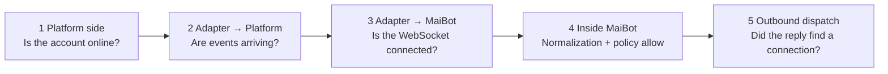

# Adapter Debugging

**"MaiBot ignores me" always means one of five links in the chain is broken; checking each link in turn is far faster than restarting over and over.** This page gives you the triage order, the evidence to judge each stage by, and an endpoint you can query directly to ask "why was this session blocked?"

## Five-Stage Triage



**Working backwards saves time**: if inbound logs already show up in the MaiBot console, the first two stages are fine—jump straight to stage 4.

## Stage 1: Platform Side

Whether the platform client or bot account is online at all. On the QQ local-client route, confirm the login has not dropped; on the open-platform route, confirm the bot is not rate-limited or disabled.

- **Check the platform client UI** — while it is offline the adapter receives no events at all, so the MaiBot side stays completely quiet.
- **Check the adapter logs** — a well-behaved adapter prints its platform connection status; if you only see the "connected to MaiBot" line and no platform-side logs, you are stuck at this stage.

## Stage 2: Adapter → Platform

Send a message and see whether the adapter receives an event:

- **An inbound event appears in the adapter logs** — this stage is fine, keep going.
- **Nothing at all happens** — the platform subscription/callback was not registered successfully, or the bot was not triggered in the group (for example, it only pushes when @-mentioned).

## Stage 3: Adapter → MaiBot

Problems at this stage leave clear signals on the MaiBot side:

::: fields
- **`Connection refused`** — MaiBot's message server is not running, the address or port is wrong, or it only listens on `127.0.0.1` while the adapter runs elsewhere.
- **Close code 1008 (invalid token)** — `auth_token` mismatch; the value is compared as a whole string, so do not add a `Bearer` prefix.
- **Close code 1000 (a new connection was established)** — a second connection for the same `platform` pushed this one out.
- **Connects and then drops quickly, reconnecting repeatedly** — heartbeat timeout (the server sends a PING every 30 seconds and disconnects after 10 seconds without a response); it can also mean the adapter blocked its event loop and never answered the PONG.
:::

::: tip Confirm the port is actually open first
Container deployments hit this trap most often: `docker-compose.yml` does not map the message server port by default, so it is only reachable inside the container. Either map the port, or put the adapter and MaiBot on the same network and let them reach each other by service name.
:::

## Stage 4: Did MaiBot Receive It?

Open the logs and look for inbound traffic. The console defaults to `INFO`, and inbound messages usually leave a trace; if not, temporarily lower the level first:

::: code-group

```toml [bot_config.toml ~vscode-icons:file-type-toml~]
[log]
console_log_level = "DEBUG"              # Temporarily turn on DEBUG for the console
file_log_level = "DEBUG"                 # Keep file logs at DEBUG; turn it back once you are done
library_log_levels = { aiohttp = "WARNING", PIL = "WARNING" }   # Suppress third-party noise
```

:::

**Inbound logs but no reply** → the access policy most likely blocked it. Ask the endpoint directly—it returns the reason along with the verdict:

::: endpoint POST /api/chat/sessions/adapter-status
Query the allow status of sessions in bulk. Pass a list of session IDs in the request body; the response returns `allowed` and `reason` for each session.

::: fields
- **Request body `session_ids`** — array of session IDs, at most 500; get them with `GET /api/chat/sessions` first.
- **`allowed`** — whether the session is allowed.
- **`reason`** — why it was blocked, for example a blacklist hit or an entry mismatch.
:::
:::

**No inbound logs at all** → the message was dropped during normalization. Go back and check the required fields (`user_info`, `group_info`, `message_id`, `time`); see [Message Protocol Reference](./protocol.md#legacy-message-one-message-object). These failures are usually assertion errors, and the log carries a stack trace.

## Stage 5: Can the Reply Get Out?

After MaiBot generates a reply it goes through Platform IO to find a send driver. Three typical failures at this stage:

::: fields
- **Sent to the wrong account / the wrong group** — the routing triple `platform` / `account_id` / `scope` does not match what the inbound report carried; use `GET /api/webui/bot-accounts` to confirm who took over the account.
- **Nothing was sent, and the log says no driver is available** — the platform has no explicit send binding and the legacy channel is unavailable too; in a plugin gateway setup, first confirm the gateway has reported itself ready.
- **The private-chat reply lost its recipient** — the outbound message is missing `additional_config.platform_io_target_user_id`; the adapter must include it when building the inbound message.
:::

To confirm which connection a given target resolves to, use these two endpoints:

::: endpoint GET /api/chat/resolve-target
Resolve `platform` + `item_id` + `rule_type` into a concrete session/routing target, to verify the routing triple.

:::

::: endpoint POST /api/chat/resolve-targets
Batch version: pass a `targets` array in the request body (at most 200 entries).

:::

## Toolbox

**Watch logs live** — the WebUI's WebSocket supports subscribing to the log stream, so you do not have to stare at a terminal:

::: code-group

```json [Subscribe to logs ~vscode-icons:file-type-json~]
{ "op": "subscribe", "id": "1", "domain": "logs", "topic": "main", "data": { "replay": 100 } }
```

:::

After subscribing you first receive a `snapshot` (the most recent logs), then each new log arrives as `event: entry`. The connection needs a one-time handshake token from `GET /api/webui/ws-token` first.

**Rehearse without a platform** — the `maim_message` repository has a mock adapter implementation (`mock_napcat_adapter`) and a set of self-check scripts under `others/`, so you can exercise the whole protocol chain without a real platform account. They exist for the library's own tests, but they are ideal as a "fake adapter" for verifying the MaiBot side.

**Capture raw frames** — protocol issues ultimately come down to the raw frames. Printing the actual `dict` the adapter sends is far faster than guessing on the server side; note that inbound messages get normalized (`message_id`, `user_id`, `group_id` are forced to strings), so do not infer protocol requirements from the printed values.

**Check whether the event loop is stuck** — if an adapter makes synchronous blocking calls, it will not even answer heartbeats. On the MaiBot side you can turn on the watchdog to confirm the problem is not on your side:

::: code-group

```toml [bot_config.toml ~vscode-icons:file-type-toml~]
[log]
event_loop_watchdog_warn_seconds = 0.5   # Warn when the event loop is more than 0.5s late; takes effect after a restart
```

:::

## Verification and Troubleshooting

**A minimal, command-level verification** — shrink the scope as far as it goes: keep one adapter, one test group, and one test user, explicitly `allow` the test group in `adapter_policy.toml`, then send "hello" in the test group and confirm in this order:

1. The adapter logs show a platform inbound event;
2. The adapter logs show "connected to MaiBot" with no disconnect/reconnect cycles;
3. An inbound log appears in the MaiBot console;
4. `POST /api/chat/sessions/adapter-status` returns `allowed: true`;
5. The platform side receives the reply.

**Wherever you get stuck, go back to that stage**. If the first four steps pass but no reply appears on the platform, the problem is outbound: look up the routing triple in the last outbound log and compare it character by character against the values reported inbound.

- **Configuration changes have no effect** — the adapter policy file is read hot, but the message-server and log-related fields in `bot_config.toml` require a MaiBot restart.
- **DEBUG logs still show no inbound traffic** — confirm you edited the right file (the `[log]` section of `bot_config.toml`) and restart after editing.
- **Everything looks fine but messages are occasionally lost** — on the API server path, resending the same `msg_id` within one hour is silently dropped; adapter retries must use a new ID.
