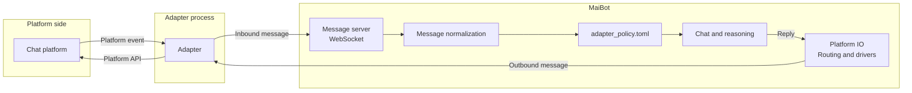

# Adapter Integration

**An adapter connects MaiBot to a chat platform, and it does not run inside the MaiBot process.** The typical shape is a standalone Python process: on one side it talks to the platform (logging into QQ, connecting to Telegram, receiving email), and on the other side it connects to MaiBot's message server over WebSocket. MaiBot itself contains no platform logic—it only understands one unified message format.

This page helps you pick a route and get oriented on the skeleton; for the protocol details and code, see [Message Protocol Reference](./protocol.md) and [Writing an Adapter](./build.md).

## Pick an Implementation Route First

MaiBot supports two kinds of "adapter"—pick the one that fits your scenario:

**Standalone external adapter process** — deployed and upgraded on its own, so a process crash leaves the MaiBot core untouched; it can be written in any language (as long as it speaks WebSocket + that JSON). Platform adapters for QQ, Telegram, email, and the like all take this route. Best for: a production integration with one platform.

**Plugin gateway ([`@MessageGateway`](/en/plugin/message-gateway))** — you implement send and receive inside a MaiBot plugin, the plugin runtime manages its lifecycle, and it starts and stops together with Mai; Python only. Best for: lightweight platforms, internal systems, or a plugin you already have that should also handle messages.

Both routes end up in the same routing and policy layer, and they can coexist; you can also run a platform on an external adapter first and switch it to a plugin gateway later.

::: tip Which route do the official adapters take today?
The officially maintained adapters (Unified QQ Connector, QQ Official Bot, etc.) are all distributed as **plugins** — installation and enabling are covered in [Connect Platforms](/en/manual/adapters/). The standalone-process route is mainly for self-built adapters or non-Python implementations.
:::

## Who Does What



- **Adapter** — the platform protocol translator: it logs in, receives events, converts platform messages into the unified format and sends them in; when a reply in the unified format comes back, it calls the platform API to deliver it.
- **Message server** — handles only WebSocket access, authentication, and handing messages to the chat pipeline.
- **Platform IO** — outbound, it uses `platform` / `account_id` / `scope` to find which driver the message should go to, and it also deduplicates inbound messages.
- **Access policy** — `config/adapter_policy.toml` decides which groups and which users are allowed; see [Access Policy and Account Routing](./policy.md).

All an adapter has to do is turn platform events into something like this (replies use the same structure, just in the other direction):

::: code-group

```json [one inbound message ~vscode-icons:file-type-json~]
{
  "message_info": {
    "platform": "telegram",
    "message_id": "114514",
    "time": 1750000000.0,
    "group_info": { "platform": "telegram", "group_id": "-1001234567890", "group_name": "摸鱼群" },
    "user_info": { "platform": "telegram", "user_id": "10086", "user_nickname": "阿岚" },
    "additional_config": { "platform_io_account_id": "bot_1" }
  },
  "message_segment": { "type": "text", "data": "麦麦在吗" }
}
```

:::

For how to fill in every field — and which ones break the pipeline when missing — see the [Message Protocol Reference](./protocol.md).

## Choosing Between the Two WebSocket Services

MaiBot ships two message servers at the same time, both under the same port scheme and both on the path `/ws`:

**Legacy message server** — enabled by default, `maim_message.ws_server_host:ws_server_port`, defaulting to `127.0.0.1:8000`. The handshake headers are `platform` + `authorization`, and a platform may have only one connection. The vast majority of existing adapters use this one.

**API server (Additional API Server)** — disabled by default; turn on `maim_message.enable_api_server`. It listens on `api_server_host:api_server_port` (default `0.0.0.0:8090`). The handshake uses `x-apikey` / `x-platform` / `x-uuid`; it supports multiple connections and an API Key allowlist, wraps every message in an extra envelope (`ver` / `msg_id` / `type` / `meta` / `payload`), and provides ACKs plus resend after a reconnect.

::: warning Set the allowlist before enabling the API server
`api_server_host` defaults to `0.0.0.0`, and an empty `api_server_allowed_api_keys` means **no validation**. To enable this service, populate the allowlist first, or bind it back to `127.0.0.1`.
:::

## Ready-Made Adapters

Prefer one that someone else has already written; confirm it supports your current MaiBot version before installing:

<Linkcard url="https://github.com/Mai-with-u/MaiBot-SnowLuma-Adapter" title="Unified QQ Connector" description="Officially maintained: log in your own QQ account, supporting both SnowLuma and NapCat clients" logo="/title_img/mai.png" />

<Linkcard url="https://github.com/Mai-with-u/MaiBot-QQ-Adapter" title="QQ Official Bot" description="Officially maintained: connect straight to the QQ Open Platform with AppID + AppSecret" logo="/title_img/mai.png" />

<Linkcard url="https://github.com/Mai-with-u/MaiBot-Telegram-Adapter" title="Telegram Adapter" description="Officially maintained: bring Mai into Telegram groups and private chats" logo="/title_img/mai.png" />

<Linkcard url="https://github.com/Mai-with-u/maim_message" title="maim_message" description="The unified message format and WebSocket communication library—required for writing an adapter" logo="/title_img/mai.png" />

Installing and configuring these adapters is a usage topic, covered in [Connect Platforms](/en/manual/adapters/); everything after this point on the page is about **writing your own**.

## What You Need Before You Start

- **Platform-side capability** — you can receive message events and call a send API. Usually this is the platform's official SDK, an OneBot implementation, or a private protocol library.
- **Python 3.10+** — the official `maim_message` library saves you from every protocol detail; in another language you implement the WebSocket and JSON structures yourself.
- **MaiBot's address and token** — for a local deployment this is `ws://127.0.0.1:8000/ws`; if `auth_token` is configured, send the exact same string.
- **A platform name that doesn't collide** — for example `telegram` or `discord`; don't take `webui`, which is a platform name MaiBot uses internally.

## Next Steps

- See what the messages look like → [Message Protocol Reference](./protocol.md)
- Write a minimal working adapter → [Writing an Adapter](./build.md)
- Control who may use it and how multiple accounts are routed → [Access Policy and Account Routing](./policy.md)
- Can't connect, can't receive, can't send → [Adapter Debugging](./debugging.md)

## Verify and Troubleshoot

Minimal verification: start MaiBot → start the adapter → send one message on the platform; MaiBot's console should show an inbound log entry and a reply.

- **The adapter reports a connection failure the moment it starts** — nine times out of ten `ws_server_host` is still `127.0.0.1` while you connect from a container or another machine; set `maim_message.ws_server_host` in `config/bot_config.toml` to `0.0.0.0` and open the port.
- **Connected, but MaiBot doesn't react** — first check whether the platform name matches the records in the access policy, then check whether `adapter_policy.toml` allows that group / user.
- **Replies never go out** — check whether the outbound driver was taken over by a plugin gateway, or whether a private chat is missing `platform_io_target_user_id`; see [Adapter Debugging](./debugging.md) for details.
- **Repeatedly kicked offline** — two legacy connections are running under the same `platform`; stop the extra one.
