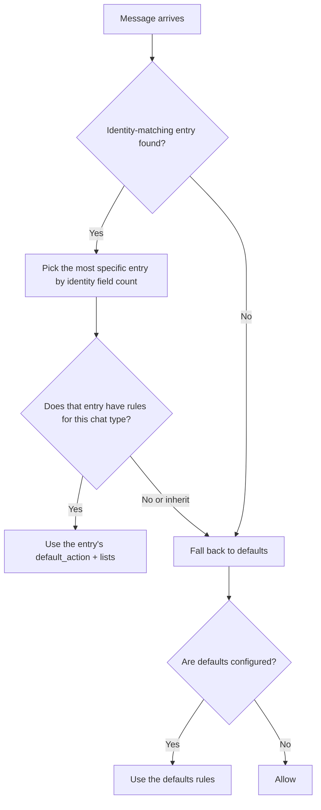

# Access Policy and Account Routing

**Adapters carry no allow/deny lists; what they are allowed to serve is decided uniformly by MaiBot's `config/adapter_policy.toml`.** When you are troubleshooting "the adapter is clearly connected to MaiBot but it ignores people", this is the first place to look; the same set of identity fields also decides who owns what when one platform has multiple accounts or multiple client instances.

## Three Concepts

**Identity** — who a given adapter instance is. It is described by up to six fields: `adapter_id`, `plugin_id`, `gateway_name`, `platform`, `account_id`, `scope`. The more fields you fill in, the more specific the entry becomes.

**Entry (`[[adapters]]`)** — a block of policy written for one identity, which then gives separate rules for group chats and private chats.

**Action** — allow (`allow`), block (`block`), or inherit (`inherit`, valid only for rules inside an entry, meaning "keep using the wider layer").

## Configuration Template

A missing file means everything is allowed, so this configuration is optional; once you want to restrict the scope, write it like this:

::: code-group

```toml [adapter_policy.toml ~vscode-icons:file-type-toml~]
# Fallback rules: every adapter not matched by an entry below lands here
[defaults.group]
default_action = "allow"   # allow = permit / block = deny (the fallback layer accepts only these two)
deny_ids = ["123456"]      # Group ID denylist

[defaults.private]
default_action = "allow"

# Rules for one adapter instance: the more identity fields match, the higher the priority
[[adapters]]
platform = "telegram"              # platform alone covers every account on that platform
account_id = "bot_1"               # add the account to narrow the scope further
# adapter_id / plugin_id / gateway_name / scope are optional identity fields too

[adapters.group]
default_action = "block"           # this account only serves allowlisted groups
allow_ids = ["-1001234567890", "测试群ID"]
deny_ids = []                      # allow_ids and deny_ids must not overlap

[adapters.private]
default_action = "inherit"         # no separate private-chat restriction; follow defaults.private

# Temporarily disable an adapter: block everything, regardless of chat type
[[adapters]]
platform = "telegram"
account_id = "bot_2"
disabled = true
```

:::

::: fields
- **`default_action`** — the fallback layer (`[defaults.*]`) accepts only `allow` / `block`; the entry layer (`[adapters.*]`) also accepts `inherit`.
- **`allow_ids`** — group / user IDs to allow.
- **`deny_ids`** — group / user IDs to deny; any overlap with `allow_ids` is an immediate error.
- **`disabled`** — set on an `[[adapters]]` entry, it disables that adapter entirely.
:::

An entry with every identity field left empty never matches — fill in at least one.

## Matching and Priority



### A Worked Example

Say the config looks like this:

::: code-group

```toml [adapter_policy.toml ~vscode-icons:file-type-toml~]
[defaults.group]
default_action = "allow"
deny_ids = ["123456"]

[[adapters]]
platform = "telegram"
account_id = "bot_1"

[adapters.group]
default_action = "block"
allow_ids = ["-1001234567890"]
```

:::

Three messages, three verdicts:

::: fields
- **`telegram` / `bot_1`, group `-1001234567890`** — matches entry 2 (two identity fields), and the group is on the allow list → **allowed**.
- **`telegram` / `bot_1`, group `99999`** — same entry, not on the allow list → **blocked**.
- **`telegram` / `bot_2`, group `123456`** — no matching entry, falls back to `defaults.group`, hits `deny_ids` → **blocked**.
:::

- **Entries take precedence over the fallback layer**, and **more specific entries win**: the entry matching more identity fields comes out on top.
- `default_action = "inherit"` inside an entry means "this layer does not care" and hands the decision to the wider layer.
- If the fallback layer is not configured either, the message is allowed — a missing `config/adapter_policy.toml` is the same as allowing everything.

## Where Identity Fields Come From

The adapter reports `account_id` and `scope` in the inbound message's `additional_config`, and MaiBot builds the runtime identity from them:

- **`platform`** — the platform name, fixed at handshake time and normalized to lowercase.
- **`account_id`** — the account identifier. The adapter reports it as `platform_io_account_id` (or `account_id`, `self_id`, `bot_account`).
- **`scope`** — the connection scope. The adapter reports it as `platform_io_scope` (or `route_scope`, `adapter_scope`, `connection_id`).
- **`plugin_id` / `gateway_name`** — present only on the plugin gateway route; `adapter_id` is assembled automatically as `gateway:<plugin_id>:<gateway_name>`.

For the full field conventions, see [Message Protocol Reference](./protocol.md#routing-fields).

## How Outbound Routing Picks a Connection

The inbound policy answers "should I respond to you"; outbound routing answers "which connection sends the reply". MaiBot looks up a send **driver** in **most-specific-first** order:

1. `platform` + `account_id` + `scope` all match;
2. `platform` + `account_id`;
3. `platform` + `scope`;
4. `platform` only;
5. when nothing matches, it falls back to that platform's legacy send channel.

::: warning An explicit binding squeezes out the fallback
As soon as one more specific send binding matches, MaiBot stops using the legacy channel. If you installed a plugin gateway and messages will not go out, first confirm whether this rule is what is doing it.
:::

Registered accounts are visible in the WebUI, or you can query them directly:

::: endpoint GET /api/webui/bot-accounts
Lists every platform account MaiBot has seen, with fields such as `online`, `last_adapter_id`, `last_plugin_id`, and `last_gateway_name`, so you can confirm which adapter actually took over a given account.

::: fields
- **`platform`** — the platform name.
- **`account_id`** — the account identifier.
- **`online`** — whether it is currently online.
- **`last_source` / `last_adapter_id` / `last_plugin_id` / `last_gateway_name`** — which adapter / plugin / gateway used it most recently.
:::
:::

## Change the Policy with the WebUI or the API

For day-to-day changes, **Adapter Settings** in the WebUI is the least trouble; for the entry point, see [Adapter Management](/en/manual/webui/adapter-management). When you need to drive it from an automation script, use these endpoints (they all require a login Cookie, see [Programmatic Access](../webui-api/)):

::: fields
- **`GET /api/chat/adapters/policy/defaults`** — read the fallback rules.
- **`PUT /api/chat/adapters/policy/defaults`** — update the fallback rules.
- **`GET /api/chat/adapters/plugins/{plugin_id}/policy`** — read an adapter's effective policy; also returns `global_defaults`, `active_identity`, and `has_entry`.
- **`PUT /api/chat/adapters/plugins/{plugin_id}/policy`** — write the group / private-chat rules for an adapter entry; returns 404 when the adapter is not running.
- **`PUT /api/chat/sessions/{session_id}/adapters/policy`** — patch a single session; `action` is `allow` / `block` / `inherit`.
:::

## Verification & Troubleshooting

**Acceptance check** — after changing the policy, send a message in your test group: a reply from MaiBot means it was allowed. Add that group to `deny_ids`, send another message, and you should get no response at all, with the block visible in the logs.

- **The adapter is connected but MaiBot ignores people** — check in order: does the policy file allow that group / user → do the entry's identity fields match what the adapter reports (especially `account_id`) → has `disabled` been set to `true`.
- **The file changed but nothing took effect** — check the syntax: `allow_ids` and `deny_ids` must not overlap, and the fallback layer's `default_action` can only be `allow` / `block`.
- **Replies do not go out, or go to the wrong account** — query `/api/webui/bot-accounts` to see who took over that account, then re-read the outbound routing order above.
- **The assumption that only one account per platform can be online does not hold** — on the legacy service a single `platform` has only one connection, so multiple accounts require different `platform` values, the API server's `x-uuid`, or the plugin gateway's `account_id` / `scope`.
- **Platform name casing does not match** — platform names are normalized to lowercase, so write them in lowercase in the policy too.
