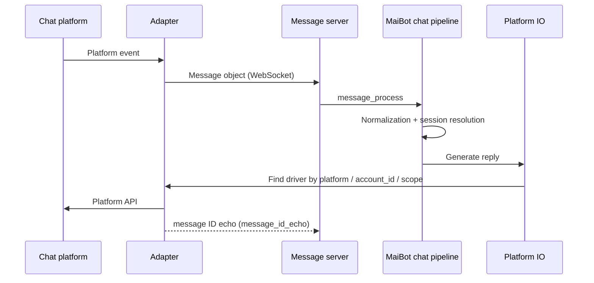

# Message Protocol Reference

**MaiBot understands exactly one unified message format, and an adapter's whole job is to translate platform messages into it and translate replies back.** This page is the reference table you keep next to you while writing an adapter: how the connection is established, what the messages look like, which fields are required, and where things fail silently.

MaiBot provides two WebSocket services with different message formats, so first confirm which one you are connecting to.

## How the Two Services Differ

**Legacy message server** — enabled by default. The message is the message object itself, with no outer envelope; authentication uses the `authorization` header. Almost every existing adapter uses this one.

**API server (Additional API Server)** — must be enabled explicitly. Each message carries an extra envelope (`msg_id`, `type`, `meta`, `payload`), and it supports multiple connections, ACK confirmation, and resend after a reconnect.

::: endpoint WS /ws (Legacy)
The connection endpoint of the legacy message server. The address comes from `maim_message.ws_server_host` and `maim_message.ws_server_port` in `config/bot_config.toml`, defaulting to `ws://127.0.0.1:8000/ws`.

::: fields
- **Handshake header `platform`** — required. The platform name, which decides what platform the message belongs to; when omitted, the library writes `unknown` and MaiBot cannot route it.
- **Handshake header `authorization`** — validated only when `maim_message.auth_token` is non-empty; the value is the **raw token**, with no `Bearer` parsing.
- **Authentication failure** — the server disconnects with close code `1008` (reason `无效的令牌`, "invalid token").
- **One connection per platform** — only the newest connection is kept for a given `platform`; the old one is pushed out with close code `1000` (reason `新的连接已建立`, "a new connection has been established").
- **Heartbeat** — protocol-level WebSocket PING/PONG; there is no JSON heartbeat message. The server sends one every 30 seconds and disconnects after 10 seconds without a response.
- **Single-frame limit** — 100 MB.
:::
:::

::: endpoint WS /ws (API)
The connection endpoint of the API server. The address comes from `maim_message.api_server_host` and `maim_message.api_server_port`, defaulting to `ws://0.0.0.0:8090/ws`. You must first set `maim_message.enable_api_server` to `true`.

::: fields
- **`x-apikey`** — the API Key, which can go in a request header or in the query string `?api_key=`. **The query string wins**.
- **`x-platform`** — the platform name; `?platform=` is supported the same way, and the query string wins.
- **`x-uuid`** — the connection identifier; the server generates one if you don't pass it. Use it to tell multiple connections on the same platform apart.
- **Authentication failure** — close code `1000` (not 1008), with an explanation in the reason.
- **Allowlist** — an empty `maim_message.api_server_allowed_api_keys` means **no validation**; the default listen address is `0.0.0.0`, so always populate the allowlist before exposing it.
- **Heartbeat** — also protocol-level PING/PONG, at uvicorn's default interval.
:::
:::

## Legacy Message: One Message Object

The legacy path sends a message object directly, with two top-level fields:

**`message_info`** — message metadata. `platform`, `message_id`, and `time` are required; `group_info`, `user_info`, and `additional_config` are the key to routing and business logic.

**`message_segment`** — the message body, shaped like `{"type": "...", "data": ...}`; when `type` is `seglist`, `data` is an array of segments.

::: code-group

```json [Group message ~vscode-icons:file-type-json~]
{
  "message_info": {
    "platform": "telegram",
    "message_id": "114514",
    "time": 1750000000.0,
    "group_info": {
      "platform": "telegram",
      "group_id": "-1001234567890",
      "group_name": "摸鱼群"
    },
    "user_info": {
      "platform": "telegram",
      "user_id": "10086",
      "user_nickname": "阿岚",
      "user_cardname": "岚"
    },
    "additional_config": {
      "platform_io_account_id": "bot_1"
    }
  },
  "message_segment": {
    "type": "text",
    "data": "麦麦在吗"
  }
}
```

:::

::: warning Never omit either `user_info` or `group_info`
During normalization MaiBot asserts outright that `user_info.user_id` and `user_info.user_nickname` are non-empty strings, and group messages additionally require `group_info.group_id` and `group_info.group_name` to be non-empty strings. A missing field is not a friendly error—it throws an assertion and the message is dropped.
:::

## Segment Types

`message_segment.type` decides the type of `data`; inbound accepts these values:

::: fields
- **`text`** — `string`. Plain text.
- **`image`** — `string`. The base64 content of an image.
- **`emoji`** — `string`. The base64 content of an emoji image.
- **`voice`** — `string`. The base64 content of a voice clip.
- **`file`** — `object`. File information.
- **`at`** — `string` or `object`. The user ID being @-mentioned; a OneBot-style dict is also accepted.
- **`reply`** — `string`. The ID of the message being replied to.
- **`dict`** — `object`. A custom structured payload.
- **`seglist`** — `Seg[]`. An array of segments for mixed text and images; almost all outbound messages take this shape.
:::

Any other type throws `NotImplementedError` outright. A mismatch between the type and `data` (for example, passing a number as `text`) crashes the same way, so **run `str()` over it before sending**.

## Reading Outbound Messages

When MaiBot replies, what it pushes to the adapter is still a message object, but the body is usually a `seglist`, and you have to translate each `type` into a platform action yourself:

::: code-group

```json [Outbound ~vscode-icons:file-type-json~]
{
  "message_info": {
    "platform": "telegram",
    "message_id": "1750000000.123",
    "time": 1750000000.0,
    "group_info": { "platform": "telegram", "group_id": "-1001234567890", "group_name": "摸鱼群" },
    "user_info": { "platform": "telegram", "user_id": "0", "user_nickname": "MaiBot" },
    "additional_config": { "platform_io_target_user_id": "" }
  },
  "message_segment": {
    "type": "seglist",
    "data": [
      { "type": "text", "data": "在的，" },
      { "type": "at", "data": "10086" },
      { "type": "text", "data": " 怎么了" }
    ]
  }
}
```

:::

Outbound private messages rely on `additional_config.platform_io_target_user_id` to find the recipient—MaiBot inherits it from the session, so the adapter should only read it, never change it.

## API Message: Envelope + Payload

The API server wraps the message object in one more envelope with five fixed fields:

::: fields
- **`ver`** — integer, always `1`. Neither side validates it.
- **`msg_id`** — string. The unique message identifier; outbound IDs from the server look like `msg_<12 hex digits>_<second-level timestamp>`, while ACKs use a UUID.
- **`type`** — string. `sys_std` for standard messages, `custom_*` for custom messages, `sys_ack` for confirmations; any other `sys_*` is silently ignored by the server.
- **`meta`** — object. Outbound it holds `sender_user`, `target_user`, `platform`, and `timestamp`; inbound there is no `target_user`, and `sender_user` carries the **API Key**.
- **`payload`** — object. For `sys_std` it is a message object; for `custom_*` it is an arbitrary business payload.
:::

On the API path the payload uses `APIMessageBase`, which adds a `message_dim` compared with the legacy format and gathers group / user information into `sender_info` / `receiver_info`:

::: fields
- **`message_info.platform`** — required.
- **`message_info.message_id`** — required.
- **`message_info.time`** — required, float seconds.
- **`message_info.sender_info`** — the sender, containing `group_info` and `user_info`.
- **`message_info.receiver_info`** — the receiver, with the same structure, used outbound to locate the recipient.
- **`message_segment`** — as above, `{type, data}`.
- **`message_dim.api_key`** — required. Outbound routing uses it to decide who the message is delivered to.
- **`message_dim.platform`** — required.
:::

If a `payload` is missing both `message_info` and `message_segment`, the whole payload is treated as one text message and stuffed into a `text` segment—a fallback that hides bugs very easily.

### ACKs and Reliability

When the server receives a message that carries a `msg_id` and whose type is not `sys_ack`, it immediately sends back a confirmation: the envelope `type` is `sys_ack`, `meta.acked_msg_id` points at the acknowledged message, and `payload` looks like `{"status": "received", "server_timestamp": 1750000000.0}`.

**`sys_ack` never enters business dispatch**; it exists only for reliable delivery: when a send fails or the connection is down, messages enter a cache keyed by `msg_id` (300 seconds and at most 1000 entries by default) and are resent automatically once the connection is back, leaving the cache as soon as the ACK arrives. Outbound messages are discarded after more than 5 minutes of disconnection.

The server deduplicates by `msg_id` over a **1-hour** window: resending the same `msg_id` within an hour is silently dropped. So **a retry must use a new `msg_id`**.

## Message ID Echo

The real message ID from the platform is usually only known after a send succeeds, while MaiBot has already generated its own ID when it queued the message. The echo mechanism reconciles the two:

After a successful send, the adapter sends a custom message with a payload like this:

::: code-group

```json [Echo payload ~vscode-icons:file-type-json~]
{
  "type": "echo",
  "echo": "1750000000.123",
  "actual_id": "114515"
}
```

:::

- **`echo`** — the `message_id` of MaiBot's outbound message.
- **`actual_id`** — the real message ID returned by the platform.

These two calls belong to two different classes and take a different number of arguments — do not mix them up:

**Adapter side — `MessageClient.send_custom_message(message_type_name, message)` (2 arguments)** — an adapter is a client once it connects to MaiBot, so `platform` comes from the connection identity and is not passed; the type name is the first argument on its own.

**MaiBot server side — `MessageServer.send_custom_message(platform, message_type_name, message)` (3 arguments)** — the first argument is the target platform name, which the server uses to send a custom message back to the matching adapter connection; the adapter side never uses this signature.

Pick the type name according to which service you connect to: for the **legacy service** use `"message_id_echo"` — the type name is a separate field and needs no prefix; for the **API server** the envelope `type` must be the full name starting with `custom_`, that is `"custom_message_id_echo"` (the API client adds the missing `custom_` prefix automatically), and the receiving side dispatches on that prefix.

When MaiBot cannot find the matching message, it only writes a debug log entry and the main flow is unaffected.

## Routing Fields

Outbound routing finds "which driver to use" through three routing dimensions:

::: fields
- **`platform`** — the platform name. Normalized with `strip().lower()`, so a case mismatch makes the message unroutable.
- **`account_id`** — the account. Used to tell multiple accounts on the same platform apart.
- **`scope`** — the scope. Used to tell multiple connections under the same account (such as several client instances) apart.
:::

The adapter reports these three values through `additional_config`; several key spellings are accepted, so pick any one:

**Account** — `platform_io_account_id`, `account_id`, `self_id`, `bot_account`

**Scope** — `platform_io_scope`, `route_scope`, `adapter_scope`, `connection_id`

They can sit at the top level of the message, inside `message_info`, or inside `message_info.additional_config`.

::: warning Don't take the `webui` platform name
Platform IO implicitly registers `webui` as a built-in platform, and `bot_console` and `maisaka_cli` are reserved names as well. Give your adapter a name of its own, such as `telegram`.
:::

## The Full Round Trip



Inbound order is not guaranteed: the server processes received messages concurrently. An adapter that needs strict ordering has to serialize them itself.

## Verify and Troubleshoot

**Minimal verification** — connect to the server with the `maim_message` client, send one `text` message to a test group, and MaiBot's console should show an inbound log entry.

- **The connection is closed immediately with code 1008** — `auth_token` is configured but the token is wrong; remember the value is raw, so adding a `Bearer ` prefix fails authentication.
- **Connected, but MaiBot shows no reaction at all** — most likely `platform` is missing or disagrees with the record in the policy; check the platform name in the handshake header / `message_dim` first.
- **An assertion error after you send a message** — check that `user_info.user_id`, `user_info.user_nickname`, `group_info.group_id`, and `group_info.group_name` are all non-empty strings, and that the `data` of a `text` segment is a string.
- **Replies never go out** — make sure outbound messages can route to your driver: identical `platform` spelling, and `account_id` / `scope` matching what you reported inbound.
- **Messages duplicated or lost** — on the API path, resending the same `msg_id` within an hour is dropped, so a retry needs a new ID; outbound messages are discarded after more than 5 minutes of disconnection.
- **Repeatedly kicked offline** — two legacy connections were started under the same `platform`; stop the extra one.
