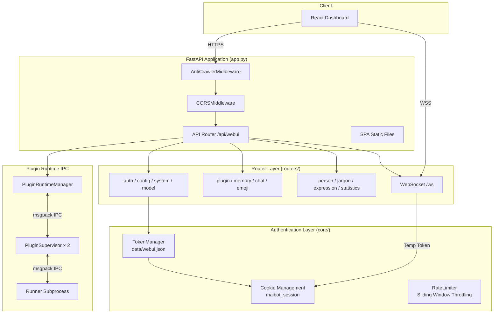
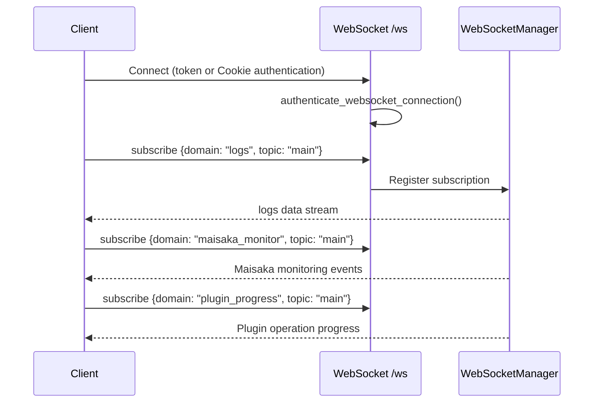
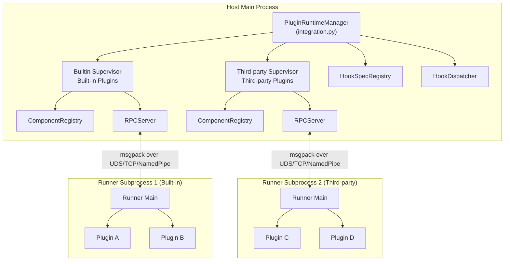
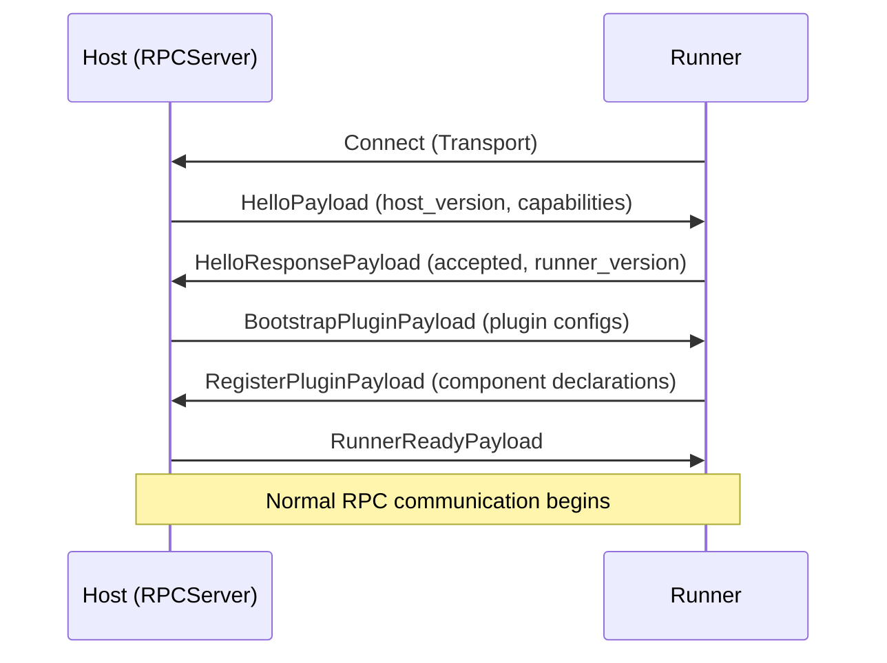
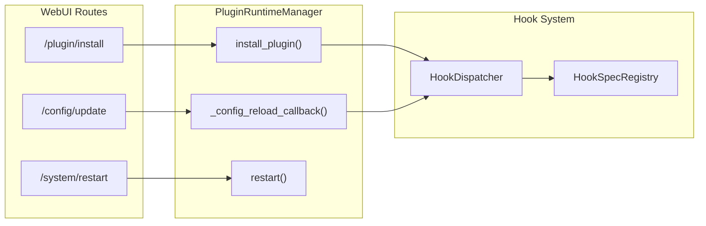

# WebUI Internals

MaiBot WebUI is a FastAPI-based web management backend that provides plugin management, configuration editing, authentication, WebSocket communication, and more. This document details its architecture, security mechanisms, and communication protocols.

## Overall Architecture



## FastAPI Application Factory

Source: `src/webui/app.py`

`create_app()` creates a FastAPI instance and configures middleware and routes:

```python
def create_app(host="0.0.0.0", port=8001, enable_static=True) -> FastAPI:
    app = FastAPI(title="MaiBot WebUI")
    _setup_anti_crawler(app)   # Anti-crawler middleware
    _setup_cors(app, port)     # CORS configuration
    _register_api_routes(app)  # Register API routes
    _setup_robots_txt(app)     # robots.txt
    if enable_static:
        _setup_static_files(app)  # SPA static files + path traversal protection
    return app
```

### CORS Configuration

Only allows localhost origins (development port + service port):

```python
allow_origins = [
    "http://localhost:5173",      # Vite dev server
    "http://127.0.0.1:5173",
    f"http://localhost:{port}",   # WebUI service port
    f"http://127.0.0.1:{port}",
]
allow_credentials = True
```

### Static File Security

`_resolve_safe_static_file_path()` uses `resolve()` + `relative_to()` double-check to prevent path traversal.

## Authentication and Security

### Token Manager

Source: `src/webui/core/security.py`

`TokenManager` manages WebUI access tokens:

| Method | Description |
|------|------|
| `_create_new_token()` | Generates a 64-character hex token (`secrets.token_hex(32)`) |
| `get_token()` | Gets the current valid token |
| `verify_token(token)` | Verifies token (`secrets.compare_digest` to prevent timing attacks) |
| `update_token(new_token)` | Updates token (requires ≥10 characters, including uppercase, lowercase, and special symbols) |
| `regenerate_token()` | Regenerates a random token |
| `is_first_setup()` | Checks if this is first-time setup |
| `mark_setup_completed()` | Marks setup as completed |

Tokens are stored in `data/webui.json` (plain-text JSON), relying on file system permissions for protection.

### Cookie Authentication

Source: `src/webui/core/auth.py`

| Configuration | Value |
|------|-----|
| Cookie Name | `maibot_session` |
| Validity Period | 7 days |
| HttpOnly | ✓ (prevents JS access) |
| SameSite | `lax` |
| Secure | Auto-determined based on environment |

Authentication flow:

```mermaid
sequenceDiagram
    participant C as Client
    participant S as Server
    participant T as TokenManager

    C->>S: POST /auth/verify {token}
    S->>T: verify_token(token)
    T-->>S: valid
    S->>C: Set-Cookie: maibot_session=token; HttpOnly; SameSite=lax
    C->>S: GET /api/webui/... (Cookie: maibot_session=token)
    S->>T: verify_token(cookie_value)
    T-->>S: valid
    S-->>C: 200 OK
```

Secure flag determination logic:
1. Read configuration `webui.secure_cookie`
2. Check `webui.mode == "production"`
3. Check request header `X-Forwarded-Proto` or `request.url.scheme`
4. HTTP connections force-disable Secure (even if configuration requires it)

### Rate Limiter

Source: `src/webui/core/rate_limiter.py`

In-memory sliding window rate limiter:

| Scenario | Limit | Ban |
|------|------|------|
| Authentication endpoints | 10 requests/min/IP | 5 consecutive failures → 10-minute ban |
| General API | 100 requests/min/IP | — |

::: warning
The rate limiter is in-memory and cannot share state across multiple instances.
:::

### Anti-Crawler Middleware

Source: `src/webui/middleware/anti_crawler.py`

`AntiCrawlerMiddleware` provides four levels of operation:

| Mode | Description |
|------|------|
| `false` | Disabled |
| `basic` | Log only, no blocking (default) |
| `loose` | 60 requests/min limit, blocks detected crawlers |
| `strict` | 15 requests/min limit, stricter detection |

Detection dimensions:
- **User-Agent**: Matches crawler/scanner tool keywords (googlebot, nmap, shodan, etc.)
- **HTTP Headers**: Detects asset mapping tool characteristic headers (x-scan, x-scanner, etc.)
- **IP Whitelist**: Supports exact IP, CIDR, and wildcard formats
- **Rate Limiting**: Sliding window request counting

## WebSocket Communication

### Unified WebSocket

Source: `src/webui/routers/websocket/unified.py`

The WebSocket endpoint `/ws` supports multi-domain subscription and invocation:



### WebSocket Authentication

Source: `src/webui/routers/websocket/auth.py`

Dual-channel authentication mechanism:

1. **Temporary Token** (recommended): First obtain a 60-second-valid temporary token via `GET /api/webui/ws-token`, then pass it during the WebSocket handshake
2. **Cookie**: Directly use the `maibot_session` Cookie for authentication

Temporary token characteristics:
- 60-second validity period
- One-time use (deleted immediately after verification)
- Verifies that the original session token is still valid

### Subscription Domains

| Domain | Topic | Description |
|----|------|------|
| `logs` | `main` | Log stream |
| `maisaka_monitor` | `main` | Maisaka reasoning monitoring events |
| `plugin_progress` | `main` | Plugin operation progress |
| `chat` | `chat_id` | Chat message stream |

## Plugin Management IPC

### Plugin Runtime Architecture



### IPC Protocol

Source: `src/plugin_runtime/protocol/`

**Protocol constants**:
- `PROTOCOL_VERSION = "1.0.0"`
- `MIN_SDK_VERSION` / `MAX_SDK_VERSION`: SDK version compatibility range

**Envelope structure**:

| Field | Type | Description |
|------|------|------|
| `protocol_version` | `str` | Protocol version |
| `request_id` | `str` | Unique request ID |
| `message_type` | `MessageType` | REQUEST / RESPONSE / BROADCAST |
| `method` | `str` | RPC method name |
| `plugin_id` | `str` | Plugin ID |
| `timestamp_ms` | `int` | Timestamp |
| `timeout_ms` | `int` | Timeout |
| `payload` | `dict` | Payload |
| `error` | `RPCError` | Error information |

**Message types**:
- `REQUEST`: RPC request from Host → Runner or Runner → Host
- `RESPONSE`: Response to a REQUEST
- `BROADCAST`: One-to-many notification

### Handshake Flow



### Transport Layer

Source: `src/plugin_runtime/transport/`

Frame format: 4-byte big-endian length prefix + msgpack-encoded Envelope.

| Transport | Platform | Description |
|----------|------|------|
| UDS (Unix Domain Socket) | Linux / macOS | Default choice |
| Named Pipe | Windows | Windows default |
| TCP | All platforms | Used when explicitly configured |

The transport factory automatically selects the optimal transport based on the runtime platform.

### Codec

Source: `src/plugin_runtime/protocol/codec.py`

Uses msgpack for Envelope serialization and deserialization.

## Configuration Hot Reload

### WebUI Hot Reload

Source: `src/webui/webui_server.py`

WebUI registers a callback via `_maybe_register_reload_callback()`, which is triggered when configuration files change:

1. Configuration manager detects TOML file changes
2. Triggers `_reload_app()` callback
3. Calls `create_app()` to recreate the FastAPI instance
4. Uvicorn switches to the new application

### Plugin Runtime Hot Reload

Source: `src/plugin_runtime/integration.py`

`PluginRuntimeManager` monitors configuration and plugin source code changes:

1. **Configuration change**: `_config_reload_callback()` is triggered
2. **Dependency analysis**: `DependencyPipeline` calculates affected plugins
3. **Restart plan**: Determines whether Runner restart is needed based on change type
4. **Execute restart**: `_handle_main_config_reload()` coordinates restart of all Supervisors

## Route Overview

Source: `src/webui/routes.py`

All API routes are mounted under the `/api/webui` prefix:

| Route Module | Prefix | Description |
|----------|------|------|
| `config_router` | `/config` | Configuration read/write (TOML) |
| `system_router` | `/system` | System control (restart/status) |
| `model_router` | `/model` | Model management |
| `memory_router` | `/memory` | Long-term memory management |
| `chat_router` | `/chat` | WebUI chat API |
| `emoji_router` | `/emoji` | Emoji management |
| `expression_router` | `/expression` | Expression management |
| `jargon_router` | `/jargon` | Jargon/term management |
| `person_router` | `/person` | Person information management |
| `plugin_router` | `/plugin` | Plugin install/uninstall/update/configure |
| `statistics_router` | `/statistics` | Statistics data |
| `ws_auth_router` | `/ws-token` | WebSocket temporary token |
| `unified_ws_router` | `/ws` | Unified WebSocket |

### Authentication Endpoints

| Endpoint | Method | Auth Required | Description |
|------|------|------|------|
| `/health` | GET | ✗ | Health check |
| `/auth/verify` | POST | ✗ | Verify token and set cookie |
| `/auth/logout` | POST | ✓ | Clear cookie |
| `/auth/check` | GET | ✓ | Check authentication status |
| `/auth/update` | POST | ✓ | Update token |
| `/auth/regenerate` | POST | ✓ | Regenerate token |
| `/setup/status` | GET | ✗ | First-time setup status |
| `/setup/complete` | POST | ✓ | Mark setup as completed |

## Dependency Injection

Source: `src/webui/dependencies.py`

FastAPI dependency injection provides authentication and rate limiting:

| Dependency | Description |
|------|------|
| `require_auth` | Verifies token in Cookie |
| `require_auth_with_rate_limit` | Verifies token + API rate limiting |
| `verify_token_optional` | Optional verification (not enforced) |
| `require_plugin_token` | Plugin-specific authentication |
| `check_auth_rate_limit` | Authentication endpoint rate limiting |
| `check_api_rate_limit` | General API rate limiting |

## SSRF Protection

Source: `src/webui/utils/network_security.py`

`validate_public_url()` blocks access to private addresses:

- 127.0.0.1 / ::1 (localhost)
- 10.0.0.0/8, 172.16.0.0/12, 192.168.0.0/16 (private networks)
- 169.254.0.0/16 (link-local)
- Other reserved address ranges

Applies to plugin installation URLs, image URLs, and other external request scenarios.

## Hook System and WebUI Interaction

WebUI interacts with the Hook system through `PluginRuntimeManager`:



## Security Audit Points

| Severity | Issue | Location |
|------|------|------|
| 🔴 High | File upload has no type/size validation | `routers/memory.py` |
| 🔴 High | WebSocket has no Origin validation | `routers/websocket/unified.py` |
| 🔴 High | Config API leaks API Key | `routers/config.py` |
| 🟡 Medium | No CSRF protection | Global |
| 🟡 Medium | No CSP headers | Global |
| 🟡 Medium | System restart has no secondary confirmation | `routers/system.py` |
| 🟢 Low | In-memory rate limiter not shared | `core/rate_limiter.py` |

::: warning
Production deployments must use a reverse proxy (such as Nginx), configure HTTPS, and set appropriate CORS and security headers.
:::
