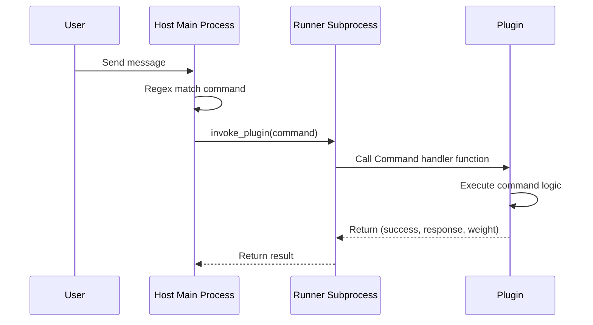

# Command Component

`@Command` is a regex-based command component. When a user's sent message matches a Command's regex pattern, MaiBot schedules the execution of the corresponding Command handler function.

## Decorator Signature

```python
from maibot_sdk import Command

@Command(
    name: str,                    # Command name (required)
    description: str = "",        # Command description
    pattern: str = "",            # Regex matching pattern
    aliases: list[str] | None = None,  # Command alias list
    **metadata,                   # Additional metadata
)
```

### Parameter Description

| Parameter | Type | Description |
|-----------|------|-------------|
| `name` | `str` | Command name, must be unique within the plugin |
| `description` | `str` | Command description |
| `pattern` | `str` | Regex matching pattern string. When a user message matches this pattern, the command is triggered |
| `aliases` | `list[str] \| None` | Command alias list, providing additional trigger methods |

## Basic Usage

```python
from maibot_sdk import MaiBotPlugin, Command


class MyPlugin(MaiBotPlugin):
    @Command("hello", pattern=r"^/hello")
    async def handle_hello(self, **kwargs):
        await self.ctx.send.text("Hello!", kwargs["stream_id"])
        return True, "Hello!", 2
```

### Command with Aliases

```python
@Command("greet", pattern=r"^/greet", aliases=["/hi", "/hey"])
async def handle_greet(self, **kwargs):
    await self.ctx.send.text("Hello!", kwargs["stream_id"])
    return True, "Hello!", 2
```

Using `/greet`, `/hi`, or `/hey` will all trigger this command.

### Command with Regex Capture Groups

```python
import re

@Command("echo", pattern=r"^/echo\s+(?P<text>.+)$")
async def handle_echo(self, **kwargs):
    matched = kwargs.get("matched_groups", {})
    text = matched.get("text", "").strip()
    stream_id = kwargs["stream_id"]
    await self.ctx.send.text(f"Echo: {text}", stream_id)
    return True, f"Echo: {text}", 1
```

## Handler Function Parameters

Command handler functions receive `**kwargs`, which contains the following parameters:

| Parameter | Type | Description |
|-----------|------|-------------|
| `stream_id` | `str` | Current chat stream ID, used for sending messages |
| `matched_groups` | `dict` | Regex named capture group matching results |
| `raw_message` | `str` | Raw message text sent by the user |
| `message` | `dict` | Complete message object |

### Return Value

Command handler functions must return a triple:

```python
return success, response, weight
```

| Field | Type | Description |
|-------|------|-------------|
| `success` | `bool` | Whether the command executed successfully |
| `response` | `str` | Text description of the command execution result |
| `weight` | `int` | Command priority weight, higher values mean higher priority |

```python
# Command executed successfully
return True, "Operation successful", 2

# Command execution failed
return False, "Parameter error", 1
```

## Regex Pattern Guide

### Recommended Patterns

```python
# Exact match /hello
pattern=r"^/hello$"

# Match /hello with optional parameter
pattern=r"^/hello(?P<name>.+)?$"

# Match /echo with required parameter
pattern=r"^/echo\s+(?P<text>.+)$"

# Match /set with key-value pair
pattern=r"^/set\s+(?P<key>\w+)\s+(?P<value>.+)$"
```

### Using Named Capture Groups

It is recommended to use `(?P<name>...)` named capture groups. Match results can be accessed by name through `kwargs["matched_groups"]`:

```python
@Command("ban", pattern=r"^/ban\s+(?P<user>\w+)(?:\s+(?P<reason>.+))?$")
async def handle_ban(self, **kwargs):
    matched = kwargs.get("matched_groups", {})
    user = matched.get("user", "")
    reason = matched.get("reason", "No reason")
    await self.ctx.send.text(f"Banned {user}, reason: {reason}", kwargs["stream_id"])
    return True, f"Banned {user}", 2
```

## Command Execution Flow



## Command-related Hooks

There are built-in Hook points before and after command execution that `@HookHandler` can subscribe to:

- `chat.command.before_execute`: Triggered before command execution, can abort or rewrite parameters
- `chat.command.after_execute`: Triggered after command execution, can rewrite return results

## Complete Example

```python
from maibot_sdk import MaiBotPlugin, Command, Tool
from maibot_sdk.types import ToolParameterInfo, ToolParamType


class AdminPlugin(MaiBotPlugin):
    async def on_load(self) -> None:
        self.ctx.logger.info("Admin plugin loaded")

    async def on_unload(self) -> None:
        pass

    async def on_config_update(self, scope: str, config_data: dict, version: str) -> None:
        pass

    @Command("status", pattern=r"^/status$")
    async def handle_status(self, **kwargs):
        """Check system status"""
        stream_id = kwargs["stream_id"]
        await self.ctx.send.text("System running normally ✅", stream_id)
        return True, "System running normally", 1

    @Command("echo", pattern=r"^/echo\s+(?P<text>.+)$")
    async def handle_echo(self, **kwargs):
        """Echo message"""
        matched = kwargs.get("matched_groups", {})
        text = matched.get("text", "").strip()
        stream_id = kwargs["stream_id"]
        await self.ctx.send.text(text, stream_id)
        return True, text, 1

    @Command("help", pattern=r"^/help$", aliases=["/帮助"])
    async def handle_help(self, **kwargs):
        """Show help information"""
        stream_id = kwargs["stream_id"]
        help_text = "Available commands:\n/status - Check status\n/echo <text> - Echo message\n/help - Show help"
        await self.ctx.send.text(help_text, stream_id)
        return True, "Help information sent", 1


def create_plugin():
    return AdminPlugin()
```
