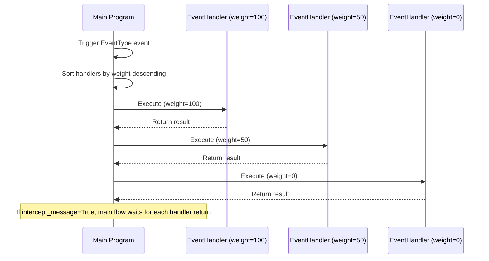

# Event Handler

`@EventHandler` is a component decorator for subscribing to message and workflow events. Unlike `@HookHandler`'s named Hook point mechanism, `@EventHandler` subscribes to events based on fixed `EventType` enum values, suitable for intercepting or observing at specific stages of the message processing flow.

## Decorator Signature

```python
from maibot_sdk import EventHandler
from maibot_sdk.types import EventType

@EventHandler(
    name: str,                                      # Component name (required)
    description: str = "",                          # Component description
    event_type: EventType = EventType.ON_MESSAGE,   # Subscribed event type
    intercept_message: bool = False,                # Whether to block message chain
    weight: int = 0,                                # Weight, higher executes first
    **metadata,                                     # Additional metadata
)
```

## EventType Event Types

| Enum Value | Description |
|--------|------|
| `UNKNOWN` | Unknown event |
| `ON_START` | Plugin startup |
| `ON_STOP` | Plugin stop |
| `ON_MESSAGE_PRE_PROCESS` | Message preprocessing stage (best timing for filtering/interception) |
| `ON_MESSAGE` | Message processing stage |
| `ON_PLAN` | Planning stage |
| `POST_LLM` | After LLM call (response generated) |
| `AFTER_LLM` | After LLM call completed |
| `POST_SEND_PRE_PROCESS` | Send preprocessing stage |
| `POST_SEND` | After message sent |
| `AFTER_SEND` | After message send completed |

## intercept_message Parameter

`intercept_message` controls whether EventHandler participates in the message processing chain in blocking mode:

| Value | Behavior |
|----|------|
| `False` (default) | Async fire-and-forget, doesn't affect main message flow |
| `True` | Synchronous blocking, main program waits for handler return before continuing |

When set to `True`, the handler can intercept, modify, or even prevent subsequent message processing.

## weight Weight

When multiple EventHandlers subscribe to the same `EventType`, `weight` determines execution order:

- **Higher values execute first**
- Default value is `0`
- Consistent with old system's `weight` semantics

## Basic Usage

### ON_START: Plugin Initialization

```python
from maibot_sdk import MaiBotPlugin, EventHandler
from maibot_sdk.types import EventType


class StartupPlugin(MaiBotPlugin):
    async def on_load(self) -> None:
        self.ctx.logger.info("Plugin loaded")

    async def on_unload(self) -> None:
        self.ctx.logger.info("Plugin unloaded")

    async def on_config_update(self, scope: str, config_data: dict, version: str) -> None:
        pass

    @EventHandler(
        "on_startup",
        description="Initialize resources when plugin starts",
        event_type=EventType.ON_START,
    )
    async def handle_startup(self, **kwargs):
        self.ctx.logger.info("Startup event triggered, beginning initialization")
        # Execute initialization logic needed at startup here
```

### ON_MESSAGE_PRE_PROCESS: Message Filtering

```python
from maibot_sdk import MaiBotPlugin, EventHandler
from maibot_sdk.types import EventType


class MessageFilterPlugin(MaiBotPlugin):
    async def on_load(self) -> None:
        self.ctx.logger.info("Message filter plugin loaded")

    async def on_unload(self) -> None:
        self.ctx.logger.info("Message filter plugin unloaded")

    async def on_config_update(self, scope: str, config_data: dict, version: str) -> None:
        pass

    @EventHandler(
        "spam_filter",
        description="Filter spam messages",
        event_type=EventType.ON_MESSAGE_PRE_PROCESS,
        intercept_message=True,   # Blocking mode, can intercept messages
        weight=100,               # High weight, execute first
    )
    async def filter_spam(self, message, **kwargs):
        raw_message = message.get("raw_message", "")
        user_id = message.get("user_info", {}).get("user_id", "")

        # Detect spam messages
        if self._is_spam(raw_message, user_id):
            self.ctx.logger.info("Intercepted spam message: user=%s, text=%s", user_id, raw_message)
            return {"intercepted": True, "reason": "spam"}

        # Allow message through
        return {"intercepted": False}

    def _is_spam(self, text: str, user_id: str) -> bool:
        # Simple spam detection logic
        spam_keywords = ["advertisement", "join group", "free"]
        return any(kw in text for kw in spam_keywords)
```

### ON_MESSAGE: Message Observation

```python
from maibot_sdk import MaiBotPlugin, EventHandler
from maibot_sdk.types import EventType


class MessageObserverPlugin(MaiBotPlugin):
    async def on_load(self) -> None:
        self._message_count = 0

    async def on_unload(self) -> None:
        self.ctx.logger.info("Total messages: %d", self._message_count)

    async def on_config_update(self, scope: str, config_data: dict, version: str) -> None:
        pass

    @EventHandler(
        "message_counter",
        description="Count messages",
        event_type=EventType.ON_MESSAGE,
    )
    async def count_message(self, message, **kwargs):
        self._message_count += 1
        self.ctx.logger.debug("Received message %d", self._message_count)
```

### AFTER_LLM: LLM Response Post-processing

```python
from maibot_sdk import MaiBotPlugin, EventHandler
from maibot_sdk.types import EventType


class LLMPostProcessor(MaiBotPlugin):
    async def on_load(self) -> None:
        self.ctx.logger.info("LLM post-processing plugin loaded")

    async def on_unload(self) -> None:
        self.ctx.logger.info("LLM post-processing plugin unloaded")

    async def on_config_update(self, scope: str, config_data: dict, version: str) -> None:
        pass

    @EventHandler(
        "llm_response_logger",
        description="Log LLM responses",
        event_type=EventType.AFTER_LLM,
        weight=50,
    )
    async def log_llm_response(self, **kwargs):
        response = kwargs.get("response", "")
        self.ctx.logger.info("LLM response: %s", response[:200])
```

### POST_SEND: Post-send Callback

```python
from maibot_sdk import MaiBotPlugin, EventHandler
from maibot_sdk.types import EventType


class SendAuditPlugin(MaiBotPlugin):
    async def on_load(self) -> None:
        self.ctx.logger.info("Send audit plugin loaded")

    async def on_unload(self) -> None:
        self.ctx.logger.info("Send audit plugin unloaded")

    async def on_config_update(self, scope: str, config_data: dict, version: str) -> None:
        pass

    @EventHandler(
        "send_audit",
        description="Audit all sent messages",
        event_type=EventType.POST_SEND,
    )
    async def audit_send(self, **kwargs):
        message = kwargs.get("message", {})
        self.ctx.logger.info(
            "Message sent: stream_id=%s",
            message.get("stream_id", "unknown"),
        )
```

## Difference from HookHandler

| Feature | @EventHandler | @HookHandler |
|------|--------------|-------------|
| Subscription Method | `EventType` enum values | Named Hook point strings |
| Granularity | Fixed event types, limited quantity | Custom Hook names, infinitely extensible |
| Interception Method | `intercept_message=True` | `mode=HookMode.BLOCKING` |
| Priority | `weight` numeric weight | `order` three-level enum + global sorting |
| Exception Strategy | No dedicated parameter | Controlled by `error_policy` |
| Use Cases | Fixed stages of message flow | Arbitrary extension points defined by main program |

General principles:
- If you need to execute logic at **fixed stages** of the message flow (e.g., when receiving messages, after LLM returns), use `@EventHandler`
- If you need to subscribe to **specific named Hook points** defined by the main program (e.g., `heart_fc.heart_flow_cycle_start`), use `@HookHandler`

## Event Processing Flow

