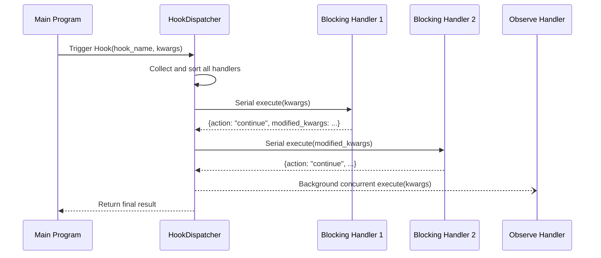

# Hook Handler

`@HookHandler` is a component decorator in MaiBot's plugin system for subscribing to **named Hook points**. The main program triggers named Hooks at key execution points, and all plugin handlers subscribed to that Hook are scheduled to execute according to fixed rules, thereby achieving message interception, rewriting, and observation.

::: warning WorkflowStep Removed
`WorkflowStep` has been replaced by `@HookHandler` in SDK 2.0. Old code still using `WorkflowStep` will raise `RuntimeError` at runtime. This is a non-backward-compatible change — you must migrate to `@HookHandler`.
:::

## Decorator Signature

```python
from maibot_sdk import HookHandler
from maibot_sdk.types import HookMode, HookOrder, ErrorPolicy

@HookHandler(
    hook: str,                              # Named Hook name to subscribe to (required)
    *,
    name: str = "",                         # Component name, uses method name if empty
    description: str = "",                  # Component description
    mode: HookMode = HookMode.BLOCKING,     # Handler mode
    order: HookOrder = HookOrder.NORMAL,    # Order slot within the same mode
    timeout_ms: int = 0,                    # Handler timeout (milliseconds), 0 = use Hook default
    error_policy: ErrorPolicy = ErrorPolicy.SKIP,  # Exception handling policy
    **metadata,                             # Additional metadata
)
```

## Handler Modes

### BLOCKING Mode

- Serial execution, **can modify** incoming `kwargs`
- Returning `modified_kwargs` can update parameters received by subsequent handlers
- Returning `action: "abort"` can terminate the entire Hook call chain
- Suitable for scenarios requiring message interception or rewriting

### OBSERVE Mode

- Background concurrent execution, **read-only** bypass observation
- Does not participate in main flow control — returned `modified_kwargs` and `abort` requests are ignored
- Suitable for scenarios like logging, data analysis that don't affect the main flow

```python
class HookMode(str, Enum):
    BLOCKING = "blocking"  # Sync wait, can modify data
    OBSERVE = "observe"    # Async observation, cannot modify
```

## Order Slots

Handlers within the same mode are sorted and executed by `order`:

| Value | Description |
|-------|-------------|
| `HookOrder.EARLY` | Execute first, suitable for pre-interception |
| `HookOrder.NORMAL` | Default order |
| `HookOrder.LATE` | Execute later, suitable for supplementary processing |

## Error Policy

When a handler raises an exception, subsequent behavior is determined by `error_policy`:

| Value | Description |
|-------|-------------|
| `ErrorPolicy.ABORT` | On exception, abort the current Hook call |
| `ErrorPolicy.SKIP` | Log the error, skip this handler and continue (**default**) |
| `ErrorPolicy.LOG` | Log the error, and continue executing subsequent hooks |

## Scheduling Order

Hook handlers are globally sorted according to the following rules:

1. **Mode priority**: `blocking` before `observe`
2. **Order slot**: `early` → `normal` → `late`
3. **Source priority**: Built-in plugins before third-party plugins
4. **Plugin ID**: Sorted alphabetically
5. **Handler name**: Sorted alphabetically

## Basic Usage

### Blocking Mode Example: Intercept and Modify Messages

```python
from maibot_sdk import MaiBotPlugin, HookHandler
from maibot_sdk.types import HookMode, HookOrder, ErrorPolicy


class MyPlugin(MaiBotPlugin):
    async def on_load(self) -> None:
        self.ctx.logger.info("Plugin loaded")

    async def on_unload(self) -> None:
        self.ctx.logger.info("Plugin unloaded")

    async def on_config_update(self, scope: str, config_data: dict, version: str) -> None:
        pass

    @HookHandler(
        "chat.receive.before_process",
        name="message_filter",
        description="Filter inbound messages",
        mode=HookMode.BLOCKING,
        order=HookOrder.EARLY,
        error_policy=ErrorPolicy.ABORT,
    )
    async def handle_message_filter(self, **kwargs):
        message = kwargs.get("message", {})
        # Filter logic: if message contains banned words, terminate processing chain
        raw_message = message.get("raw_message", "")
        if "banned_word" in raw_message:
            self.ctx.logger.info("Message filtered: %s", raw_message)
            return {"action": "abort"}

        # Modify message content and continue
        kwargs["message"]["filtered"] = True
        return {"action": "continue", "modified_kwargs": kwargs}
```

### Observe Mode Example: Log Recording

```python
from maibot_sdk import MaiBotPlugin, HookHandler
from maibot_sdk.types import HookMode, HookOrder


class LogPlugin(MaiBotPlugin):
    async def on_load(self) -> None:
        self.ctx.logger.info("Log plugin loaded")

    async def on_unload(self) -> None:
        self.ctx.logger.info("Log plugin unloaded")

    async def on_config_update(self, scope: str, config_data: dict, version: str) -> None:
        pass

    @HookHandler(
        "chat.receive.after_process",
        name="message_logger",
        description="Record all inbound messages",
        mode=HookMode.OBSERVE,
        order=HookOrder.LATE,
    )
    async def observe_message(self, **kwargs):
        message = kwargs.get("message", {})
        self.ctx.logger.info(
            "Observed message: user=%s, text=%s",
            message.get("user_id", "unknown"),
            message.get("raw_message", ""),
        )
        # Observe mode return values are ignored
```

### Blocking Mode Example: Modify Send Parameters

```python
from maibot_sdk import MaiBotPlugin, HookHandler
from maibot_sdk.types import HookMode, HookOrder


class SendInterceptorPlugin(MaiBotPlugin):
    async def on_load(self) -> None:
        self.ctx.logger.info("Send interceptor plugin loaded")

    async def on_unload(self) -> None:
        self.ctx.logger.info("Send interceptor plugin unloaded")

    async def on_config_update(self, scope: str, config_data: dict, version: str) -> None:
        pass

    @HookHandler(
        "send_service.before_send",
        name="send_modifier",
        description="Modify send parameters",
        mode=HookMode.BLOCKING,
        order=HookOrder.NORMAL,
        timeout_ms=5000,
    )
    async def modify_send_params(self, **kwargs):
        # Disable typing effect, force enable send log
        kwargs["typing"] = False
        kwargs["show_log"] = True
        return {"action": "continue", "modified_kwargs": kwargs}
```

## Common Hook Names

### Chat Message Chain

| Hook Name | Trigger Timing |
|-----------|---------------|
| `chat.receive.before_process` | Before inbound message executes `process()` |
| `chat.receive.after_process` | After inbound message completes lightweight preprocessing |

### Command Execution Chain

| Hook Name | Trigger Timing |
|-----------|---------------|
| `chat.command.before_execute` | After command matches successfully, before actual execution |
| `chat.command.after_execute` | After command execution ends |

### Send Service Chain

| Hook Name | Trigger Timing |
|-----------|---------------|
| `send_service.after_build_message` | After outbound message is built |
| `send_service.before_send` | Before calling Platform IO to send |
| `send_service.after_send` | After send process ends |

### Heart Flow Cycle Chain

| Hook Name | Trigger Timing |
|-----------|---------------|
| `heart_fc.heart_flow_cycle_start` | When heart flow cycle starts |
| `heart_fc.heart_flow_cycle_end` | When heart flow cycle ends |

### Maisaka Planner Chain

| Hook Name | Trigger Timing |
|-----------|---------------|
| `maisaka.planner.before_request` | Before sending planning request to model |
| `maisaka.planner.after_response` | After receiving model response |

## Handler Return Values

Blocking mode handlers can return a dictionary to control the subsequent flow:

| Return Field | Type | Description |
|-------------|------|-------------|
| `action` | `str` | `"continue"` to continue the call chain, `"abort"` to terminate it |
| `modified_kwargs` | `dict` | Modified parameters, will be passed to subsequent handlers |

Observe mode handler return values are ignored — no need to return a control dictionary.

## Hook Dispatch Flow



## Migration Guide: WorkflowStep → HookHandler

| Old API | New API | Description |
|---------|---------|-------------|
| `@WorkflowStep(stage="pre_process")` | `@HookHandler("chat.receive.before_process")` | Use named Hook points instead of fixed stages |
| `blocking=True` | `mode=HookMode.BLOCKING` | Parameter name change |
| `observe=True` | `mode=HookMode.OBSERVE` | Parameter name change |
| `priority=10` | `order=HookOrder.EARLY` | Changed to three-tier enum |

::: danger
Calling `WorkflowStep(...)` directly now immediately raises `RuntimeError` — there is no compatibility mapping. You must manually replace all `@WorkflowStep` with `@HookHandler`.
:::

```python
# Old code (SDK 1.x) — no longer works
@WorkflowStep(stage="pre_process", blocking=True)
async def on_pre_process(self, **kwargs):
    ...

# New code (SDK 2.0)
@HookHandler("chat.receive.before_process", mode=HookMode.BLOCKING)
async def on_pre_process(self, **kwargs):
    ...
```
