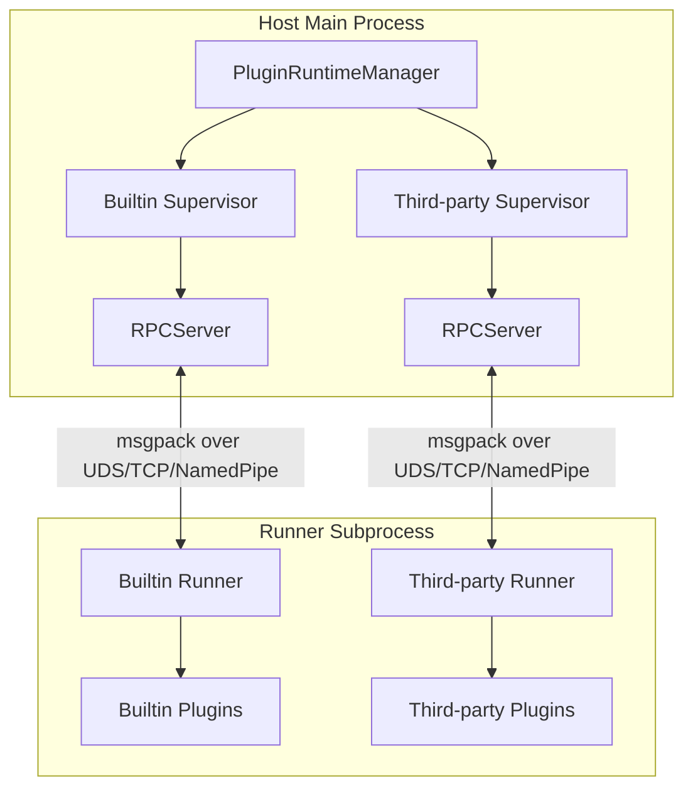

# Plugin Development Guide

MaiBot's plugin system uses a Host/Runner IPC architecture, where plugin code runs in independent subprocesses and communicates with the main process through an RPC protocol encoded with msgpack. This section introduces the plugin system's architecture principles, development workflow, and core concepts.

## Architecture Overview



### Host (Main Process Side)

- **PluginRuntimeManager**: Singleton manager, manages Builtin and Third-party Supervisors
- **PluginSupervisor**: Responsible for Runner subprocess startup, stop, health check, and plugin hot-reload
- **ComponentRegistry**: Component registry, manages all Tool, Command, and other components declared by plugins
- **HookDispatcher**: Hook dispatcher, dispatches named Hook calls to corresponding Supervisors

### Runner (Subprocess Side)

- Each Supervisor manages an independent Runner subprocess
- Uses `PluginLoader` to discover and load plugins
- Communicates with Host through `RPCClient`
- Injects `PluginContext` after plugin loading, then calls `on_load()` lifecycle method

### Communication Protocol

- **Encoding**: Uses msgpack format for binary serialization (`MsgPackCodec`)
- **Transport**: Supports Unix Domain Socket, TCP, and Named Pipe
- **RPC Model**:
  - Host → Runner: Calls plugin components (Tool, Command, etc.) through `invoke_plugin()`
  - Runner → Host: Plugins initiate RPC callbacks through `self.ctx` capability proxies (e.g., `ctx.send.text()`, `ctx.db.query()`)

## Quick Start

### 1. Install the SDK

```bash
pip install maibot-plugin-sdk
```

::: tip Note
The install package name is `maibot-plugin-sdk`, but in code you import using `maibot_sdk`:
```python
from maibot_sdk import MaiBotPlugin, Command, Tool
```
:::

### 2. Create Plugin Directory

```
plugins/
└── my-plugin/
    ├── _manifest.json
    ├── plugin.py
    └── config.toml          # Optional
```

### 3. Write Manifest

Declare plugin metadata in `_manifest.json` (see [Manifest System](./manifest.md) for complete field definitions):

```json
{
  "manifest_version": 2,
  "id": "com.example.my-plugin",
  "version": "1.0.0",
  "name": "My Plugin",
  "description": "An example plugin",
  "author": {
    "name": "Developer",
    "url": "https://github.com/developer"
  },
  "license": "MIT",
  "urls": {
    "repository": "https://github.com/developer/my-plugin"
  },
  "host_application": {
    "min_version": "1.0.0",
    "max_version": "1.99.99"
  },
  "sdk": {
    "min_version": "1.0.0",
    "max_version": "2.99.99"
  },
  "capabilities": ["send_message"],
  "i18n": {
    "default_locale": "zh-CN"
  }
}
```

### 4. Write Plugin Code

Inherit `MaiBotPlugin` in `plugin.py`, declare components with decorators, and implement three lifecycle methods:

```python
from maibot_sdk import MaiBotPlugin, Command, Tool
from maibot_sdk.types import ToolParameterInfo, ToolParamType


class MyPlugin(MaiBotPlugin):
    async def on_load(self) -> None:
        self.ctx.logger.info("Plugin loaded")

    async def on_unload(self) -> None:
        self.ctx.logger.info("Plugin unloaded")

    async def on_config_update(self, scope: str, config_data: dict, version: str) -> None:
        if scope == "self":
            self.ctx.logger.info("Plugin config updated: version=%s", version)

    @Tool(
        "greet",
        brief_description="Greet the user",
        detailed_description="Parameter details:\n- stream_id: string, required. Current chat stream ID.",
        parameters=[
            ToolParameterInfo(
                name="stream_id",
                param_type=ToolParamType.STRING,
                description="Current chat stream ID",
                required=True,
            ),
        ],
    )
    async def handle_greet(self, stream_id: str, **kwargs):
        await self.ctx.send.text("Hello!", stream_id)
        return {"success": True, "message": "Replied"}

    @Command("hello", pattern=r"^/hello")
    async def handle_hello(self, **kwargs):
        await self.ctx.send.text("Hello!", kwargs["stream_id"])
        return True, "Hello!", 2


def create_plugin():
    return MyPlugin()
```

::: warning Must implement all three lifecycle methods
The SDK requires all plugins to implement `on_load()`, `on_unload()`, and `on_config_update()`. Otherwise the Runner will refuse to load the plugin. See [Lifecycle](./lifecycle.md) for details.
:::

### 5. Install and Run

Place the plugin directory in the `plugins/` folder. MaiBot will automatically discover and load the plugin on startup. You can also manage plugins through the WebUI.

## Core Concepts

### Plugin Base Class

All plugins must inherit `MaiBotPlugin`, declaring plugin capabilities through class attributes and decorators:

```python
from maibot_sdk import MaiBotPlugin, Tool, Command, CONFIG_RELOAD_SCOPE_SELF
from typing import ClassVar


class MyPlugin(MaiBotPlugin):
    # Subscribe to global config hot-reload (only "bot" and "model" are valid values)
    config_reload_subscriptions: ClassVar[tuple[str, ...]] = ("bot", "model")

    @Tool("my_tool", brief_description="Example tool")
    async def handle_tool(self, **kwargs):
        ...

    @Command("my_cmd", pattern=r"^/my_cmd")
    async def handle_cmd(self, **kwargs):
        ...


def create_plugin():
    return MyPlugin()
```

### Component Decorators

The SDK provides 7 component decorators, all imported from the `maibot_sdk` top level:

| Decorator | Purpose | Description |
|-----------|---------|-------------|
| `@Tool` | LLM tool/function calling | LLM-callable tool, the most commonly used component type |
| `@Command` | Slash commands | Commands triggered by user via regex matching |
| `@HookHandler` | Named Hook handler | Subscribes to specific Hook points, supports blocking/observe modes |
| `@EventHandler` | Message/workflow events | Listens to lifecycle events such as messages, LLM generation, etc. |
| `@API` | Inter-plugin API | Exposes APIs that can be called by other plugins |
| `@MessageGateway` | Platform adapter | Bridges external platforms (QQ, Discord, etc.) into MaiBot |
| `@Action` | Legacy compatibility | Internally auto-converts to `@Tool`. New plugins should use `@Tool` directly |

### Capability Proxies

Access 15 capability proxies through `self.ctx`. All calls are automatically forwarded to Host via RPC:

```python
# Context access
self.ctx              # PluginContext instance
self.ctx.logger       # logging.Logger, named "plugin.<plugin_id>"

# Capability proxies
self.ctx.api          # Plugin API query, invocation, and dynamic sync
self.ctx.gateway      # Message gateway routing and runtime state reporting
self.ctx.send         # Send text, image, emoji, forward, hybrid messages
self.ctx.db           # Database CRUD and count
self.ctx.llm          # LLM text generation and tool calls
self.ctx.config       # Plugin config reading
self.ctx.emoji        # Emoji management
self.ctx.message      # Historical message queries
self.ctx.frequency    # Talk frequency control
self.ctx.component    # Plugin and component management
self.ctx.chat         # Chat stream queries
self.ctx.person       # User information queries
self.ctx.render       # Render HTML to PNG image
self.ctx.knowledge    # LPMM knowledge base search
self.ctx.tool         # LLM tool definition queries
```

### Configuration Model

Plugins can declare strongly-typed configuration through `PluginConfigBase`. The Runner will automatically generate default config and WebUI Schema:

```python
from maibot_sdk import MaiBotPlugin, PluginConfigBase, Field


class MyPluginConfig(PluginConfigBase):
    enabled: bool = Field(default=True, description="Whether to enable the plugin")
    greeting: str = Field(default="Hello!", description="Default greeting")


class MyPlugin(MaiBotPlugin):
    config_model = MyPluginConfig

    async def on_load(self) -> None:
        # Access strongly-typed config via self.config
        self.ctx.logger.info("Current greeting: %s", self.config.greeting)
        # Access raw dict via self.get_plugin_config_data()
        raw = self.get_plugin_config_data()
```

- After declaring `config_model`, `self.config` returns a strongly-typed config instance
- Calling `self.config` without declaring `config_model` raises `RuntimeError`
- `self.get_plugin_config_data()` is always available, returns raw config dict
- Config source is `config.toml` under the plugin directory

## Directory Structure Convention

```
my-plugin/
├── _manifest.json       # Required: Plugin manifest
├── plugin.py            # Required: Plugin entry, contains create_plugin()
├── config.toml          # Optional: Plugin configuration
├── i18n/                # Optional: Internationalization resources
│   ├── zh-CN.json
│   └── en-US.json
└── assets/              # Optional: Static resources
```

## Built-in Plugins vs Third-party Plugins

MaiBot maintains two independent Runner subprocesses:

- **Built-in Plugins**: Located in `src/plugins/built_in/`, run under Builtin Supervisor
- **Third-party Plugins**: Located in `plugins/`, run under Third-party Supervisor

Both use the same communication protocol and component registration mechanism. The startup order between Supervisors is determined by cross-Supervisor dependency relationships. If circular dependencies are detected, startup is refused.

## Next Steps

- [Manifest System](./manifest.md): Understand complete field definitions and validation rules of `_manifest.json`
- [Lifecycle](./lifecycle.md): Learn about plugin load, unload, and config hot-reload lifecycle methods
- [Hook Handler](./hooks.md): Learn how to use @HookHandler to intercept and rewrite messages
- [Tool Component](./tools.md): Learn how to develop LLM-callable tool components
- [Command Component](./commands.md): Learn how to develop slash command components
- [Action Component](./actions.md): Learn about the legacy @Action decorator
- [Configuration](./config.md): Learn how to declare and use plugin configuration
- [API Reference](./api-reference.md): Browse the complete plugin SDK API
