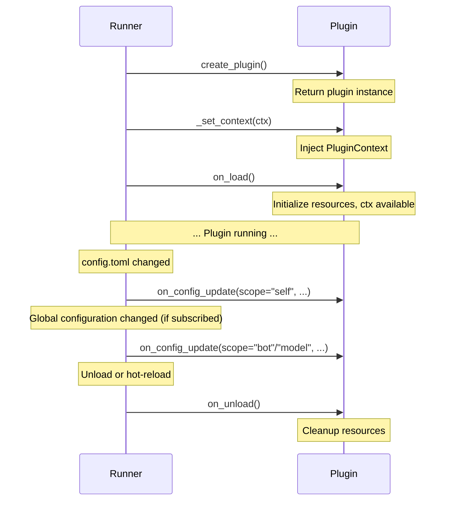

# Lifecycle

MaiBot plugins have three lifecycle methods: `on_load()`, `on_unload()`, and `on_config_update()`. The SDK requires all plugins to implement these three methods, otherwise the Runner will refuse to load.

## create_plugin() Factory Function

Each plugin's `plugin.py` must export a top-level `create_plugin()` function that returns the plugin instance:

```python
from maibot_sdk import MaiBotPlugin


class MyPlugin(MaiBotPlugin):
    async def on_load(self) -> None:
        ...

    async def on_unload(self) -> None:
        ...

    async def on_config_update(self, scope: str, config_data: dict, version: str) -> None:
        ...


def create_plugin():
    return MyPlugin()
```

When the Runner loads a plugin:

1. Imports the `plugin.py` module
2. Calls `create_plugin()` to get the plugin instance
3. Injects `PluginContext` (now `self.ctx` is available)
4. Calls `on_load()`

## on_load()

Callback after plugin loading is complete. The Runner calls this method **after** injecting `PluginContext` and completing capability bootstrap, so you can directly use all capability proxies in `self.ctx`.

```python
async def on_load(self) -> None:
    """Called after plugin loaded. Initialize resources here.

    Runner has already injected PluginContext before calling this,
    so self.ctx is available.
    """
```

**Typical Uses:**

- Initialize plugin internal state
- Call `self.ctx.gateway.update_state()` to report message gateway status
- Call `self.register_dynamic_api()` to register dynamic APIs and `await self.sync_dynamic_apis()`
- Read configuration and initialize resources

**Example:**

```python
from maibot_sdk import MaiBotPlugin, PluginConfigBase, Field


class MyConfig(PluginConfigBase):
    greeting: str = Field(default="Hello!", description="Default greeting message")


class MyPlugin(MaiBotPlugin):
    config_model = MyConfig

    async def on_load(self) -> None:
        # self.ctx has been injected and is ready to use
        self.ctx.logger.info("Plugin loaded, current greeting: %s", self.config.greeting)

        # Can register dynamic APIs here
        self.register_dynamic_api(
            "my_api",
            self._handle_api,
            description="Example API",
            version="1",
            public=True,
        )
        await self.sync_dynamic_apis()

    async def _handle_api(self, **kwargs):
        return {"status": "ok"}
```

## on_unload()

Callback before plugin unloading. Release all resources held by the plugin in this method.

```python
async def on_unload(self) -> None:
    """Called before plugin unloaded. Cleanup resources."""
```

**Typical Uses:**

- Close network connections, file handles
- Report gateway offline status (`self.ctx.gateway.update_state(..., ready=False)`)
- Unregister dynamic APIs
- Save persistent data

**Example:**

```python
class MyPlugin(MaiBotPlugin):
    async def on_unload(self) -> None:
        self.ctx.logger.info("Plugin is unloading")

        # Report message gateway offline
        await self.ctx.gateway.update_state(
            gateway_name="my_gateway",
            ready=False,
        )

        # Clear dynamic APIs
        self.clear_dynamic_apis()
        await self.sync_dynamic_apis(offline_reason="Plugin unloaded")
```

::: warning Note
`self.ctx` can still be used in `on_unload()`, but cleanup work should be completed quickly without time-consuming operations.
:::

## on_config_update()

Configuration hot-reload callback. When plugin configuration or subscribed global configuration changes, the Runner calls this method.

```python
async def on_config_update(
    self,
    scope: str,
    config_data: dict[str, Any],
    version: str,
) -> None:
    """Called when config hot-reloads.

    Args:
        scope: Configuration change scope, values are "self", "bot", or "model".
        config_data: Latest configuration data for the current scope.
        version: Configuration version number.
    """
```

### scope Values

| scope | Constant | Meaning | Trigger Condition |
|-------|------|------|----------|
| `"self"` | `CONFIG_RELOAD_SCOPE_SELF` | Plugin's own configuration | **Always triggered** when `config.toml` in plugin directory changes, no subscription needed |
| `"bot"` | `ON_BOT_CONFIG_RELOAD` | Global Bot configuration | Requires subscription through `config_reload_subscriptions` |
| `"model"` | `ON_MODEL_CONFIG_RELOAD` | LLM model configuration | Requires subscription through `config_reload_subscriptions` |

::: important
- `scope == "self"` callback **always triggers**, no additional subscription needed
- `scope == "bot"` and `scope == "model"` only trigger after declaration in `config_reload_subscriptions`
:::

### Example

```python
from maibot_sdk import MaiBotPlugin, CONFIG_RELOAD_SCOPE_SELF, ON_BOT_CONFIG_RELOAD, ON_MODEL_CONFIG_RELOAD
from typing import ClassVar


class MyPlugin(MaiBotPlugin):
    # Subscribe to hot-reload of bot and model global configurations
    config_reload_subscriptions: ClassVar[tuple[str, ...]] = ("bot", "model")

    async def on_load(self) -> None:
        self.ctx.logger.info("Plugin loaded")

    async def on_unload(self) -> None:
        self.ctx.logger.info("Plugin unloaded")

    async def on_config_update(self, scope: str, config_data: dict, version: str) -> None:
        if scope == CONFIG_RELOAD_SCOPE_SELF:
            # Plugin's own configuration changed, self.config will auto-update
            self.ctx.logger.info("Plugin configuration updated: version=%s", version)
        elif scope == ON_BOT_CONFIG_RELOAD:
            # Global Bot configuration changed
            bot_name = config_data.get("bot_name", "unknown")
            self.ctx.logger.info("Bot configuration updated: bot_name=%s, version=%s", bot_name, version)
        elif scope == ON_MODEL_CONFIG_RELOAD:
            # LLM model configuration changed
            model_name = config_data.get("model_name", "unknown")
            self.ctx.logger.info("Model configuration updated: model=%s, version=%s", model_name, version)
```

## config_reload_subscriptions

Class variable that declares the global configuration hot-reload scopes the plugin needs to subscribe to. Only supports `"bot"` and `"model"` values:

```python
from typing import ClassVar


class MyPlugin(MaiBotPlugin):
    # Subscribe to two global configurations
    config_reload_subscriptions: ClassVar[tuple[str, ...]] = ("bot", "model")

    # Subscribe only to Bot configuration
    # config_reload_subscriptions: ClassVar[tuple[str, ...]] = ("bot",)

    # Subscribe only to Model configuration
    # config_reload_subscriptions: ClassVar[tuple[str, ...]] = ("model",)

    # Don't subscribe to any global configuration (default)
    # config_reload_subscriptions: ClassVar[tuple[str, ...]] = ()
```

**Rules:**

- Default is empty tuple `()`, i.e., no subscription to any global configuration
- `"self"` scope **always triggers** callback, doesn't need and can't be declared here
- Only `"bot"` and `"model"` are valid subscription values
- Declaring unsupported values will throw `ValueError` in `get_config_reload_subscriptions()`
- Cannot directly pass string (e.g., `config_reload_subscriptions = "bot"`), must use iterable collection

## Complete Lifecycle Example

Below is a complete plugin example containing all lifecycle methods:

```python
from typing import Any, ClassVar

from maibot_sdk import (
    CONFIG_RELOAD_SCOPE_SELF,
    Command,
    MaiBotPlugin,
    ON_BOT_CONFIG_RELOAD,
    ON_MODEL_CONFIG_RELOAD,
    Tool,
)
from maibot_sdk.types import ToolParameterInfo, ToolParamType


class GreeterPlugin(MaiBotPlugin):
    """Greeting plugin — demonstrates complete plugin lifecycle."""

    # Subscribe to global configuration hot-reload
    config_reload_subscriptions: ClassVar[tuple[str, ...]] = ("bot", "model")

    async def on_load(self) -> None:
        """Initialize when plugin loads."""
        self.ctx.logger.info("GreeterPlugin loaded")
        # self.ctx is already available here, can directly call capability proxies
        raw_config = self.get_plugin_config_data()
        self.ctx.logger.info("Current configuration: %s", raw_config)

    async def on_unload(self) -> None:
        """Cleanup resources when plugin unloads."""
        self.ctx.logger.info("GreeterPlugin is unloading")

    async def on_config_update(self, scope: str, config_data: dict[str, Any], version: str) -> None:
        """Handle configuration hot updates."""
        if scope == CONFIG_RELOAD_SCOPE_SELF:
            self.ctx.logger.info("Plugin configuration updated: version=%s", version)
        elif scope == ON_BOT_CONFIG_RELOAD:
            self.ctx.logger.info("Bot configuration updated: version=%s", version)
        elif scope == ON_MODEL_CONFIG_RELOAD:
            self.ctx.logger.info("Model configuration updated: version=%s", version)

    @Tool(
        "greet",
        brief_description="Greet the user",
        detailed_description="Parameter description:\n- stream_id: string, required. Current chat stream ID.",
        parameters=[
            ToolParameterInfo(
                name="stream_id",
                param_type=ToolParamType.STRING,
                description="Current chat stream ID",
                required=True,
            ),
        ],
    )
    async def handle_greet(self, stream_id: str, **kwargs):
        await self.ctx.send.text("Hello!", stream_id)
        return {"success": True, "message": "Replied"}

    @Command("hello", pattern=r"^/hello")
    async def handle_hello(self, **kwargs):
        await self.ctx.send.text("Hello!", kwargs["stream_id"])
        return True, "Hello!", 2


def create_plugin():
    return GreeterPlugin()
```

## Lifecycle Sequence

