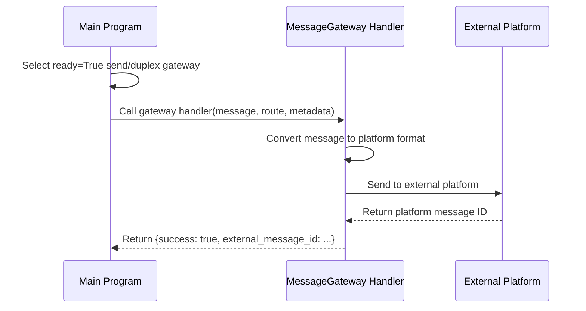
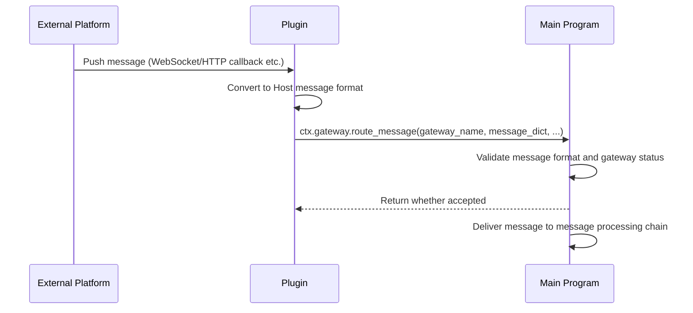
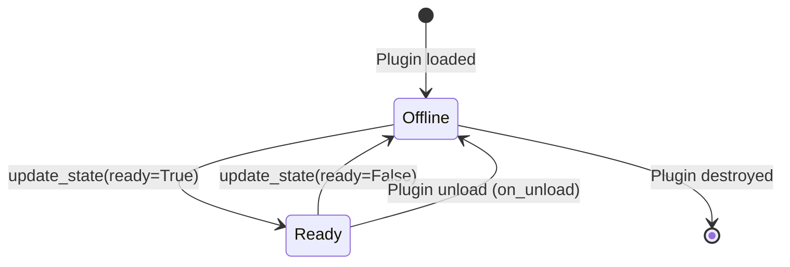

# Message Gateway

The `@MessageGateway` decorator is used to declare message gateway components, enabling bidirectional message routing between MaiBot and external message platforms (like QQ, Discord, etc.). Message gateways are core components of platform adapters, responsible for outbound message sending and inbound message injection.

## Decorator Signature

```python
from maibot_sdk import MessageGateway

@MessageGateway(
    route_type: str,             # Route type: send / receive / duplex (required)
    *,
    name: str = "",              # Component name, uses method name if empty
    description: str = "",       # Component description
    platform: str = "",          # Platform name (e.g., qq, discord)
    protocol: str = "",          # Protocol or access dialect name
    account_id: str = "",        # Account ID / self_id
    scope: str = "",             # Route scope
    **metadata,                  # Additional metadata
)
```

## Route Types

| route_type | Enum Value | Direction | Description |
|------------|--------|------|------|
| `"send"` | `MessageGatewayRouteType.SEND` | Outbound | Host → Plugin → External Platform |
| `"receive"` | `MessageGatewayRouteType.RECEIVE` | Inbound | External Platform → Plugin → Host |
| `"duplex"` | `MessageGatewayRouteType.DUPLEX` | Bidirectional | Supports both outbound and inbound |

::: tip Alias Support
`route_type` also accepts `"recv"` as an alias for `"receive"`.
:::

## ctx.gateway Capability Proxy

| Method | Description |
|------|------|
| `await self.ctx.gateway.route_message(gateway_name, message_dict, route_metadata=None, ...)` | Inject inbound message to Host |
| `await self.ctx.gateway.update_state(gateway_name, ready, platform="", account_id="", scope="", metadata=None)` | Report gateway status |

### Status Management

- Only gateways with `ready=True` will be selected by the main program for message routing
- Gateways with `route_type="send"` or `"duplex"` and `ready=True` can be selected by Platform IO to handle outbound messages
- Gateways with `route_type="receive"` or `"duplex"` and `ready=True` can inject inbound messages through `ctx.gateway.route_message()`
- Plugins should report `ready=True` when the link is available, and `ready=False` when disconnected or unloaded

## Complete Adapter Example

Below is a complete QQ platform adapter example, implementing bidirectional message routing based on the NapCat protocol:

```python
from typing import Any

from maibot_sdk import MaiBotPlugin, MessageGateway


class NapCatGatewayPlugin(MaiBotPlugin):
    async def on_load(self) -> None:
        # Report gateway ready status
        await self.ctx.gateway.update_state(
            gateway_name="napcat_gateway",
            ready=True,
            platform="qq",
            account_id="10001",
            scope="primary",
            metadata={"protocol": "napcat"},
        )
        self.ctx.logger.info("NapCat gateway ready")

    async def on_unload(self) -> None:
        # Report gateway offline
        await self.ctx.gateway.update_state(
            gateway_name="napcat_gateway",
            ready=False,
        )
        self.ctx.logger.info("NapCat gateway offline")

    async def on_config_update(self, scope: str, config_data: dict, version: str) -> None:
        pass

    @MessageGateway(
        route_type="duplex",
        name="napcat_gateway",
        platform="qq",
        protocol="napcat",
        account_id="10001",
        scope="primary",
    )
    async def send_to_platform(
        self,
        message: dict[str, Any],
        route: dict[str, Any] | None = None,
        metadata: dict[str, Any] | None = None,
        **kwargs: Any,
    ) -> dict[str, Any]:
        """Outbound: Forward Host messages to external platform."""
        # Convert Host MessageDict to platform format and send
        platform_msg = self._convert_to_platform_format(message)
        result = await self._send_to_napcat(platform_msg)
        return {"success": True, "external_message_id": result.get("message_id")}

    async def handle_inbound(self, payload: dict[str, Any]) -> None:
        """Inbound: Inject external platform messages into Host.

        This method is triggered by external platform callbacks (like WebSocket push),
        not a component decorator method, but demonstrates the inbound message injection flow.
        """
        accepted = await self.ctx.gateway.route_message(
            gateway_name="napcat_gateway",
            message_dict={
                "message_id": payload["message_id"],
                "platform": "qq",
                "message_info": {
                    "user_info": {
                        "user_id": payload["user_id"],
                        "user_nickname": payload["nickname"],
                    },
                    "additional_config": {},
                },
                "raw_message": payload["message"],
            },
            route_metadata={
                "self_id": "10001",
                "connection_id": "primary",
            },
            external_message_id=payload["message_id"],
            dedupe_key=payload["message_id"],
        )
        if not accepted:
            self.ctx.logger.warning(
                "Host did not accept inbound message: %s", payload["message_id"]
            )

    def _convert_to_platform_format(
        self, message: dict[str, Any]
    ) -> dict[str, Any]:
        """Convert Host message format to platform format."""
        return {
            "action": "send_msg",
            "params": {
                "message_type": "group",
                "group_id": message.get("group_id"),
                "message": message.get("raw_message", ""),
            },
        }

    async def _send_to_napcat(
        self, platform_msg: dict[str, Any]
    ) -> dict[str, Any]:
        """Send message to NapCat API."""
        # In actual implementation, this would call NapCat's HTTP/WebSocket API
        return {"message_id": "platform-msg-1"}


def create_plugin():
    return NapCatGatewayPlugin()
```

## Inbound-only Gateway Example

If you only need to inject messages into MaiBot (like Webhook listening), you can use `route_type="receive"`:

```python
from typing import Any

from maibot_sdk import MaiBotPlugin, MessageGateway


class WebhookReceiverPlugin(MaiBotPlugin):
    async def on_load(self) -> None:
        await self.ctx.gateway.update_state(
            gateway_name="webhook_receiver",
            ready=True,
            platform="webhook",
            scope="default",
        )

    async def on_unload(self) -> None:
        await self.ctx.gateway.update_state(
            gateway_name="webhook_receiver",
            ready=False,
        )

    async def on_config_update(self, scope: str, config_data: dict, version: str) -> None:
        pass

    @MessageGateway(
        route_type="receive",
        name="webhook_receiver",
        platform="webhook",
    )
    async def handle_outbound(self, message: dict[str, Any], **kwargs: Any) -> dict[str, Any]:
        """Inbound-only gateway, won't receive messages in outbound direction."""
        # receive type gateways won't be selected to handle outbound messages
        # This processor won't be called, but must be declared
        return {"success": True}

    async def inject_webhook_message(self, payload: dict[str, Any]) -> None:
        """Receive Webhook callback and inject message."""
        accepted = await self.ctx.gateway.route_message(
            gateway_name="webhook_receiver",
            message_dict={
                "message_id": payload["id"],
                "platform": "webhook",
                "message_info": {
                    "user_info": {
                        "user_id": payload.get("sender", "unknown"),
                        "user_nickname": payload.get("sender_name", "unknown"),
                    },
                    "additional_config": {},
                },
                "raw_message": payload.get("content", ""),
            },
        )
        if accepted:
            self.ctx.logger.info("Webhook message injected")


def create_plugin():
    return WebhookReceiverPlugin()
```

## Gateway Handler Parameters

The handler method decorated with `@MessageGateway` receives the following parameters:

| Parameter | Type | Description |
|------|------|------|
| `self` | `MaiBotPlugin` | Plugin instance |
| `message` | `dict[str, Any]` | Message dictionary from Host (outbound direction) |
| `route` | `dict[str, Any] \| None` | Route information |
| `metadata` | `dict[str, Any] \| None` | Route metadata |
| `**kwargs` | `Any` | Other parameters |

The handler return value is `dict[str, Any]`, which should at least contain a `success` field indicating whether the send was successful.

## Message Routing Flow

### Outbound Flow (Host → External Platform)



### Inbound Flow (External Platform → Host)



## Gateway Lifecycle



::: important
- Plugins should call `ctx.gateway.update_state(ready=True)` in `on_load()` to report ready status
- Plugins should call `ctx.gateway.update_state(ready=False)` in `on_unload()` to report offline status
- Only gateways with `ready=True` will participate in message routing
:::

## Platform Field Description

| Field | Description | Example |
|------|------|------|
| `platform` | Target platform name | `"qq"`, `"discord"`, `"webhook"` |
| `protocol` | Protocol or implementation name | `"napcat"`, `"go-cqhttp"`, `"discord.py"` |
| `account_id` | Bot account ID | `"10001"`, `"bot#1234"` |
| `scope` | Route scope | `"primary"`, `"default"` |

`platform`, `protocol`, `account_id`, `scope` can also be dynamically reported at runtime through `ctx.gateway.update_state()`, no need to be fixed in the decorator.