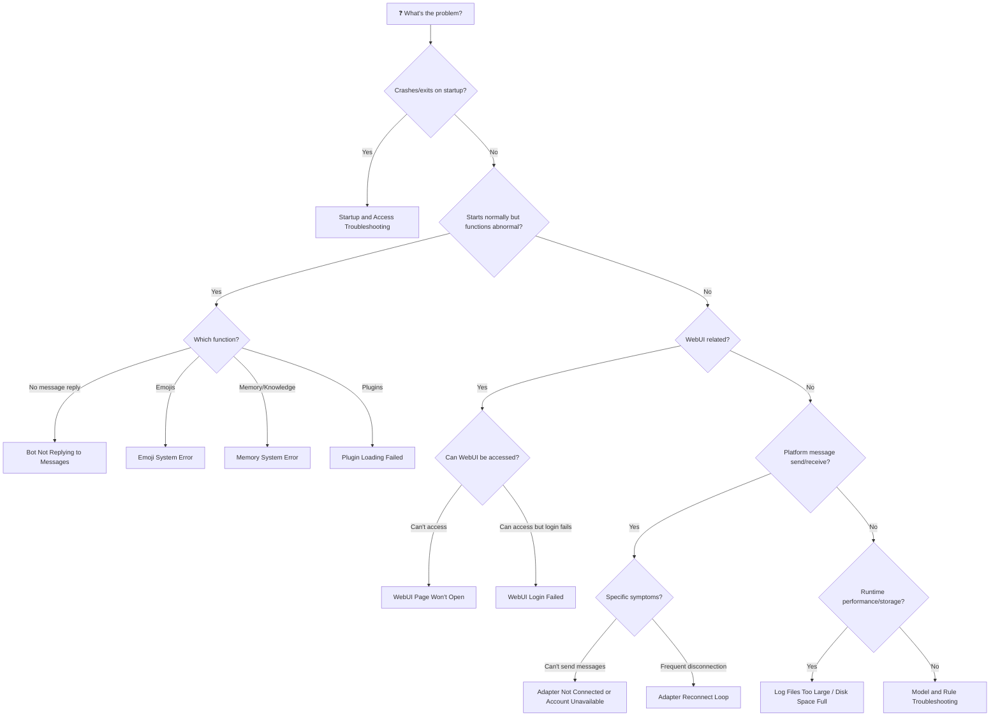

# 🔧 Error Troubleshooting FAQ

> ⚠️ **Network is the root cause of 80% of problems** — API can't connect, Git can't pull, plugins can't install, it's most likely a network issue.
> When encountering any error, first check if you can access the external network (`curl -I https://www.baidu.com`), if not, switch networks / enable proxy.

> Troubleshooting is now split into the topic pages below. Start with "Browse by Topic" to find the right page; when the log already contains a specific error code or keyword, use the "⚡ Error Code Quick Reference" to jump straight there; if you're unsure which category your problem falls into, check the "📋 Error Troubleshooting Flowchart" at the end.

## Browse by Topic

**[Startup and Access Troubleshooting](/en/faq/troubleshooting-startup)** — MaiBot won't start, or the WebUI won't open or won't accept your login: configuration files, MCP, ports, WebUI access and login, and Git operations in the WebUI.

**[Model and Rule Troubleshooting](/en/faq/troubleshooting-model)** — Unexpected bot behavior: API keys and balance, network timeouts, regular expressions, and keyword rules.

**[Runtime and Data Troubleshooting](/en/faq/troubleshooting-runtime)** — Runtime anomalies and data problems: missing replies, databases, emojis, memory, disk space, and person or user data.

**[Plugin and Adapter Troubleshooting](/en/faq/troubleshooting-plugins-adapters)** — Plugins and adapters: plugin loading failures, adapters that are not connected or whose accounts are unavailable, and WebSocket reconnect loops.

**[Getting Help](/en/faq/getting-help)** — Self-checks before asking, the issue checklist, community support channels, and how to export logs.

## ⚡ Error Code Quick Reference

> Quickly locate the corresponding scenario by common keywords in error logs.

### HTTP Status Code Quick Reference

**HTTP 400 Bad Request** 🟧 Severe → [Adapter Not Connected or Account Unavailable](/en/faq/troubleshooting-plugins-adapters#adapter-not-connected-or-account-unavailable) — Request parameter error, message sending failed

**HTTP 401 Unauthorized** 🟥 Fatal → [API Key Error / Insufficient Balance](/en/faq/troubleshooting-model#api-key-error-insufficient-balance) — API Key invalid or missing

**HTTP 401 Unauthorized** 🟧 Severe → [WebUI Login Failed / Token Expired](/en/faq/troubleshooting-startup#webui-login-failed-token-expired) — Session expired or Token invalid

**HTTP 402 Payment Required** 🟧 Severe → [API Key Error / Insufficient Balance](/en/faq/troubleshooting-model#api-key-error-insufficient-balance) — Account balance insufficient

**HTTP 403 Forbidden** 🟥 Fatal → [API Key Error / Insufficient Balance](/en/faq/troubleshooting-model#api-key-error-insufficient-balance) — API Key insufficient permissions

**HTTP 429 Too Many Requests** 🟧 Severe → [Network Timeout / Connection Failure](/en/faq/troubleshooting-model#network-timeout-connection-failure) — Request frequency too high, rate limited

**HTTP 500 Internal Server Error** 🟧 Severe → [Network Timeout / Connection Failure](/en/faq/troubleshooting-model#network-timeout-connection-failure) — API server internal error

**HTTP 502 Bad Gateway** 🟧 Severe → [Network Timeout / Connection Failure](/en/faq/troubleshooting-model#network-timeout-connection-failure) — Gateway error, upstream service unreachable

**HTTP 503 Service Unavailable** 🟧 Severe → [Network Timeout / Connection Failure](/en/faq/troubleshooting-model#network-timeout-connection-failure) — Service temporarily unavailable (overload/maintenance)

### Common Error Keyword Index

**`Address already in use`** / **`[Errno 98]`** / **`[Errno 10048]`** 🟧 Severe → [Port Occupied](/en/faq/troubleshooting-startup#port-occupied) — Port is already in use by another process

**`APIConnectionError`** 🟧 Severe → [Network Timeout / Connection Failure](/en/faq/troubleshooting-model#network-timeout-connection-failure) — API connection failed

**`Connection refused`** / **`无法访问此网站`** 🟥 Fatal → [WebUI Page Won't Open](/en/faq/troubleshooting-startup#webui-page-won-t-open) — WebUI service not started or port unreachable

**`database is locked`** 🟧 Severe → [Database Error](/en/faq/troubleshooting-runtime#database-error) — Database locked by multiple processes

**`DatabaseError`** / **`OperationalError`** 🟧 Severe → [Database Error](/en/faq/troubleshooting-runtime#database-error) — Database operation exception

**`FileNotFoundError`** 🟥 Fatal → [Configuration File Not Found or Incorrect Format](/en/faq/troubleshooting-startup#configuration-file-not-found-or-incorrect-format) — Configuration file does not exist

**`Host version incompatible`** / **`SDK version incompatible`** 🟧 Severe → [Plugin Loading Failed](/en/faq/troubleshooting-plugins-adapters#plugin-loading-failed) — The plugin's declared version range does not cover the current version

**`ImportError`** / **`ModuleNotFoundError`** 🟧 Severe → [Plugin Loading Failed](/en/faq/troubleshooting-plugins-adapters#plugin-loading-failed) — Plugin dependency missing

**`No space left on device`** 🟧 Severe → [Log Files Too Large / Disk Space Full](/en/faq/troubleshooting-runtime#log-files-too-large-disk-space-full) — Disk space insufficient

**`PluginConfigVersionError`** 🟧 Severe → [Plugin Loading Failed](/en/faq/troubleshooting-plugins-adapters#plugin-loading-failed) — Plugin configuration version not supported

**`re.error`** / **`bad escape`** 🟨 Warning → [Invalid Regular Expression](/en/faq/troubleshooting-model#invalid-regular-expression) — Regex syntax error

**`TimeoutError`** 🟧 Severe → [Network Timeout / Connection Failure](/en/faq/troubleshooting-model#network-timeout-connection-failure) — Request timeout

**`Token expired`** 🟨 Warning → [WebUI Login Failed / Token Expired](/en/faq/troubleshooting-startup#webui-login-failed-token-expired) — Login session expired

**`TOML syntax error`** 🟥 Fatal → [Configuration File Not Found or Incorrect Format](/en/faq/troubleshooting-startup#configuration-file-not-found-or-incorrect-format) — Configuration file format error

**`ValueError`** 🟥 Fatal → [MCP Configuration Error](/en/faq/troubleshooting-startup#mcp-configuration-error) — MCP server configuration parameter invalid

**Emoji registration failed** 🟨 Warning → [Emoji System Error](/en/faq/troubleshooting-runtime#emoji-system-error) — Quantity limit exceeded or `data/emojis/` is unwritable

**Memory loading failed** 🟧 Severe → [Memory System Error](/en/faq/troubleshooting-runtime#memory-system-error) — Memory index corrupted or memory directory unwritable

**`Session 过期`** 🟨 Warning → [WebUI Login Failed / Token Expired](/en/faq/troubleshooting-startup#webui-login-failed-token-expired) — Browser session expired

## 📋 Error Troubleshooting Flowchart

> Not sure which category your problem falls into? Follow the flowchart to find the corresponding section.

