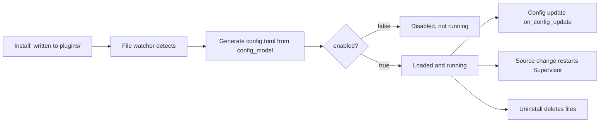

# Manage Plugins

Enable, configure, update, and uninstall installed plugins under "Plugin Extensions" in the WebUI.

## View Plugins

The plugin list shows installed plugins and their runtime status. **Version-locked** plugins are excluded from automatic updates and update notifications.

## Enable / Disable

- Switch ON → the runtime loads the plugin
- Switch OFF → the unload lifecycle runs and the plugin stops
- Normally **takes effect immediately, without restarting all of MaiBot**

## Configure Plugins

Edit API keys, trigger words, and feature switches in the plugin settings. Saving invokes the plugin's `on_config_update` callback.

## Custom Pages

Plugins with a `webui.json` can provide custom pages:

- **Sidebar entries** — shown in the workspace sidebar under "Plugin Extensions"; the entry label and icon come from the plugin itself
- **Top workspace entries** — a plugin can also declare its own top-level workspace. When one plugin has several workspace pages, the first is the default and the rest collapse into "More Plugin Workspaces"
- **Page addresses** — of the form `/extensions/{plugin_id}/{page_id}`; a plugin cannot define custom routes or override built-in entries

**Reorder or hide**: adjust entries under "Plugin Extensions → Manage Plugin Pages". Preferences are stored in the current browser; switching browsers or clearing the cache restores the defaults.

**Changes not taking effect?** Editing `webui.json` requires a **plugin reload** to take effect. After reloading, the browser reflects entries within at most 30 seconds, or refresh manually.

For the full field reference, component types, limits, and troubleshooting, see [WebUI Pages](/en/plugin/webui-pages).

## Install from a ZIP

Upload a `.zip` archive through "Plugin Extensions → More actions → Install plugin from ZIP".

After installation, the file watcher detects the plugin and generates `config.toml` from `config_model`. Plugins whose `enabled` defaults to `false` need manual enabling; normal installation requires no MaiBot restart.

The archive must meet these rules or it is rejected:

- **Size** — the archive is at most 100 MB; unpacked it is at most 300 MB and 10000 files
- **Layout** — `_manifest.json` and `plugin.py` sit in the archive root, or inside a single top-level plugin folder; one archive installs one plugin
- **Content** — no encryption, no `.git` directory, no symbolic links, and no paths such as `../` that escape the folder
- **Not installed yet** — if a plugin with the same ID is already installed, uninstall it first

::: warning Only install archives you trust
A ZIP install skips the plugin market listing. MaiBot only checks that the archive is well-formed, not what the code does. Do not install archives from unknown sources.
:::

## Update Plugins

Click "Update" to download and install a compatible version. Source changes restart the plugin Supervisor and reload the plugin.

"Update" runs an **automatic update**: it moves to the newest stable version compatible with your MaiBot and SDK. It only moves forward — it never auto-downgrades and never overrides a version you locked.

The same plugin cannot run install / update / uninstall at the same time; different plugins can be processed in parallel.

### Install a Specific Version / Downgrade

To install a particular version (including one older than what you have now), open the plugin's **detail page** from the market or plugin extensions and install after selecting a version in the "Install version" card:

- Versions disabled in the dropdown are incompatible with your current MaiBot / SDK, and the reason follows in parentheses (e.g. "Requires MaiBot ≥ 1.4.0")
- "· Recommended" is the newest stable version under the compatibility check and is selected by default
- Switching versions backs up the old directory and keeps `config.toml` / `config_back/` / `data/`, but **does not roll back plugin data**
- If the selected version affects other installed plugins' dependency requirements, it does not block the install: a "plugin dependency reminder" will tell you which plugin may stop working

### Lock a Version

After ticking "Lock this version after install to block automatic updates" under the version dropdown:

- The plugin no longer participates in automatic updates, and the page stops prompting for new versions
- To resume automatic updates, open the detail page, select a version again, and **untick** "Lock this version after install to block automatic updates"

Clicking "Update" on a locked plugin returns "This plugin has a locked version; select a version on the plugin detail page and unlock it before updating".

### Updating Branch-Installed Plugins

Plugins installed through "Install from Git" remain ordinary branch plugins — click "Update" for a `git pull`. Plugins installed from a release can no longer be `git pull`-ed; you get "This plugin was installed from a release; update it through version selection" — pick a version on the detail page instead.

## Uninstall Plugins

After you confirm uninstalling, the plugin stops before its files are deleted.

⚠️ Before uninstalling, confirm whether the plugin stores user data in its own directory—that data may be lost after uninstall. For release-installed plugins, uninstalling also removes the `.maibot-release.json` receipt.

## Lifecycle and Restart Boundary

- **Install** — written to `plugins/` then detected by the watcher; Runner generates `config.toml` from `config_model` defaults; `enabled=false` needs manual enable
- **Enable / Disable** — the runtime loads or unloads the plugin, **no MaiBot restart needed**
- **Config change** — a loaded plugin receives `on_config_update`; setting it disabled unloads it, enabled loads it
- **Source update** — changes to `.py` / `plugin.py` / `_manifest.json` restart the plugin Supervisor; briefly unavailable, core needs no restart
- **Uninstall** — disable and unload first, then delete files

::: warning Restart is only a fallback
Only fully restart MaiBot when the log explicitly reports that watching, loading, unloading, or a config callback failed. Normal plugin management should not require restarting the core.
:::

## FAQ

**Q: Install failed?** Check network and the URL, and review error messages; for release installs, first check whether that version is compatible in the dropdown and whether dependencies are missing.
**Q: A "plugin dependency reminder" popped up?** Another installed plugin's dependency requirement does not match this version. The install / update completes as usual, but the plugin named in the reminder may stop working; if it actually misbehaves, install a version that satisfies the requirement.
**Q: "Update" says the version is locked?** You ticked "Lock this version" when installing. Open the detail page, select a version again, and untick the lock to restore automatic updates.
**Q: Want to roll back to an older version but it says no automatic downgrade?** Automatic updates only move forward. Open the plugin detail page and manually select the older version under "Install version".
**Q: "This plugin was installed from a release; update it through version selection"?** This plugin is managed by the version index and can no longer be `git pull`-ed; switch versions only via the detail page.
**Q: Are config and data still there after switching versions?** `config.toml`, `config_back/`, and `data/` are preserved; but a downgrade does not roll back new content the plugin wrote into data files.
**Q: Installed but no effect?** Confirm it's enabled, the config is correct, and check MaiBot logs.
**Q: Can I develop my own?** Yes! See [Plugin Development](/en/plugin/).

## Verify and Troubleshoot

**Verification** — install a test plugin with "Install from ZIP": it appears in the list with its toggle off by default; switch it on and the log reports a successful load while `plugins/<plugin-name>/config.toml` is generated; then edit one plugin setting and confirm it saves — installation, enabling, and configuration all work.

- **The ZIP is rejected as badly structured** — `_manifest.json` and `plugin.py` must sit at the archive root or inside a single top-level plugin folder, and one archive may contain only one plugin; a wrapper folder, a second plugin directory, `.git`, or `__MACOSX` entries all get refused.
- **"ZIP extracts to more than 300 MB or contains more than 10000 files" / "ZIP file cannot exceed 100 MB"** — trim the package before uploading: leave out test data, virtual environments, and logs; if it is genuinely too large, install from the plugin marketplace or Git instead.
- **"Plugin validation failed: …"** — `_manifest.json` did not pass validation: fix the `id`, version, URL, or dependency fields named in the message, keeping `manifest_version` at `2` and `version` in strict `X.Y.Z`. If a plugin with the same ID is already installed, the message asks you to uninstall it first.
- **The plugin is listed after install but the bot does nothing** — a freshly installed plugin has `enabled` set to `false`, so turn the toggle on manually; while disabled it is never loaded and produces no runtime logs at all.
- **The toggle is on but the plugin still does not run** — read the log: a failed load, an uninstallable dependency, or a missing lifecycle method is named there. Use "More actions → Restart MaiBot" only when the log explicitly reports a watcher, load, unload, or config-callback failure, and fix the first error in the log before restarting.
