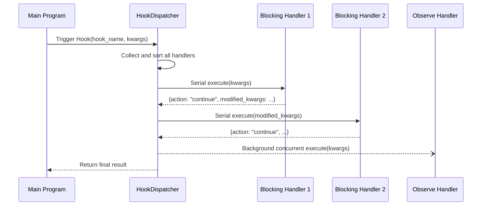

# Hook Handler

`@HookHandler` is a component decorator in MaiBot's plugin system for subscribing to **named Hook points**. The main program triggers named Hooks at key execution points, and all plugin handlers subscribed to that Hook are scheduled to execute according to fixed rules, thereby achieving message interception, rewriting, and observation.

::: warning WorkflowStep Removed
`WorkflowStep` has been replaced by `@HookHandler` in SDK 2.0. Old code still using `WorkflowStep` will raise `RuntimeError` at runtime. This is a non-backward-compatible change — you must migrate to `@HookHandler`.
:::

## Decorator Signature

::: code-group

```python [Python ~vscode-icons:file-type-python~]
from maibot_sdk import HookHandler
from maibot_sdk.types import HookMode, HookOrder, ErrorPolicy

@HookHandler(
    hook: str,                              # Named Hook name to subscribe to (required)
    *,
    name: str = "",                         # Component name, uses method name if empty
    description: str = "",                  # Component description
    mode: HookMode = HookMode.BLOCKING,     # Handler mode
    order: HookOrder = HookOrder.NORMAL,    # Order slot within the same mode
    timeout_ms: int = 0,                    # Handler timeout (milliseconds), 0 = use Hook default
    error_policy: ErrorPolicy = ErrorPolicy.SKIP,  # Exception handling policy
    **metadata,                             # Additional metadata
)
```

:::

## Handler Modes

### BLOCKING Mode

- Serial execution, **can modify** incoming `kwargs`
- Returning `modified_kwargs` can update parameters received by subsequent handlers
- Returning `action: "abort"` can terminate the entire Hook call chain
- Suitable for scenarios requiring message interception or rewriting

### OBSERVE Mode

- Background concurrent execution, **read-only** bypass observation
- Does not participate in main flow control — returned `modified_kwargs` and `abort` requests are ignored
- Suitable for scenarios like logging, data analysis that don't affect the main flow

::: code-group

```python [Python ~vscode-icons:file-type-python~]
class HookMode(str, Enum):
    BLOCKING = "blocking"  # Sync wait, can modify data
    OBSERVE = "observe"    # Async observation, cannot modify
```

:::

## Order Slots

Handlers within the same mode are sorted and executed by `order`:

- **`HookOrder.EARLY`** — Execute first, suitable for pre-interception
- **`HookOrder.NORMAL`** — Default order
- **`HookOrder.LATE`** — Execute later, suitable for supplementary processing

## Error Policy

When a handler raises an exception, subsequent behavior is determined by `error_policy`:

- **`ErrorPolicy.ABORT`** — On exception, abort the current Hook call
- **`ErrorPolicy.SKIP`** — Log the error, skip this handler and continue (**default**)
- **`ErrorPolicy.LOG`** — Log the error, and continue executing subsequent hooks

## Scheduling Order

Hook handlers are globally sorted according to the following rules:

1. **Mode priority**: `blocking` before `observe`
2. **Order slot**: `early` → `normal` → `late`
3. **Source priority**: Built-in plugins before third-party plugins
4. **Plugin ID**: Sorted alphabetically
5. **Handler name**: Sorted alphabetically

## Basic Usage

### Blocking Mode Example: Intercept and Modify Messages

::: code-group

```python [Python ~vscode-icons:file-type-python~]
from maibot_sdk import MaiBotPlugin, HookHandler
from maibot_sdk.types import HookMode, HookOrder, ErrorPolicy


class MyPlugin(MaiBotPlugin):
    async def on_load(self) -> None:
        self.ctx.logger.info("Plugin loaded")

    async def on_unload(self) -> None:
        self.ctx.logger.info("Plugin unloaded")

    async def on_config_update(self, scope: str, config_data: dict, version: str) -> None:
        pass

    @HookHandler(
        "chat.receive.before_process",
        name="message_filter",
        description="Filter inbound messages",
        mode=HookMode.BLOCKING,
        order=HookOrder.EARLY,
        error_policy=ErrorPolicy.ABORT,
    )
    async def handle_message_filter(self, **kwargs):
        message = kwargs.get("message", {})
        # Filter logic: if message contains banned words, terminate processing chain
        raw_message = message.get("raw_message", "")
        if "banned_word" in raw_message:
            self.ctx.logger.info("Message filtered: %s", raw_message)
            return {"action": "abort"}

        # Modify message content and continue
        kwargs["message"]["filtered"] = True
        return {"action": "continue", "modified_kwargs": kwargs}
```

:::

### Observe Mode Example: Log Recording

::: code-group

```python [Python ~vscode-icons:file-type-python~]
from maibot_sdk import MaiBotPlugin, HookHandler
from maibot_sdk.types import HookMode, HookOrder


class LogPlugin(MaiBotPlugin):
    async def on_load(self) -> None:
        self.ctx.logger.info("Log plugin loaded")

    async def on_unload(self) -> None:
        self.ctx.logger.info("Log plugin unloaded")

    async def on_config_update(self, scope: str, config_data: dict, version: str) -> None:
        pass

    @HookHandler(
        "chat.receive.after_process",
        name="message_logger",
        description="Record all inbound messages",
        mode=HookMode.OBSERVE,
        order=HookOrder.LATE,
    )
    async def observe_message(self, **kwargs):
        message = kwargs.get("message", {})
        self.ctx.logger.info(
            "Observed message: user=%s, text=%s",
            message.get("user_id", "unknown"),
            message.get("raw_message", ""),
        )
        # Observe mode return values are ignored
```

:::

### Blocking Mode Example: Modify Send Parameters

::: code-group

```python [Python ~vscode-icons:file-type-python~]
from maibot_sdk import MaiBotPlugin, HookHandler
from maibot_sdk.types import HookMode, HookOrder


class SendInterceptorPlugin(MaiBotPlugin):
    async def on_load(self) -> None:
        self.ctx.logger.info("Send interceptor plugin loaded")

    async def on_unload(self) -> None:
        self.ctx.logger.info("Send interceptor plugin unloaded")

    async def on_config_update(self, scope: str, config_data: dict, version: str) -> None:
        pass

    @HookHandler(
        "send_service.before_send",
        name="send_modifier",
        description="Modify send parameters",
        mode=HookMode.BLOCKING,
        order=HookOrder.NORMAL,
        timeout_ms=5000,
    )
    async def modify_send_params(self, **kwargs):
        # Disable typing effect, force enable send log
        kwargs["typing"] = False
        kwargs["show_log"] = True
        return {"action": "continue", "modified_kwargs": kwargs}
```

:::

## Built-in Hook List

The following are all the Hook points registered in the Host runtime center table — 22 in total. Each Hook notes whether abort (terminating the call chain) and parameter modification (changing the kwargs received by subsequent handlers) are allowed.

::: warning The list follows what the Host actually registers
The list follows what the current Host actually registers — 22 Hooks. The plugin SDK documentation additionally lists 3 Hooks that are not registered yet (`emoji.register.after_build_emotion`, `jargon.query.before_search`, `jargon.query.after_search`) — **subscribing to them fails plugin registration**, so treat the list below as authoritative.
:::

### Chat Message Chain

- **`chat.receive.before_process`** — Before the inbound message runs `SessionMessage.process()` — abort allowed ✅ · param changes allowed ✅

  Use this hook to annotate image context: image/emoji entries in the message dictionary's `raw_message` carry `binary_data_base64` when media is available; forwarded content is nested under `data[].content`. A blocking handler can return `modified_kwargs={"message": updated_message}` and add `{"type":"text","data":"Recognition hint"}` after the corresponding image. Move synchronous inference to a thread or separate process and bound the total duration; continue the original message on timeout or failure. Model scores are not calibrated correctness probabilities. This hook does not require collecting chat images into a training dataset.
- **`chat.receive.after_process`** — After the inbound message completes lightweight preprocessing — abort allowed ✅ · param changes allowed ✅

### Command Execution Chain

- **`chat.command.before_execute`** — After the command matches successfully and before actual execution — abort allowed ✅ · param changes allowed ✅
- **`chat.command.after_execute`** — After command execution ends — abort allowed ❌ · param changes allowed ✅

### Emoji Chain

- **`emoji.maisaka.before_select`** — Before Maisaka selects an emoji — abort allowed ✅ · param changes allowed ✅
- **`emoji.maisaka.after_select`** — After Maisaka has selected an emoji — abort allowed ✅ · param changes allowed ✅
- **`emoji.register.after_build_description`** — After the emoji pack description is generated — abort allowed ✅ · param changes allowed ✅

### Jargon Chain

- **`jargon.extract.before_persist`** — Before a jargon entry is written to the database — abort allowed ✅ · param changes allowed ✅
- **`jargon.inference.before_finalize`** — Before a jargon inference result is written back — abort allowed ✅ · param changes allowed ✅

### Expression Chain

- **`expression.select.before_select`** — Before an expression is selected — abort allowed ✅ · param changes allowed ✅
- **`expression.select.after_selection`** — After expression selection completes — abort allowed ✅ · param changes allowed ✅
- **`expression.learn.after_extract`** — After expression learning parses the candidates — abort allowed ✅ · param changes allowed ✅
- **`expression.learn.before_upsert`** — Before an expression is written to the database — abort allowed ✅ · param changes allowed ✅

### Send Service Chain

- **`send_service.after_build_message`** — After the outbound `SessionMessage` is built — abort allowed ✅ · param changes allowed ✅
- **`send_service.before_send`** — Before calling Platform IO to send — abort allowed ✅ · param changes allowed ✅
- **`send_service.after_send`** — After the send process completes — abort allowed ❌ · param changes allowed ❌

### Maisaka Planner Chain

- **`maisaka.planner.before_request`** — Before the Maisaka planner requests the model — abort allowed ❌ · param changes allowed ✅
- **`maisaka.planner.after_response`** — After Maisaka receives the model response — abort allowed ❌ · param changes allowed ✅

### Maisaka Replyer Chain

- **`maisaka.replyer.before_request`** — Before the Maisaka replyer sends the model request; can read or rewrite this call's `reply_tool_args` — abort allowed ❌ · param changes allowed ✅
- **`maisaka.replyer.before_model_request`** — After the Maisaka replyer builds the final `messages` and before the model request; can rewrite the actual message list sent to the model — abort allowed ❌ · param changes allowed ✅
- **`maisaka.replyer.after_response`** — After the Maisaka replyer receives the model response; can rewrite the reply or request regeneration — abort allowed ❌ · param changes allowed ✅
- **`maisaka.reply.before_post_process`** — Before text post-processing of the final visible reply; can rewrite the body or adjust post-processing for this reply only — abort allowed ❌ · param changes allowed ✅

`reply_tool_args` remains visible in the expression selection chain, `maisaka.replyer.before_request`, and `maisaka.replyer.after_response`. It contains extra reply tool arguments other than `msg_id`, `set_quote`, and `reference_info`; modifications returned from `before_request` continue to later replyer hooks.

#### Controlling Text Post-Processing Per Reply

`maisaka.reply.before_post_process` runs after the final reply has been selected but before text splitting and Chinese typo injection. A blocking handler can read `response`, `session_id`, `reply_message_id`, and `reply_tool_args`, and can modify these fields:

- **`response`** `str` — The final visible body for this reply.
- **`skip_post_process`** `bool` — When `true`, this reply completely bypasses `process_llm_response`, including text splitting, Chinese typo injection, parenthesized-content cleanup, and length limiting.
- **`enable_splitter`** `bool` — Whether this reply may be split according to the global configuration.
- **`enable_chinese_typo`** `bool` — Whether Chinese typo injection may run for this reply according to the global configuration.

`skip_post_process` only bypasses body text processing. Rich-reply attachments such as images, mentions, and emoji are still assembled. The handler must preserve the remaining `kwargs`, and all three policy fields must remain booleans.

::: code-group

```python [Python ~vscode-icons:file-type-python~]
from maibot_sdk import HookHandler
from maibot_sdk.types import HookMode


@HookHandler("maisaka.reply.before_post_process", mode=HookMode.BLOCKING)
async def preserve_selected_reply(self, **kwargs):
    response = kwargs.get("response", "")
    if response.startswith("[keep-raw]"):
        kwargs["response"] = response.removeprefix("[keep-raw]").lstrip()
        kwargs["skip_post_process"] = True

    return {"action": "continue", "modified_kwargs": kwargs}
```

:::

#### Switching Models or Appending Prompts Before Replyer Requests

`maisaka.replyer.before_request` is the last mutable point before the replyer sends the model request. A blocking handler can rewrite these fields:

- **`task_name`** `str` — Task name used by this replyer request. Changing it uses that task's default model pool and generation options.
- **`model_name`** `str` — Concrete model name for this replyer request. It must exist in `[[models]]` in `model_config.toml`. When set, only this model is attempted once instead of rotating through the task model pool.
- **`extra_prompt`** `str` — Extra reply requirements appended to this replyer prompt.
- **`reference_info`** `str` — Reference information passed by the reply tool. It can be rewritten.
- **`reply_tool_args`** `dict` — Extra reply tool arguments. Changes continue to later replyer hooks.

`model_name` is a concrete model name. To route through another task's model pool, change `task_name`. If both `task_name` and `model_name` are set, the task supplies generation options such as temperature, token limit, and timeout, while `model_name` selects the actual model.

If you need to rewrite the exact message list sent by the replyer, use `maisaka.replyer.before_model_request`. This Hook fires after the replyer has built `messages` for the currently selected model capability. Blocking handlers can return a new `messages` list; this is useful for inserting a synthetic first `user` message after `system`, experimenting with temporary prompts, or logging the final request body. The Hook only changes this temporary LLM request and does not write back to chat history or affect mid-term memory insertion.

::: tip An easier alternative
If you only want to inject parameters into a reply or rewrite reply content before sending (for example, turning text into voice), prefer the [Reply Extension](./reply-extensions.md): no Planner Hook changes, and sending, history, and failure handling are managed by the main program.
:::

A common pattern is to first use `maisaka.planner.before_request` to add a parameter schema to the built-in `reply` tool so the planner can fill that parameter, then read `reply_tool_args` in `maisaka.replyer.before_request` to route the model:

::: code-group

```python [Python ~vscode-icons:file-type-python~]
from maibot_sdk import MaiBotPlugin, HookHandler
from maibot_sdk.types import HookMode


class ThinkingLevelPlugin(MaiBotPlugin):
    @HookHandler("maisaka.planner.before_request", mode=HookMode.BLOCKING)
    async def add_reply_tool_param(self, **kwargs):
        for tool in kwargs.get("tool_definitions", []):
            function = tool.get("function", {})
            if function.get("name") != "reply":
                continue

            parameters = function.setdefault("parameters", {})
            properties = parameters.setdefault("properties", {})
            properties["thinking_level"] = {
                "type": "string",
                "enum": ["normal", "deep"],
                "description": "Reply thinking intensity. normal means a regular reply; deep uses a stronger model and analyzes context more carefully.",
            }
        return {"action": "continue", "modified_kwargs": kwargs}

    @HookHandler("maisaka.replyer.before_request", mode=HookMode.BLOCKING)
    async def route_replyer_model(self, **kwargs):
        reply_tool_args = kwargs.get("reply_tool_args", {})
        if reply_tool_args.get("thinking_level") == "deep":
            kwargs["model_name"] = "your-deep-model-name"
            kwargs["extra_prompt"] = "Please understand the context more carefully before replying."

        return {"action": "continue", "modified_kwargs": kwargs}
```

:::

Adding or changing a hook name usually does not require plugin SDK runtime changes: `@HookHandler` accepts a string hook name, and availability is validated by the Host-registered HookSpec. SDK-side updates are only needed for constants, type hints, docs, or examples.

### Example: Replacing the Expression Selection


`before_select` receives `chat_id`, `session_id`, `chat_info`, `chat_history`, `reply_message`, `reply_tool_args`, `target_message`, `reply_reason`, `max_num`, `think_level`, and `candidates`. `reply_tool_args` contains extra reply tool arguments other than `msg_id`, `set_quote`, and `reference_info`. `after_selection` also receives `selected_expression_ids` and `selected_expressions`.

::: code-group

```python [Python ~vscode-icons:file-type-python~]
@HookHandler("expression.select.after_selection", mode=HookMode.BLOCKING)
async def replace_expression_selection(self, **kwargs):
    strategy = kwargs.get("reply_tool_args", {}).get("expression_strategy")
    candidates = kwargs.get("candidates", [])
    selected_ids = [item["id"] for item in candidates[:1]]
    kwargs["selected_expression_ids"] = selected_ids
    return {"action": "continue", "modified_kwargs": kwargs}
```

:::

## Host Validation Rules

During plugin registration, the Host validates `@HookHandler` declarations. An invalid declaration fails plugin registration outright. The rules are:

1. **The Hook name must be registered**: the `hook` argument must be a name that already exists in the built-in Hook list above. Passing an unregistered Hook name fails registration.
2. **mode must satisfy the Hook's capability constraints**: the Host checks whether `mode` is compatible with that Hook point's capabilities (for example, a Hook that only allows parameter modification cannot run in a mode that forbids it).
3. **error_policy=ABORT requires a Hook that allows abort**: `error_policy=ErrorPolicy.ABORT` can only be declared when that Hook's "abort allowed" column is "yes". Declaring the `ABORT` policy for a Hook that does not allow abort fails registration.

At runtime the Host exposes this Hook list to the WebUI backend route `/plugins/runtime/hooks`, so panels or debugging tools can read the dynamic center table directly.

## Handler Return Values

Blocking mode handlers can return a dictionary to control the subsequent flow:

- **`action`** `str` — `"continue"` to continue the call chain, `"abort"` to terminate it
- **`modified_kwargs`** `dict` — Modified parameters, will be passed to subsequent handlers

Observe mode handler return values are ignored — no need to return a control dictionary.

## Hook Dispatch Flow



## Migration Guide: WorkflowStep → HookHandler

- **`@WorkflowStep(stage="pre_process")`** → **`@HookHandler("chat.receive.before_process")`** — Use named Hook points instead of fixed stages
- **`blocking=True`** → **`mode=HookMode.BLOCKING`** — Parameter name change
- **`observe=True`** → **`mode=HookMode.OBSERVE`** — Parameter name change
- **`priority=10`** → **`order=HookOrder.EARLY`** — Changed to three-tier enum

::: danger
Calling `WorkflowStep(...)` directly now immediately raises `RuntimeError` — there is no compatibility mapping. You must manually replace all `@WorkflowStep` with `@HookHandler`.
:::

::: code-group

```python [Python ~vscode-icons:file-type-python~]
# Old code (SDK 1.x) — no longer works
@WorkflowStep(stage="pre_process", blocking=True)
async def on_pre_process(self, **kwargs):
    ...

# New code (SDK 2.0)
@HookHandler("chat.receive.before_process", mode=HookMode.BLOCKING)
async def on_pre_process(self, **kwargs):
    ...
```

:::

## Verify and Troubleshoot

**Verification** — reload the plugin, then trigger the chain once (for example, have the bot receive a message so `chat.receive.before_process` fires): the Runner log shows your handler's output and the message is modified or aborted as expected, which means the hook name, mode, and return value are all correct.

- **Plugin registration fails** — the Host validates declarations at registration time: `hook` must be a name from the built-in list, and one wrong word (such as `chat.receive.before_processing`) fails registration, with the offending component named in the log.
- **You declared `ErrorPolicy.ABORT` for a Hook that does not allow abort** — `send_service.after_send`, `maisaka.planner.*`, `maisaka.replyer.*`, and `maisaka.reply.before_post_process` do not allow abort, so that declaration fails registration; drop the policy or subscribe to a Hook that allows abort.
- **Your `modified_kwargs` changes are ignored** — return values are honored only in `mode=HookMode.BLOCKING`; `OBSERVE` handlers run concurrently in the background and their `modified_kwargs` and `abort` requests are discarded.
- **The plugin raises `RuntimeError` after upgrading to SDK 2.0** — it still contains `@WorkflowStep`, which SDK 2.0 removed with no compatibility mapping; migrate to `@HookHandler` (`blocking=True` → `mode=HookMode.BLOCKING`, `priority=10` → `order=HookOrder.EARLY`).
- **Handlers run in an order you did not expect** — sorting is mode → order → origin → plugin ID → handler name: built-in plugins always precede third-party ones, and `HookOrder.EARLY` only moves you ahead within the same mode.
