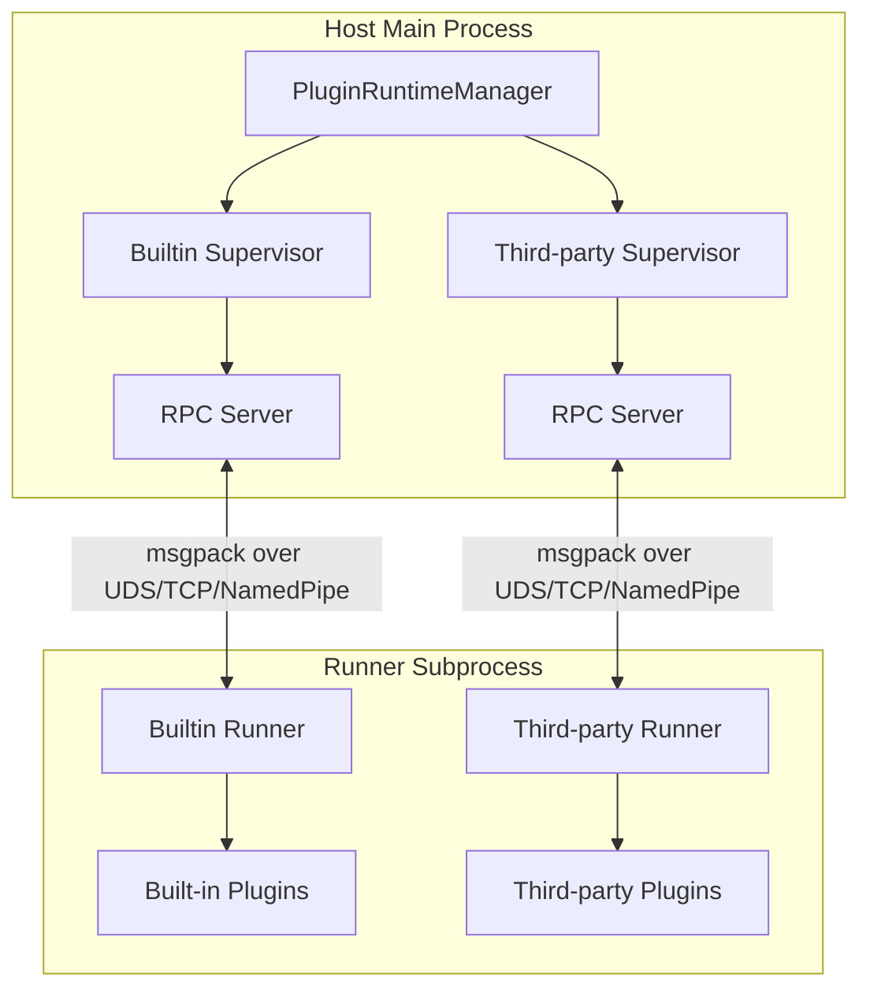

# Plugin Development Guide

MaiBot's plugin system adopts a Host/Runner IPC architecture. Plugin code runs in isolated child processes and communicates with the main process via an RPC protocol encoded with msgpack. This section introduces the architectural principles, development workflow, and core concepts of the plugin system.

## Architecture Overview



### Host (Main Process Side)

- **PluginRuntimeManager**: Singleton manager that manages both Builtin and Third-party Supervisors
- **PluginSupervisor**: Responsible for starting, stopping, health checking, and hot-reloading of Runner subprocesses
- **ComponentRegistry**: Component registry that manages all components (such as Tools, Commands, etc.) declared by plugins
- **HookDispatcher**: Hook dispatcher that routes named hook invocations to the corresponding Supervisor

### Runner (Subprocess Side)

- Each Supervisor manages its own independent Runner subprocess
- Discovers and loads plugins via `PluginLoader`
- Communicates with the Host via `RPCClient`
- Injects `PluginContext` after plugin loading, then calls the `on_load()` lifecycle method

### Communication Protocol

- **Encoding/Decoding**: Uses msgpack format for binary serialization (`MsgPackCodec`)
- **Transport Layer**: Supports three transport methods: Unix Domain Socket, TCP, and Named Pipe
- **RPC Model**:
  - Host → Runner: Invokes plugin components (Tools, Commands, etc.) via `invoke_plugin()`
  - Runner → Host: Plugins initiate RPC callbacks via the capability proxy in `self.ctx` (e.g., `ctx.send.text()`, `ctx.db.query()`)


## Quick Start

### 1. Install SDK

::: code-group

```bash [Bash ~vscode-icons:file-type-shell~]
pip install maibot-plugin-sdk
```

:::

If you are also modifying `maibot-plugin-sdk` locally, you can set an environment variable so that MaiBot's plugin Runner automatically prefers the local SDK source:

::: code-group

```powershell [PowerShell ~vscode-icons:file-type-powershell~]
$env:MAIBOT_PLUGIN_SDK_PATH = "C:\GitHub\MaiBot-dev\maibot-plugin-sdk"
uv run python bot.py
```

:::

That path must point to an SDK repository containing `pyproject.toml` and `maibot_sdk/`. Once set, the Runner puts that path at the front of `PYTHONPATH` and uses the local SDK's `project.version` for plugin manifest compatibility checks. Do not point this environment variable at an untrusted directory; it puts the Python code in that directory onto the plugin runtime import path.

To build a local SDK distribution package, run the following in the SDK repository:

::: code-group

```powershell [PowerShell ~vscode-icons:file-type-powershell~]
uv sync --extra dev
uv run pytest
uv build
```

:::

::: tip Note
The package name is `maibot-plugin-sdk`, but in code, import using `maibot_sdk`:
::: code-group

```python [Python ~vscode-icons:file-type-python~]
from maibot_sdk import MaiBotPlugin, Command, Tool
```

:::

:::

### 2. Create Plugin Directory

```
plugins/
└── my-plugin/
    ├── _manifest.json
    └── plugin.py
```

Declare plugin configuration in `plugin.py` with `PluginConfigBase` and `Field`. When the Runner first loads the plugin, it generates the runtime `config.toml` from `config_model` and fills in newly added fields after the configuration model changes.

### 3. Write Manifest

Declare plugin metadata in `_manifest.json` (for full field descriptions, see [Manifest System](./manifest.md)):

::: code-group

```json [JSON ~vscode-icons:file-type-json~]
{
  "manifest_version": 2,
  "id": "com.example.my-plugin",
  "version": "1.0.0",
  "name": "My Plugin",
  "description": "An example plugin",
  "author": {
    "name": "Developer",
    "url": "https://github.com/developer"
  },
  "license": "MIT",
  "urls": {
    "repository": "https://github.com/developer/my-plugin"
  },
  "host_application": {
    "min_version": "1.0.0",
    "max_version": "1.99.99"
  },
  "sdk": {
    "min_version": "1.0.0",
    "max_version": "2.99.99"
  },
  "capabilities": ["send.text", "send.emoji", "config.get"],
  "i18n": {
    "default_locale": "zh-CN"
  }
}
```

:::

### 4. Write Plugin Code

Inherit `MaiBotPlugin` in `plugin.py`, declare components using decorators, and implement three lifecycle methods:

::: code-group

```python [Python ~vscode-icons:file-type-python~]
from maibot_sdk import MaiBotPlugin, Command, Tool
from maibot_sdk.types import ToolParameterInfo, ToolParamType


class MyPlugin(MaiBotPlugin):
    async def on_load(self) -> None:
        self.ctx.logger.info("Plugin loaded")

    async def on_unload(self) -> None:
        self.ctx.logger.info("Plugin unloaded")

    async def on_config_update(self, scope: str, config_data: dict, version: str) -> None:
        if scope == "self":
            self.ctx.logger.info("Plugin configuration updated: version=%s", version)

    @Tool(
        "greet",
        brief_description="Greet the user",
        detailed_description="Parameter description:\n- stream_id: string, required. Current chat stream ID.",
        parameters=[
            ToolParameterInfo(
                name="stream_id",
                param_type=ToolParamType.STRING,
                description="Current chat stream ID",
                required=True,
            ),
        ],
    )
    async def handle_greet(self, stream_id: str, **kwargs):
        await self.ctx.send.text("Hello!", stream_id)
        return {"success": True, "message": "Replied"}

    @Command("hello", pattern=r"^/hello")
    async def handle_hello(self, **kwargs):
        await self.ctx.send.text("Hello!", kwargs["stream_id"])
        return True, "Hello!", 2


def create_plugin():
    return MyPlugin()
```

:::

::: warning Three lifecycle methods must be implemented
The SDK requires all plugins to implement `on_load()`, `on_unload()`, and `on_config_update()`. Otherwise, the Runner will refuse to load the plugin. See [Lifecycle](./lifecycle.md) for details.
:::

### 5. Install and Run

Place the plugin directory into the `plugins/` folder. After starting MaiBot, the plugin will be automatically discovered and loaded. Plugin management can also be performed via the WebUI.

## Core Concepts

### Plugin Base Class

All plugins must inherit from `MaiBotPlugin` and declare plugin capabilities through class attributes and decorators:

::: code-group

```python [Python ~vscode-icons:file-type-python~]
from maibot_sdk import MaiBotPlugin, Tool, Command, CONFIG_RELOAD_SCOPE_SELF
from typing import ClassVar, Iterable


class MyPlugin(MaiBotPlugin):
    # Subscribe to global configuration hot reload (only "bot" and "model" are valid values)
    config_reload_subscriptions: ClassVar[Iterable[str]] = ("bot", "model")

    @Tool("my_tool", brief_description="Example tool")
    async def handle_tool(self, **kwargs):
        ...

    @Command("my_cmd", pattern=r"^/my_cmd")
    async def handle_cmd(self, **kwargs):
        ...


def create_plugin():
    return MyPlugin()
```

:::

### Component Decorators

The SDK provides 9 component decorators, all imported from the top level of `maibot_sdk`:

**`@Tool`** — LLM tool/function calling. Tools callable by the LLM, the most commonly used component type

**`@Command`** — Slash commands. Commands triggered by users via regex matching

**`@HookHandler`** — Named Hook handlers. Subscribes to specific Hook points, supports blocking/observe modes

**`@EventHandler`** — Message/Workflow events. Listens to lifecycle events such as messages and LLM generation

**`@API`** — Inter-plugin API. Exposes APIs callable by other plugins

**`@MessageGateway`** — Platform adapter. Integrates external platforms (QQ, Email, etc.) into MaiBot

**`@HomeCard`** — WebUI home page card. Shows plugin status, entry points, or custom content on the home page

**`@LLMProvider`** — LLM Provider. Declares new LLM model access points (client_type) to extend model services

**`@ReplyExtension`** — Reply extension. Injects namespaced parameters into the reply tool and participates in reply generation (SDK 2.10.0+; see [Reply Extensions](./reply-extensions.md))

**`@Action`** — Legacy plugin compatibility. Internally auto-converted to `@Tool`; new plugins should directly use `@Tool`

### Capability Proxies

Access 17 capability proxies via `self.ctx`. All calls are automatically forwarded to the Host via RPC:

::: code-group

```python [Python ~vscode-icons:file-type-python~]
# Context access
self.ctx              # PluginContext instance
self.ctx.paths        # Plugin persistence and runtime directories
self.ctx.logger       # logging.Logger, named "plugin.<plugin_id>"

# Capability proxies
self.ctx.api          # Plugin API query, invocation, and dynamic synchronization
self.ctx.gateway      # Message gateway routing and runtime status reporting
self.ctx.send         # Send text, images, emojis, forwards, and mixed messages
self.ctx.db           # Database CRUD operations and counting
self.ctx.llm          # LLM text generation, tool calling, embeddings, and ASR speech recognition
self.ctx.config       # Plugin configuration reading
self.ctx.emoji        # Emoji pack management
self.ctx.message      # Historical message query
self.ctx.frequency    # Speech frequency control
self.ctx.component    # Plugin and component management
self.ctx.chat         # Chat stream query, open, or create chat streams, plus avatar lookup
self.ctx.person       # User information query
self.ctx.render       # Render HTML to PNG images
self.ctx.knowledge    # LPMM knowledge base search
self.ctx.statistics   # Local statistics and billing data reading
self.ctx.tool         # LLM tool definition query
self.ctx.maisaka      # Maisaka context appending and proactive tasks
```

:::

### Configuration Models

Plugins can declare strongly-typed configurations via `PluginConfigBase`. The Runner will automatically generate default configurations and WebUI Schemas:

::: code-group

```python [Python ~vscode-icons:file-type-python~]
from maibot_sdk import MaiBotPlugin, PluginConfigBase, Field


class MyPluginConfig(PluginConfigBase):
    enabled: bool = Field(default=True, description="Whether to enable the plugin")
    greeting: str = Field(default="Hello!", description="Default greeting message")


class MyPlugin(MaiBotPlugin):
    config_model = MyPluginConfig

    async def on_load(self) -> None:
        # Access strongly-typed configuration via self.config
        self.ctx.logger.info("Current greeting: %s", self.config.greeting)
        # Access raw dict via self.get_plugin_config_data()
        raw = self.get_plugin_config_data()
```

:::

- After declaring `config_model`, `self.config` returns a strongly-typed configuration instance
- Calling `self.config` without declaration will raise a `RuntimeError`
- `self.get_plugin_config_data()` is always available and returns the raw configuration dictionary
- `config_model` defines the configuration structure and defaults, while the Runner stores current runtime values in `config.toml` under the plugin directory

## Directory Structure Conventions

```
my-plugin/
├── _manifest.json       # Required: Plugin manifest
├── plugin.py            # Required: Plugin entry point, containing create_plugin()
├── webui.json           # Optional: Declarative custom WebUI pages
├── i18n/                # Optional: Internationalization resources
│   ├── zh-CN.json
│   └── en-US.json
└── assets/              # Optional: Static assets
```

The configuration model is part of the plugin source, and the Runner generates the runtime configuration instance. The plugin repository's `.gitignore` should include `/config.toml`; after installation, WebUI or runtime configuration APIs maintain the user's configuration.

Store plugin runtime data in the plugin-specific directories injected by the Host. Starting from SDK 2.6.0, these directories are available through `self.ctx.paths`:

::: code-group

```python [Python ~vscode-icons:file-type-python~]
self.ctx.paths.data_dir     # Persistent data, default: data/plugins/<plugin_id>/
self.ctx.paths.runtime_dir  # Temporary data, default: temp/plugins/<plugin_id>/
```

:::

- `data_dir` is suitable for storing plugin databases, JSON states, user-generated content, and other data that needs to persist across restarts.
- `runtime_dir` is suitable for storing download caches, rendering intermediate artifacts, and temporary files that can be rebuilt.
- Store new data in these dedicated directories. Map user input to controlled filenames and verify resolved paths remain inside the target directory.

## Built-in and Third-party Plugins

MaiBot maintains two independent Runner subprocesses:

- **Built-in plugins**: Located in `src/plugins/built_in/`, running under the Builtin Supervisor
- **Third-party plugins**: Located in `plugins/`, running under the Third-party Supervisor

Both use the same communication protocol and component registration mechanism. The startup order between Supervisors is determined by cross-Supervisor dependencies; if a circular dependency is detected, startup is rejected.

## Next Steps

**Basics** — [Manifest System](./manifest.md): field definitions and validation rules for `_manifest.json` · [Lifecycle](./lifecycle.md): loading, unloading and config hot-reload · [Configuration Management](./config.md): declaring and using plugin config

**Components** — [Tool Component](./tools.md): LLM-callable tools · [Command Component](./commands.md): slash commands · [Hook System](./hooks.md): intercept and rewrite messages · [Event Handlers](./event-handlers.md): listen to lifecycle events · [Message Gateway](./message-gateway.md): connect a new platform as a plugin · [API Components](./api-components.md): inter-plugin APIs · [LLMProvider Component](./llmprovider.md): integrate new model services · [Reply Extensions](./reply-extensions.md): inject plugin parameters into the reply tool, add requirements before generation, or transform messages before sending · [Home Cards](./home-cards.md): WebUI home-page cards · [WebUI Pages](./webui-pages.md): declarative custom pages · [Action Component](./actions.md): the legacy `@Action` decorator

**Going Deeper** — [Vibe Coding](./vibe-coding.md): AI-assisted plugin development · [API Reference](./api-reference.md): the complete Plugin SDK API · [Publish a Plugin](./submission.md): submit to the official plugin center

**Integration Perspective** — [Plugin Integration](/en/develop/plugin): the integration surfaces, runtime boundaries and version compatibility (read before you start)
