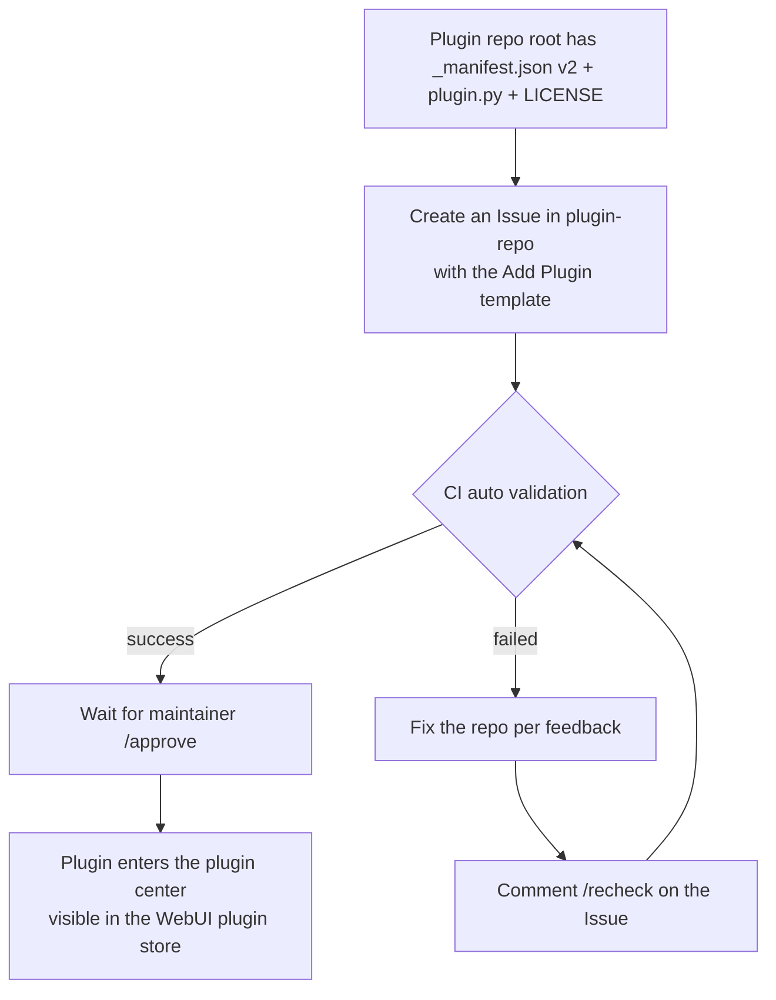

# Publish a Plugin

Once your plugin is written and verified locally, you can submit it to the official MaiBot plugin center so all users can find and install it through the WebUI plugin store.

## What Is the Plugin Center

The plugin center ([plugins.maibot.chat](https://plugins.maibot.chat/)) is powered by the official repository [Mai-with-u/plugin-repo](https://github.com/Mai-with-u/plugin-repo). Plugins themselves live as **independent public GitHub repositories**; the plugin center maintains only index files — `plugins.json` for plugin metadata and `plugin_versions.json` for each plugin's release versions and compatibility ranges — and validates every submission through automated workflows.

Submitting is **completely open source and free** — no fees or invitations required. Once approved, your plugin appears in plugin store search results.

## Before You Submit: Plugin Repository Requirements

Your plugin must be a **public GitHub repository** whose root directory contains the following files:

**`_manifest.json`** — The plugin manifest, using the **manifest v2** structure; field spec in [Manifest System](./manifest.md)

**`plugin.py`** — The plugin entry file, containing the `create_plugin()` factory function

**`LICENSE`** — A license file whose type matches the `license` field in `_manifest.json`

**`README.md`** — Recommended: feature introduction, installation instructions, configuration notes, and usage examples

::: tip What "plugin repository" means
The plugin repository is **your own standalone (or project) GitHub repository** (e.g. `https://github.com/you/my-plugin`). The plugin center locates it via the `urls.repository` field in `_manifest.json`.
:::

## Publishing a Release: Tags Must Match the Manifest

The plugin market's install dialog works by **release version**: the official index sync tool scans your repository's Git Releases and generates a version record for each tag. Any mismatch gets that version pushed into `rejected_releases`, where users only see "N release versions failed validation" on the plugin detail page and cannot install it.

Align every item when publishing a new version:

- **The Git Tag matches `_manifest.json`'s `version` exactly** — tag `1.4.2` or `v1.4.2`, and the manifest `version` must be `1.4.2`
- **`version` uses strict three-part form** — `x.y.z`, with no `-rc1` / `+build` style suffixes; mark prereleases with GitHub's Prerelease flag
- **The plugin `id` must not change** — a release that changes `id` from `com.you.plugin` to something else is rejected as "the release changed the plugin ID"
- **`manifest_version` stays on a supported protocol version** — currently fixed at `2`
- **`_manifest.json` must be readable from that tag's commit** — tags with rewritten history or a deleted manifest are rejected

::: tip Recommended flow
Change code → update `version` in `_manifest.json` → commit and push → tag and push with the same version → create a Release from that tag on GitHub (tick Prerelease when needed). When tag, manifest, and Release all agree on the version number, one index sync picks it up.
:::

## Submission Method: Issue Submission (Recommended)

Submit via an Issue template — **no fork or local Git operations needed**, and it avoids merge conflicts from multiple people editing `plugins.json` at once.

1. Open the [plugin-repo repository](https://github.com/Mai-with-u/plugin-repo) [New Issue](https://github.com/Mai-with-u/plugin-repo/issues/new/choose) page and choose the **"Add Plugin / 添加插件"** template.
2. Fill in the information:
   - **Plugin ID**: recommended to match the `id` in your `_manifest.json`.
   - **Repository URL**: the full public GitHub HTTPS URL, e.g. `https://github.com/username/my-plugin`.
3. After submitting, CI automatically reads the `_manifest.json` at the root of your plugin repository and validates it, commenting the result on your Issue.
4. Once validation passes, a maintainer approves it with `/approve` — your plugin is then added to the plugin center.

### Status Labels

**`pending-validation`** — Waiting for automatic validation

**`validated`** — Validation passed, waiting for maintainer approval

**`validation-failed`** — Validation failed, fix according to the feedback

**`approved`** — Approved and added to the plugin center

**`rejected`** — Rejected by a maintainer

### What If Validation Fails

1. Fix your plugin repository according to the error messages in the Issue.
2. After fixing, comment `/recheck` on the Issue.
3. CI re-validates and comments the result on the Issue again.

## Submission Flow Overview



## Submission Checklist

Go through this list before submitting:

- [ ] Plugin repository is a **public** GitHub repository
- [ ] Root directory contains `_manifest.json` (`manifest_version: 2`), `plugin.py`, and `LICENSE`
- [ ] `id` is stable and unique — no spaces, no path characters
- [ ] All versions are three-part (`x.y.z`)
- [ ] Every Git Release tag matches the manifest `version`, and `id` has not changed (otherwise that version never reaches the market)
- [ ] `host_application` / `sdk` upper bounds are not pinned to a patch release (for example write `999.999.999`) — constrain `min_version` seriously instead
- [ ] `author` is a `{ name, url }` object
- [ ] `urls.repository` is a public HTTPS URL without a `.git` suffix
- [ ] `capabilities` declares only what the plugin actually needs
- [ ] Plugin loads and runs correctly with a real MaiBot instance locally
- [ ] If the plugin contains a `webui.json`, it has been reloaded and its pages opened for verification in a local MaiBot

## Further Reading

- [Plugin Store](https://plugins.maibot.chat/) — browse all accepted plugins
- [plugin-repo repository](https://github.com/Mai-with-u/plugin-repo) — plugin index and contribution guide
- [Manifest System](./manifest.md) — full `_manifest.json` field reference
- [Development Guide](./) — start writing a plugin from scratch

## Verify and Troubleshoot

**Verification** — watch the label flow after you open the Issue: CI comments its validation result, the label moves from `pending-validation` to `validated`, a maintainer's `/approve` moves it to `approved`, and the plugin detail page can install that version. Check the tag and manifest locally first:

::: code-group

```bash [Bash ~vscode-icons:file-type-shell~]
# Run in your plugin repository root: the latest tag and the manifest version must agree
git describe --tags --abbrev=0
python -c "import json; print(json.load(open('_manifest.json'))['version'])"
```

:::

- **The label stays at `validation-failed`** — after fixing the repository you must comment `/recheck` for CI to run again; editing files alone does not restart validation.
- **A version lands in `rejected_releases` and the market shows "N release versions failed validation"** — the tag (`1.4.2` or `v1.4.2`) must correspond to a plain three-part `1.4.2` in the manifest, `id` must not change, `manifest_version` stays `2`, and `_manifest.json` must be readable from that tag's commit; then tag and create the Release again.
- **CI says it cannot read `_manifest.json`** — the plugin repository must be public on GitHub, `urls.repository` must be a public HTTPS URL without a `.git` suffix, and the manifest must sit in the repository root.
- **`LICENSE` validation fails** — the root directory needs a `LICENSE` whose type matches the `license` field in `_manifest.json`, and `plugin.py` must expose the `create_plugin()` factory.
- **Approved and searchable, but the installed plugin fails to load** — usually it was never verified against a real MaiBot, or its `host_application` / `sdk` upper bound is pinned to a patch release; set the upper bound to `999.999.999`, constrain `min_version` seriously, and reload it locally once more (including any `webui.json` pages).
