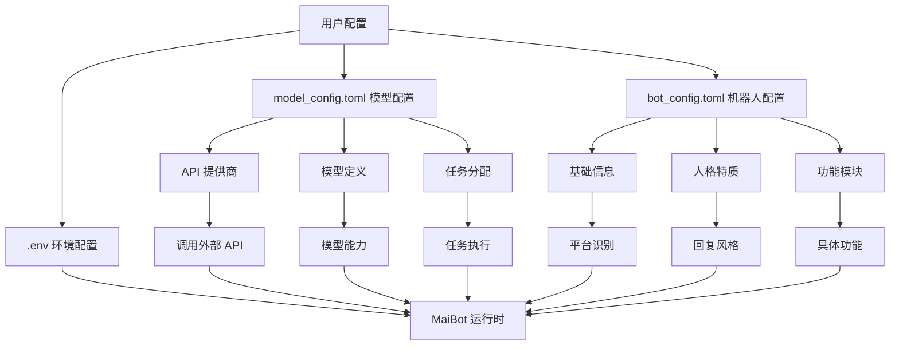

# MaiBot 配置概览

## 配置体系总览

MaiBot 使用三个核心配置文件来管理不同方面的功能：

### 1. 核心配置文件

| 配置文件 | 位置 | 主要功能 | 必需性 |
|---------|------|----------|--------|
| **`bot_config.toml`** | `config/` 目录 | 机器人行为配置：人格、聊天、记忆、表情包等 | ✅ 必需 |
| **`model_config.toml`** | `config/` 目录 | 模型和 API 配置：API 提供商、模型定义、任务分配 | ✅ 必需 |
| **`.env`** | 项目根目录 | 环境变量：监听地址、端口、WebUI 设置 | ✅ 必需 |

### 2. 配置文件关系图



### 3. 配置流程总览

```
开始配置
    ↓
[准备工作]
    ├── 检查环境要求
    ├── 了解文件结构
    └── 获取模板文件
    ↓
[第一步：.env 配置]
    ├── 设置监听地址/端口
    ├── 配置 WebUI
    └── 配置平台适配器
    ↓
[第二步：model_config.toml]
    ├── 添加 API 提供商
    ├── 定义模型
    └── 分配任务模型
    ↓
[第三步：bot_config.toml]
    ├── 设置基础信息
    ├── 配置人格特质
    └── 开启所需功能
    ↓
[第四步：验证和启动]
    ├── 运行配置检查
    ├── 启动 MaiBot
    └── 测试功能
    ↓
配置完成
```

## 配置文件详细说明

### bot_config.toml 结构

`bot_config.toml` 控制机器人的所有行为表现，包含以下主要部分：

| 配置部分 | 功能描述 | 重要性 | 参见 |
|---------|----------|--------|------|
| `[inner]` | 内部版本控制 | 🔴 关键 | [配置项索引](./config_item_index.md#inner---内部版本控制) |
| `[bot]` | 机器人基本信息（平台、账号、昵称） | 🔴 关键 | [配置项索引](./config_item_index.md#bot---机器人基本信息) |
| `[personality]` | 人格特质、表达风格、多重人格 | 🔴 关键 | [配置项索引](./config_item_index.md#personality---人格特质) |
| `[expression]` | 表达学习配置（学习列表、共享组） | 🟡 重要 | [配置项索引](./config_item_index.md#expression---表达学习配置) |
| `[chat]` | 聊天设置（发言频率、上下文长度） | 🔴 关键 | [配置项索引](./config_item_index.md#chat---聊天设置) |
| `[memory]` | 记忆模块配置（思考深度、全局记忆） | 🟡 重要 | [配置项索引](./config_item_index.md#memory---记忆模块配置) |
| `[dream]` | 做梦功能配置 | 🟢 可选 | [配置项索引](./config_item_index.md#dream---做梦功能配置) |
| `[tool]` | 工具开关 | 🟡 重要 | [配置项索引](./config_item_index.md#tool---工具开关) |
| `[emoji]` | 表情包功能 | 🟢 可选 | [配置项索引](./config_item_index.md#emoji---表情包功能) |
| `[voice]` | 语音识别开关 | 🟢 可选 | [配置项索引](./config_item_index.md#voice---语音识别开关) |
| `[message_receive]` | 消息过滤规则 | 🟡 重要 | [配置项索引](./config_item_index.md#message_receive---消息过滤) |
| `[lpmm_knowledge]` | LPMM 知识库配置 | 🟡 重要 | [配置项索引](./config_item_index.md#lpmm_knowledge---lpmm-知识库配置) |
| `[keyword_reaction]` | 关键词/正则触发回复 | 🟢 可选 | [配置项索引](./config_item_index.md#keyword_reaction---关键词正则触发回复) |
| `[response_post_process]` | 回复后处理 | 🟢 可选 | [配置项索引](./config_item_index.md#response_post_process---回复后处理) |
| `[log]` | 日志配置 | 🟡 重要 | [配置项索引](./config_item_index.md#log---日志配置) |
| `[debug]` | 调试开关 | 🟢 可选 | [配置项索引](./config_item_index.md#debug---调试开关) |
| `[maim_message]` | 消息服务配置 | 🟢 可选 | [配置项索引](./config_item_index.md#maim_message---消息服务配置) |
| `[webui]` | WebUI 独立服务器配置 | 🟡 重要 | [配置项索引](./config_item_index.md#webui---webui-独立服务器配置) |
| `[telemetry]` | 统计信息开关 | 🟢 可选 | [配置项索引](./config_item_index.md#telemetry---统计信息开关) |
| `[experimental]` | 实验性功能 | 🟢 可选 | [配置项索引](./config_item_index.md#experimental---实验性功能) |

### model_config.toml 结构

`model_config.toml` 管理 AI 模型和 API 连接，包含以下主要部分：

| 配置部分 | 功能描述 | 重要性 | 参见 |
|---------|----------|--------|------|
| `[inner]` | 内部版本控制 | 🔴 关键 | [配置项索引](./config_item_index.md#inner---内部版本控制-1) |
| `[[api_providers]]` | API 服务提供商列表（可多个） | 🔴 关键 | [配置项索引](./config_item_index.md#api_providers---api-服务提供商) |
| `[[models]]` | 模型定义列表（可多个） | 🔴 关键 | [配置项索引](./config_item_index.md#models---模型定义) |
| `[model_task_config.*]` | 任务模型配置 | 🔴 关键 | [配置项索引](./config_item_index.md#model_task_config---任务模型配置) |

### .env 结构

`.env` 文件包含环境变量配置：

| 变量名 | 功能描述 | 默认值 | 必需性 | 参见 |
|--------|----------|--------|--------|------|
| `MAIBOT_HOST` | MaiBot 监听地址 | `0.0.0.0` | ✅ 必需 | [配置项索引](./config_item_index.md#env-环境变量) |
| `MAIBOT_PORT` | MaiBot 监听端口 | `8080` | ✅ 必需 | [配置项索引](./config_item_index.md#env-环境变量) |
| `WEBUI_ENABLED` | 是否启用 WebUI | `true` | ✅ 必需 | [配置项索引](./config_item_index.md#env-环境变量) |
| `WEBUI_HOST` | WebUI 监听地址 | `0.0.0.0` | ✅ 必需 | [配置项索引](./config_item_index.md#env-环境变量) |
| `WEBUI_PORT` | WebUI 监听端口 | `8081` | ✅ 必需 | [配置项索引](./config_item_index.md#env-环境变量) |

## 配置依赖关系

### 1. 文件间依赖

1. **`bot_config.toml` 依赖 `model_config.toml`**：
   - `bot_config.toml` 中的 `model_list` 字段必须引用 `model_config.toml` 中定义的模型名称
   - 模型名称必须完全匹配（包括大小写）

2. **`model_config.toml` 依赖 API 提供商**：
   - 每个模型必须通过 `api_provider` 字段引用已定义的 API 提供商
   - API 提供商名称必须完全匹配

3. **`.env` 与 `bot_config.toml` 的 `[webui]` 部分**：
   - WebUI 相关配置已移至 `.env` 文件
   - `bot_config.toml` 中的 `[webui]` 部分仅用于独立服务器配置

### 2. 配置项依赖

| 配置项 | 依赖项 | 验证方法 | 参见 |
|--------|--------|----------|------|
| `model_list` | `model_config.toml` 中的模型定义 | 检查模型名称是否存在 | [model_config 详细配置](./configuration_model_standard.md) |
| `api_provider` | `[[api_providers]]` 中的提供商定义 | 检查提供商名称是否存在 | [model_config 详细配置](./configuration_model_standard.md) |
| `platform` 格式 | 平台标识符规范 | 验证格式：`平台:账号:类型` | [bot_config 详细配置](./configuration_standard.md) |

## 配置最佳实践

### 1. 配置顺序建议

1. **先配置 `.env`**：设置基础网络环境（参见：[配置快速入门](./index.md)）
2. **再配置 `model_config.toml`**：建立 API 连接和模型定义（参见：[model_config 详细配置](./configuration_model_standard.md)）
3. **最后配置 `bot_config.toml`**：基于可用模型配置机器人行为（参见：[bot_config 详细配置](./configuration_standard.md)）

### 2. 版本管理

- 每次修改配置都递增 `inner.version`
- 记录配置变更日志
- 备份原始配置文件

### 3. 测试策略

1. **最小配置测试**：先使用最小可用配置验证基础功能
2. **增量配置**：逐步添加功能，每次测试验证
3. **回归测试**：修改配置后，重新测试受影响的功能

## 快速导航

- **[配置快速入门](./index.md)**：从零开始的配置指南
- **[配置项索引](./config_item_index.md)**：所有配置项的详细说明和快速查找
- **[bot_config 详细配置](./configuration_standard.md)**：机器人行为配置详解
- **[model_config 详细配置](./configuration_model_standard.md)**：模型和 API 配置详解
- **[Windows 一键配置](./config_windows_onekey_withwebui.md)**：Windows 用户专用指南
- **[备份与恢复](./backup.md)**：配置备份策略

## 下一步

根据你的需求选择合适的配置路径：

- **新用户**：从 [配置快速入门](./index.md) 开始
- **查找特定配置项**：使用 [配置项索引](./config_item_index.md)
- **需要详细说明**：查看对应配置文件的详细指南
- **遇到问题**：参考故障排除部分或 [常见问题解答](/manual/faq/)

---

**最后更新**：2025-03-10  
**设计目标**：降低配置复杂度，提高用户体验