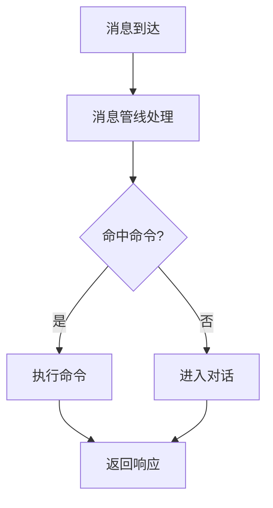

# 文档编写特性

编写者注：本页收录本站用到的**非 VitePress 原生**的插件特性，这些特性需要编写者在 Markdown 中写特定语法才能触发。VitePress 原生的 custom container（`::: tip` / `::: warning` 等）、代码块行号高亮等特性请参见 [VitePress 官方文档](https://vitepress.dev/guide/markdown)；代码片段导入本站也已启用，见下文「代码片段导入」。

本页遵守[参与文档站](./)里的硬规则：**内容页禁止使用 Markdown 表格**，请用定义列表或 `::: fields` 容器；索引页可以按需使用表格。

## Mermaid 图表

用 ` ```mermaid ` 围栏代码块插入流程图、时序图、类图等。本站通过 `vitepress-plugin-mermaid` 插件支持。也支持 ` ```mmd `（不渲染，仅展示源码，用于教学示例）。

支持的图表类型：flowchart、sequenceDiagram、classDiagram、stateDiagram、erDiagram、gantt、pie、gitGraph 等。

**用法示例：**

````markdown

````

**效果预览：**


> 该插件在消息流程、数据库和运行时等开发文档中实际使用。

## 更新时间线

用 `::: timeline <日期>` ... `:::` 容器创建时间线排版。本站通过 `vitepress-markdown-timeline` 插件支持。日期格式 `YYYY-MM-DD`，内部用 Markdown 项目符号列表。

**用法示例：**

```
::: timeline 2026-07-09
- [1.0.12] 优化 Planner 到 Replyer 的信息传递
- WebUI：增强麦麦观察离线记录，支持自定义 API 模型列表
- 首次配置会引导用户把启动时临时 Token 更换为固定 Token
:::
```

**效果预览：** [查看时间线渲染效果 →](/changelog/)

> 该插件在 `zh/changelog/index.md` 中实际使用。

## 代码组图标

本站通过 `vitepress-plugin-group-icons` 插件在 `::: code-group` 的标签页上自动显示图标。编写者有**三种**方式触发图标。

### 1. 内置关键词自动匹配

标签文本中包含特定关键词时自动出现对应图标。常用关键词包括：

- **包管理器** — pnpm、npm、yarn、bun、deno
- **框架** — vue、react、svelte、angular、next、nuxt、astro、solid
- **工具** — vite、rollup、webpack、esbuild、eslint、tailwind
- **其他** — tsconfig、gitignore、.env、prisma、gradle
- **文件扩展名** — 标签文本中包含文件名（如 `vite.config.ts`、`package.json`、`main.py`）时自动匹配：.ts、.js、.py、.json、.yml、.toml、.rs、.go、.html、.css、.scss、.lua、.swift 等数十种

> 完整内置标签列表见 [vitepress-plugin-group-icons 官方文档](https://vp.yuy1n.io/features.html)。

### 2. 本仓库自定义关键词

下列关键词也已配置自动匹配（在 `.vitepress/config.mts` 的 `customIcon` 中定义），只要标签文本中含有这些关键词就会自动出现对应图标：

- **`git`** — vscode-icons:file-type-git 图标
- **`uv`** — vscode-icons:file-type-python 图标
- **`pip`** — vscode-icons:file-type-python 图标

### 3. 标签内联命名图标

在 code-group 的标签中嵌入 `~iconify-id~` 语法，显式指定图标。格式为 `[标签文字 ~iconify图标名~]`，图标名从 [Iconify](https://icon-sets.iconify.design/) 获取（如 `vscode-icons:file-type-git`、`logos:docker-icon`）。

**综合用法示例：**

````markdown
::: code-group

```bash [稳定版（推荐）~vscode-icons:file-type-git~]
git clone https://github.com/Mai-with-u/MaiBot.git
cd MaiBot
```

```bash [开发版（尝鲜）~vscode-icons:file-type-git~]
git clone -b dev https://github.com/Mai-with-u/MaiBot.git
cd MaiBot
```

```bash [pip 安装依赖]
# 标签含 "pip" 自动出现 Python 图标（本仓库自定义关键词）
pip install -r requirements.txt
```

```bash [uv 安装依赖]
# 标签含 "uv" 自动出现 Python 图标（本仓库自定义关键词）
uv sync
```

:::
````

**效果预览：**

::: code-group

```bash [稳定版 ~vscode-icons:file-type-git~]
git clone https://github.com/Mai-with-u/MaiBot.git
```

```bash [uv 安装]
uv sync
```

```bash [pip 安装]
pip install -r requirements.txt
```

:::

> 上面「效果预览」中的 `[uv 安装]`、`[pip 安装]` 刻意保留无图标写法，用来演示关键词自动匹配；正式内容页必须按 S2 显式写出图标。

## 代码组强制写法与禁止包裹

本站约定：**凡是有语言标注的独立代码块，一律放进单标签 `::: code-group` 内**，标签显式指定 `~vscode-icons:<id>~` 内联图标，不依赖关键词匹配。下面用 S1–S5 说明强制写法与禁止包裹规则。

### S1 独立代码块必须外包 code-group

即使一个 code-group 里只有一个代码块，也必须用 `::: code-group` 包裹，并给标签配内联图标：

````markdown
::: code-group

```toml [TOML ~vscode-icons:file-type-toml~]
[bot]
platform = "qq"
```

:::
````

禁止不带 code-group 的裸语言 fence（` ```toml `、` ```python `、` ```bash ` 等）。

### S2 标签必须显式内联图标

code-group 标签要写成 `[标签文字 ~iconify图标名~]`，显式给出图标，**不要依赖关键词自动匹配**：

- ❌ ` ```toml [配置] ` — 无图标
- ✅ ` ```toml [配置 ~vscode-icons:file-type-toml~] ` — 显式图标

图标名从 [Iconify](https://icon-sets.iconify.design/) 获取，常用：`vscode-icons:file-type-toml`、`vscode-icons:file-type-python`、`vscode-icons:file-type-json`、`vscode-icons:file-type-shell`、`vscode-icons:file-type-git`、`logos:docker-icon`。

### S3 无语言标注的展示块不包裹

没有语言标注的裸 fence（` ``` ` 无语言），用于展示目录树、日志输出、流程步骤、ASCII 图等**纯文本内容**，不属于代码，不需要外包 code-group，保持原样即可：

````markdown
```
my-plugin/
├── _manifest.json
└── plugin.py
```
````

### S4 mermaid / mmd 不包裹

Mermaid 流程图（` ```mermaid `）用于渲染图表，` ```mmd ` 用于展示 Mermaid 源码，两者都必须保持独立 fence，**禁止**外包 code-group，否则无法渲染或失去展示语义。

### S5 代码组内至少一个代码块、不嵌套

`::: code-group` 内必须包含一个或多个 ` ``` ` fence，且**不能在 code-group 内再嵌套 code-group**。多个代码块用同一逻辑主题整理到一组，标签文字简短。

### en 镜像约定

翻译成英文时，code-group 结构、图标 ID、代码内容必须与中文版**完全一致**（术语可翻译，代码/字段/图标不翻译）。标签文字可译，但图标 `~vscode-icons:<id>~` 原样保留。

## 接口卡片 `::: endpoint`

写接口 / 协议参考时用它。卡片标题会**成为真正的 `<h3>`**：既进右侧「本页目录」，也自动生成锚点，锚点由 `方法 + 路径` 推导（`POST /api/x` → `#post-api-x`）。

**用法示例：**

````markdown
::: endpoint POST /api/webui/auth/verify
验证 Token 并登录，成功后写入 Cookie。

::: fields
- **token** — `string`，必填。待验证的 Token。
:::
:::
````

**效果预览：**

::: endpoint POST /api/webui/auth/verify
验证 Token 并登录，成功后写入 Cookie。

::: fields
- **token** — `string`，必填。待验证的 Token。
:::
:::

规则：

- 信息串写 `方法 路径`，方法从 `GET` / `POST` / `PUT` / `PATCH` / `DELETE` / `OPTIONS` / `HEAD` / `WS` 中选，会自动上色；
- 只写一段文字（如 `::: endpoint 出站回执`）也可以，就变成一张普通小节卡片；
- **卡片体里可以再嵌套 `::: fields`、`::: tip`、`::: code-group`**——本站的自定义容器支持嵌套，与 VitePress 原生容器不同；
- 每张卡片都要有自己的收尾 `:::`，漏写会在构建时报出具体行号。

## 字段速查 `::: fields`

接口字段、参数、配置项这类「名称 — 说明」的密集列表用它，替代被禁止的表格。容器内写普通列表，列表项以 `**名称**` 开头即可。

**用法示例：**

````markdown
::: fields
- **`stream_id`** — 聊天流 ID，必填。
- **`count`** — 返回条数，默认 `20`。
:::
````

**效果预览：**

::: fields
- **`stream_id`** — 聊天流 ID，必填。
- **`count`** — 返回条数，默认 `20`。
:::

需要标注「必填 / 可选」时，在条目里直接用 `<Badge>`：

::: fields
- **`token`** <Badge type="danger" text="必填" /> — 待验证的 Token。
- **`remember`** <Badge type="tip" text="可选" /> — 是否延长有效期，默认 `false`。
:::

## 编号步骤 `::: steps`

教程类页面用它包住有序列表，编号会渲染成圆形徽标。**只包一层 `<ol>`**，步骤正文照常写 Markdown。

**用法示例：**

````markdown
::: steps
1. 装依赖。
2. 改配置。

   ```toml [bot_config.toml ~vscode-icons:file-type-toml~]
   [bot]
   platform = "qq"
   ```

3. 启动。
:::
````

**效果预览：**

::: steps
1. 装依赖。
2. 改配置。

   ```toml [bot_config.toml ~vscode-icons:file-type-toml~]
   [bot]
   platform = "qq"
   ```

3. 启动。
:::

## 代码片段导入

用 `<<<` 把仓库里的真实文件嵌进文档，避免示例代码与文档各写一份。`@/` 指**站点根目录**（不是当前文件所在目录）。

**用法示例：**

````markdown
::: code-group

<<< @/zh/examples/adapter-minimal/adapter.py#bridge [bridge 部分 ~vscode-icons:file-type-python~]

:::
````

规则：

- 标题写在**最后**：`<<< @/路径/file.py{1,3-5} [标题 ~图标~]`（行号在前、标题在后，顺序反了会把标题当成文件名）；
- `#region名` 可以只导入文件中 `# region 名` 与 `# endregion 名` 之间的片段；
- `{1,3-5}` 是高亮行号；
- 文件路径写错会在构建时报错，这是有意的——它同时充当示例代码的存在性校验。

## 注册的 Vue 组件

以下 Vue 组件已在主题中注册，可以在 Markdown 中直接以 HTML 标签形式使用。组件源码位于 `.vitepress/theme/components/` 目录，在 `.vitepress/theme/index.ts` 中通过 `app.component()` 注册。

### IntegrationRoutes 接入路线卡片

接入路线卡片，适合放在总览 / 导航类页面：按当前语言自动切换中英文案，数据（标题、链接、适用人群）在 `.vitepress/theme/utils/integration-routes.ts` 里维护。当前没有页面在用，按需启用。

- **`only`** (可选, 默认 `''`) — 逗号分隔的路线键，只显示其中几条，例如 `only="adapter,plugin"`

````html
<IntegrationRoutes />
````

**效果预览：**

<IntegrationRoutes only="adapter,plugin,model" />

### xgplayer 视频播放器

- **`url`** (必填) — 视频地址
- **`poster`** (可选, 默认 `''`) — 封面图地址
- **`width`** (可选, 默认 `'100%'`) — 播放器宽度
- **`height`** (可选, 默认 `'auto'`) — 播放器高度

````html
<xgplayer url="https://litev4.github.io/rickroll/rickroll.mp4" width="100%" height="auto" />
````

**效果预览：**

<xgplayer url="https://litev4.github.io/rickroll/rickroll.mp4" width="100%" height="auto" />

### Bilibili iframe 嵌入

除了 xgplayer 组件，也可以直接用 `<iframe>` 嵌入哔哩哔哩等第三方平台的视频：

````html
<iframe 
style="width:100%; aspect-ratio:16/9; margin-top: 2em;" 
src="//player.bilibili.com/player.html?bvid=BV1amAneGE3P" 
frameborder="0" 
allow="accelerometer; autoplay; clipboard-write; encrypted-media; gyroscope; picture-in-picture; web-share" 
allowfullscreen>
</iframe>
````

**效果预览：**

<iframe 
style="width:100%; aspect-ratio:16/9; margin-top: 2em;" 
src="//player.bilibili.com/player.html?bvid=BV1amAneGE3P" 
frameborder="0" 
allow="accelerometer; autoplay; clipboard-write; encrypted-media; gyroscope; picture-in-picture; web-share" 
allowfullscreen>
</iframe>

### Linkcard 链接卡片

::: tip 使用偏好
**独立成行/成块引用的外部链接一律用 Linkcard 卡片**——如适配器仓库、插件站、官方文档、社区链接等。仅句中内联引用（如「按官方文档安装」）可用普通 markdown 链接。卡片是块级元素，不要塞进正文句子里。
:::

- **`url`** (必填) — 链接地址
- **`title`** (必填) — 卡片标题
- **`description`** (必填) — 卡片描述
- **`logo`** (可选, 默认 `''`) — 左侧 logo 图片地址

````html
<Linkcard url="https://github.com/Mai-with-u/MaiBot" title="MaiBot" description="一个智能 QQ 群聊天机器人" logo="/title_img/mai.png" />
````

**效果预览：**

<Linkcard url="https://github.com/Mai-with-u/MaiBot" title="MaiBot" description="一个智能 QQ 群聊天机器人" logo="/title_img/mai.png" />

