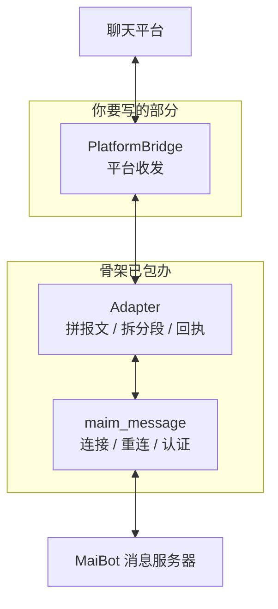

# 编写一个适配器

**接一个新平台只需要写三个方法。** 其余部分——连接 MaiBot、断线重连、认证、消息格式——都由官方 `maim_message` 库和一份百来行的骨架代码包办。这一页带你从零把它跑起来。

前置条件：

- **Python 3.10+**，能 `pip install maim_message`；
- 一个**能收发消息的平台 SDK**（平台官方库、OneBot 实现或你自己的协议栈）；
- 一个**已经跑起来的 MaiBot**，并且知道它的消息服务器地址与令牌。

::: tip 先确认你要接哪套服务
本页用**经典消息服务器**（默认开启，`ws://127.0.0.1:8000/ws`）。如果你要接的是 API 服务器（`enable_api_server`），连接参数换成 `x-apikey` / `x-platform`，报文要在外层多包一层信封——差别见[消息协议参考](./protocol.md)。
:::

## 骨架的分工



`PlatformBridge` 只有三个方法：发文本、发图片、收事件。骨架负责把事件拼成 MaiBot 的统一格式、把回复拆成分段、把平台真实消息 ID 回执给 MaiBot。

## 动手

::: steps
1. 装依赖。

   ::: code-group

   ```bash [pip ~vscode-icons:file-type-python~]
   pip install maim_message
   ```

   :::

   MaiBot 侧对版本有下限要求：低于 `0.6.2` 会直接拒绝启动消息服务，当前配套版本是 `0.6.8`。

2. 建目录。

   ```
   my-adapter/
   ├── adapter.py       # 骨架：连接、路由、回执
   ├── bridge.py        # 你的平台收发实现
   └── requirements.txt
   ```

3. 实现平台侧的三个方法。只关心平台 SDK 的调用，不要在这里碰 MaiBot 的格式。

   <<< @/zh/examples/adapter-minimal/adapter.py#bridge [bridge 部分 ~vscode-icons:file-type-python~]

   - **`send_text`** — 发送后返回平台侧消息 ID；拿不到就返回空串，回执会自动跳过。
   - **`send_image`** — 入站图片是 base64，多数平台需要先落盘或上传再发。
   - **`poll_events`** — 平台事件收成字典列表，字段约定见下一步。

4. 拼入站报文。缺少必填字段会触发 MaiBot 的**断言**，消息会被丢弃。

   <<< @/zh/examples/adapter-minimal/adapter.py#inbound [入站拼装 ~vscode-icons:file-type-python~]

   三条硬性要求：

   - **`user_info.user_id` 与 `user_info.user_nickname` 必须是非空字符串**；群消息还要 `group_info.group_id` 与 `group_info.group_name`；
   - **`message_id`、`time` 必须存在**，`time` 是 float 秒；
   - **文本分段的 `data` 必须是字符串**，数字 ID 要先 `str()`。

   顺手多填两个字段，出站回复才找得到路：

   ::: fields
   - **`additional_config.platform_io_account_id`** — 本适配器实例的账号标识；同平台多账号时靠它区分。
   - **`additional_config.platform_io_target_user_id`** — 私聊回复的收件人。
   :::

5. 处理出站分段。MaiBot 推过来的正文多半是 `seglist`，按 `type` 逐个翻译；不认识的分段类型记一条日志跳过，不要让整个适配器崩掉。

   <<< @/zh/examples/adapter-minimal/adapter.py#outbound [出站处理 ~vscode-icons:file-type-python~]

6. 回传真实消息 ID。发送成功后把平台返回的 ID 回执给 MaiBot，之后它才知道"这条回复在平台上是哪条"，撤回、引用、回复链才挂得上。

   ::: code-group

   ```python [回执 ~vscode-icons:file-type-python~]
   await client.send_custom_message(
       "message_id_echo",
       {"type": "echo", "echo": mmc_message_id, "actual_id": platform_message_id},
   )
   ```

   :::

   这里的 `client` 是 `maim_message.MessageClient`：`send_custom_message(message_type_name, message)` 只有 **2 个参数**，`platform` 由连接身份决定，不用传。3 参数的 `send_custom_message(platform, message_type_name, message)` 是服务端 `MessageServer` 的方法，适配器用不到。经典服务的类型名就是 `message_id_echo`；**API 服务器要写成 `custom_message_id_echo`**（API 客户端会自动补 `custom_` 前缀）。

7. 启动并连起来。

   ::: code-group

   ```python [主流程 ~vscode-icons:file-type-python~]
   async def run(self) -> None:
       await self.client.connect(url=MAIBOT_WS_URL, platform=PLATFORM, token=MAIBOT_TOKEN or None)
       # run() 阻塞并自带指数退避重连，和收事件循环并发跑
       await asyncio.gather(self.poll_loop(), self.client.run())
   ```

   :::

   `connect()` 只是存下连接参数，真正建连在 `run()` 里；**别忘了并发跑你自己的收事件循环**。
:::

## 完整代码

下面就是上面每一步拼起来的成品。复制出去，把 `PlatformBridge` 三个方法填上，改掉顶部的四个常量即可运行。

::: code-group

<<< @/zh/examples/adapter-minimal/adapter.py [adapter.py ~vscode-icons:file-type-python~]

:::

## MaiBot 侧要改什么

默认配置只监听本机。适配器和 MaiBot 不在同一台机器（或不在同一个容器网络）时，改 `config/bot_config.toml`：

::: code-group

```toml [bot_config.toml ~vscode-icons:file-type-toml~]
[maim_message]
ws_server_host = "0.0.0.0"   # 从 127.0.0.1 改成 0.0.0.0 才能被外部连上
ws_server_port = 8000
auth_token = ["换成一段足够长的随机串"]   # 非空即开启认证；适配器侧要填一模一样的值
```

:::

::: warning 认证值是原文比对
`auth_token` 走 `authorization` 请求头做**整串比较**，没有 `Bearer` 前缀解析。适配器侧多打一个 `Bearer ` 就会被以关闭码 1008 断开。
:::

## 多账号与访问范围

- **同平台多账号**：经典服务下一个 `platform` 只能有一条连接，第二条会把第一条顶掉。多账号要么把 `account_id` 填进 `additional_config` 并用不同 `platform`，要么改用 API 服务器的 `x-uuid` 区分，或走插件网关的 `account_id` / `scope`。
- **谁能用麦麦**：适配器不自带黑白名单，入站放行统一由 `config/adapter_policy.toml` 控制，见[访问策略与账户路由](./policy.md)。

## 部署建议

::: fields
- **单独进程** — 适配器崩了不要拖垮麦麦；用 systemd、supervisor 或一个独立的 Docker 容器托管。
- **别自己写重连** — `maim_message` 客户端自带指数退避重连（2 秒起，上限 10 秒），重复实现只会打架。
- **日志带平台名与账号** — 多账号排查时，没有这两个字段的日志基本没用。
- **大图先压缩** — 单帧上限 100 MB，图片与语音在协议上是 base64（体积约涨三分之一）；平台侧能压缩就先压缩。
- **保留一个测试群** — 上线前先在固定测试群跑通收发，再放开正式群。
:::

## 验证与排错

**验收动作** — 在平台上发一条"你好"：MaiBot 控制台出现入站日志，平台侧收到回复，且 MaiBot 日志里能看到 `收到回送消息ID` 的调试信息。

- **启动报"连接失败"或立刻断开** — 九成是地址问题：MaiBot 仍在监听 `127.0.0.1`，或端口没放行；容器部署还要确认端口映射。
- **关闭码 1008** — 令牌不一致，注意值要完全一致、不要加前缀。
- **连上了但麦麦没反应** — 先看平台名是否与配置一致，再查 `adapter_policy.toml` 是否放行该群 / 该用户。
- **报断言错误 / 消息直接消失** — 回到第 4 步逐项核对必填字段与类型，尤其是 `user_nickname` 和 `group_name`。
- **回复发不出去** — 私聊检查 `platform_io_target_user_id` 是否填了；群聊确认 `group_info.group_id` 与平台侧一致。
- **反复重连** — 同一个 `platform` 有两条连接在互相顶替，或者心跳超时（服务端 30 秒一次 PING、10 秒无响应即断）。
