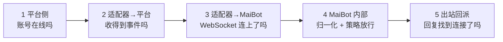

# 适配器排错

**"麦麦不理人"永远是五段链路里的一段断了，逐段确认比反复重启快得多。** 这一页给出分诊顺序、每段的判断依据，以及一个能直接问出"为什么这个会话被拦"的接口。

## 五段分诊



**从后往前切更省时间**：如果 MaiBot 控制台能看到入站日志，前两段就已经是好的，直接跳到第 4 段。

## 第 1 段：平台侧

平台客户端/机器人账号自己是否在线。QQ 本地客户端路线要确认登录没有掉线，开放平台路线要确认机器人没被限频或停用。

- **看平台客户端的界面** — 掉线时适配器收不到任何事件，MaiBot 侧自然一片安静。
- **看适配器日志** — 好的适配器会打印平台连接状态；只有"连上 MaiBot"这一条日志、没有平台侧日志，说明卡在这一段。

## 第 2 段：适配器 → 平台

发一条消息，看适配器是否收到事件：

- **适配器日志出现入站事件** — 这一段正常，继续往下。
- **完全没有反应** — 平台订阅/回调没注册成功，或群里没触发机器人（例如需要 @ 才推送）。

## 第 3 段：适配器 → MaiBot

这一段的问题在 MaiBot 侧有明确信号：

::: fields
- **`Connection refused` / 连接被拒绝** — MaiBot 没起消息服务器，或地址端口不对，或只在 `127.0.0.1` 监听而适配器在别处。
- **关闭码 1008（无效的令牌）** — `auth_token` 不一致；值是整串比对，别加 `Bearer` 前缀。
- **关闭码 1000（新的连接已建立）** — 同一个 `platform` 有第二条连接把它顶掉了。
- **连上后很快断开、反复重连** — 心跳超时（服务端 30 秒 PING、10 秒无响应即断）；也可能是适配器阻塞了事件循环，没回 PONG。
:::

::: tip 先确认端口真的开着
容器部署最容易踩这个坑：`docker-compose.yml` 默认并没有把消息服务器端口映射出来，只在容器内部可用。要么把端口映射出来，要么让适配器和 MaiBot 在同一网络里按服务名互访。
:::

## 第 4 段：MaiBot 收到了吗

打开日志看入站。默认控制台是 `INFO`，入站消息一般会留下痕迹；没有的话先临时调低级别：

::: code-group

```toml [bot_config.toml ~vscode-icons:file-type-toml~]
[log]
console_log_level = "DEBUG"              # 控制台临时开 DEBUG
file_log_level = "DEBUG"                 # 文件日志保持 DEBUG，排查完再调回去
library_log_levels = { aiohttp = "WARNING", PIL = "WARNING" }   # 压掉第三方噪音
```

:::

**有入站日志但没回复** → 大概率是访问策略拦了。直接问接口，它会连原因一起返回：

::: endpoint POST /api/chat/sessions/adapter-status
批量查询会话的放行状态。请求体传会话 ID 列表，返回每个会话的 `allowed` 与 `reason`。

::: fields
- **请求体 `session_ids`** — 会话 ID 数组，最多 500 个；先调 `GET /api/chat/sessions` 拿到。
- **`allowed`** — 是否放行。
- **`reason`** — 拦截原因，例如命中黑名单还是条目不匹配。
:::
:::

**连入站日志都没有** → 消息在归一化阶段就丢了，回头核对必填字段（`user_info`、`group_info`、`message_id`、`time`），见[消息协议参考](./protocol.md#经典报文-一条消息对象)。这类失败往往是断言异常，日志里会带堆栈。

## 第 5 段：回复发得出去吗

MaiBot 生成回复后要走 Platform IO 找到发送驱动。这一段出问题的三种典型：

::: fields
- **发到了别的账号 / 别的群** — 路由三元组 `platform` / `account_id` / `scope` 与入站上报的不一致；用 `GET /api/webui/bot-accounts` 确认账号被谁接管。
- **完全没发出，日志说没有可用驱动** — 该平台没有显式发送绑定、经典通道也不可用；插件网关场景下先确认网关已上报就绪。
- **私聊回复丢了收件人** — 出站消息缺 `additional_config.platform_io_target_user_id`，适配器侧构造入站报文时要把它带上。
:::

要确认某个目标会被解析到哪条连接，可以用这两个接口：

::: endpoint GET /api/chat/resolve-target
把 `platform` + `item_id` + `rule_type` 解析成具体的会话/路由目标，用来验证路由三元组。

:::

::: endpoint POST /api/chat/resolve-targets
批量版本，请求体传 `targets` 数组（最多 200 条）。

:::

## 工具箱

**实时看日志** — WebUI 的 WebSocket 支持订阅日志流，不用盯着终端：

::: code-group

```json [订阅日志 ~vscode-icons:file-type-json~]
{ "op": "subscribe", "id": "1", "domain": "logs", "topic": "main", "data": { "replay": 100 } }
```

:::

订阅后会先收到一份 `snapshot`（最近日志），随后每条新日志以 `event: entry` 推来。连接需要先用 `GET /api/webui/ws-token` 换一次性握手令牌。

**无平台演练** — `maim_message` 仓库的 `others/` 目录里有一个模拟适配器实现（`mock_napcat_adapter`）和一组自检脚本，可以在没有真实平台账号时把协议链路跑通。它们是给库自身的测试用的，拿来当"假适配器"验证 MaiBot 侧最合适。

**抓报文** — 协议问题最终要看原始帧。在适配器侧打印实际发出的 `dict`，比在服务端猜快得多；注意入站消息会被规范化（`message_id`、`user_id`、`group_id` 强制转字符串），别拿打印出来的值反推协议要求。

**看事件循环有没有被卡住** — 适配器如果做同步阻塞调用，会连心跳都回不了。MaiBot 侧可以开看门狗确认问题不在自己这边：

::: code-group

```toml [bot_config.toml ~vscode-icons:file-type-toml~]
[log]
event_loop_watchdog_warn_seconds = 0.5   # 事件循环迟到超过 0.5 秒就告警；需要重启生效
```

:::

## 验证与排错

**一条命令级的最小验证** — 先把范围压到最小：只留一个适配器、一个测试群、一个测试用户，`adapter_policy.toml` 里对测试群显式 `allow`，然后在测试群发"你好"，按下面顺序确认：

1. 适配器日志有平台入站事件；
2. 适配器日志有"已连接 MaiBot"且没有断线重连；
3. MaiBot 控制台出现入站日志；
4. `POST /api/chat/sessions/adapter-status` 返回 `allowed: true`；
5. 平台侧收到回复。

**卡在哪一步，就回到对应的那一段**。四步全过但平台上没出现回复时，问题在出站：查上一条出站日志里的路由三元组，与入站上报的值逐个字符比对。

- **改完配置没变化** — 适配器策略文件是热读的，但 `bot_config.toml` 里与消息服务器、日志相关的字段需要重启 MaiBot。
- **DEBUG 日志刷不出入站** — 确认日志级别改对了文件（`bot_config.toml` 的 `[log]` 段），并在改后重启。
- **一切正常但偶发丢消息** — API 服务器路径下同一 `msg_id` 一小时内重发会被静默丢弃；适配器重试必须换新 ID。
