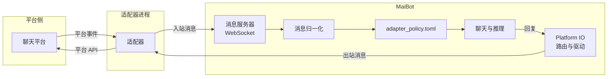

# 适配器接入

**适配器（Adapter）把 MaiBot 接进一个聊天平台，它不在 MaiBot 进程里跑。** 典型形态是一个独立 Python 进程：一边连平台（登录 QQ、连 Telegram、收邮件），另一边用 WebSocket 连到 MaiBot 的消息服务器。MaiBot 本体不含任何平台逻辑，只认一套统一消息格式。

本页帮你选路线、认骨架；具体协议与代码见[消息协议参考](./protocol.md)与[编写一个适配器](./build.md)。

## 先选一条实现路线

MaiBot 支持两种"适配器"，按你的场景二选一：

**外部独立适配器进程** — 单独部署、单独升级，进程崩了不影响麦麦本体；可以跨语言（只要能说 WebSocket + 那套 JSON）。QQ、Telegram、邮件等平台适配器都走这条。适合：正式对接一个平台。

**插件网关（[`@MessageGateway`](/plugin/message-gateway)）** — 把收发消息写进一个 MaiBot 插件里，由插件运行时托管生命周期，跟着麦麦一起启停；只能写 Python。适合：轻量平台、内部系统、你已经有一个插件想顺便收发消息。

两条路线最终都汇入同一套路由与策略，可以并存；同一个平台也可以先跑外部适配器、后期改成插件网关。

::: tip 官方适配器现在走哪条？
1.3.0 起，官方维护的适配器（统一 QQ 连接器、QQ 官方机器人等）都以**插件**形态分发，安装与启用见[接入平台](/manual/adapters/)。外部独立进程路线主要用于自研适配器或跨语言实现。
:::

## 谁负责什么



- **适配器** — 平台协议翻译：登录、收事件、把平台消息转成统一格式发进来；收到统一格式的回复再调平台 API 发出去。
- **消息服务器** — 只负责 WebSocket 接入、认证和把消息交给聊天管线。
- **Platform IO** — 出站时按 `platform` / `account_id` / `scope` 找到该发给哪个驱动，并做入站去重。
- **访问策略** — `config/adapter_policy.toml` 决定哪些群、哪些人放行，见[访问策略与账户路由](./policy.md)。

适配器要做的，就是把平台事件拼成下面这种东西发过来（回复也是同一个结构，只是方向相反）：

::: code-group

```json [一条入站消息 ~vscode-icons:file-type-json~]
{
  "message_info": {
    "platform": "telegram",
    "message_id": "114514",
    "time": 1750000000.0,
    "group_info": { "platform": "telegram", "group_id": "-1001234567890", "group_name": "摸鱼群" },
    "user_info": { "platform": "telegram", "user_id": "10086", "user_nickname": "阿岚" },
    "additional_config": { "platform_io_account_id": "bot_1" }
  },
  "message_segment": { "type": "text", "data": "麦麦在吗" }
}
```

:::

字段逐个怎么填、哪些不填会直接崩，见[消息协议参考](./protocol.md)。

## 两套 WebSocket 服务怎么选

MaiBot 同时提供两套消息服务器，都挂在同一个端口体系下，路径都是 `/ws`：

**经典消息服务器（Legacy）** — 默认开启，`maim_message.ws_server_host:ws_server_port`，默认 `127.0.0.1:8000`。握手头 `platform` + `authorization`，一个平台只能有一条连接。现有适配器绝大多数走这条。

**API 服务器（Additional API Server）** — 默认关闭，需要把 `maim_message.enable_api_server` 打开，监听 `api_server_host:api_server_port`（默认 `0.0.0.0:8090`）。握手用 `x-apikey` / `x-platform` / `x-uuid`，支持多连接与 API Key 白名单，报文外层多一个信封（`ver` / `msg_id` / `type` / `meta` / `payload`），并带 ACK 与断线重发。

::: warning 开 API 服务器前先设白名单
`api_server_host` 默认是 `0.0.0.0`，而 `api_server_allowed_api_keys` 为空表示**不校验**。要开这个服务，先填白名单，或把它绑回 `127.0.0.1`。
:::

## 现成适配器

优先用别人写好的；确认它支持你当前的 MaiBot 版本再装：

<Linkcard url="https://github.com/Mai-with-u/MaiBot-SnowLuma-Adapter" title="统一 QQ 连接器" description="官方维护：登录自己的 QQ，同时支持 SnowLuma / NapCat 客户端" logo="/title_img/mai.png" />

<Linkcard url="https://github.com/Mai-with-u/MaiBot-QQ-Adapter" title="QQ 官方机器人" description="官方维护：AppID + AppSecret 直连 QQ 开放平台" logo="/title_img/mai.png" />

<Linkcard url="https://github.com/Mai-with-u/MaiBot-Telegram-Adapter" title="Telegram 适配器" description="官方维护：把麦麦接进 Telegram 群与私聊" logo="/title_img/mai.png" />

<Linkcard url="https://github.com/Mai-with-u/maim_message" title="maim_message" description="统一消息格式与 WebSocket 通信库，写适配器必装" logo="/title_img/mai.png" />

安装与配置这些适配器属于使用范畴，见[接入平台](/manual/adapters/)；本页之后的内容是**自己写一个**。

## 接入前你要准备什么

- **平台侧能力** — 能拿到消息事件、能调发送接口。通常是平台官方 SDK、OneBot 实现或私有协议库。
- **Python 3.10+** — 用官方 `maim_message` 库能省掉全部协议细节；其他语言需要自己实现 WebSocket 与 JSON 结构。
- **MaiBot 的地址与令牌** — 本机部署就是 `ws://127.0.0.1:8000/ws`；配置了 `auth_token` 就要带上同样的字符串。
- **一个不冲突的平台名** — 例如 `telegram`、`discord`；不要占用 `webui`，它是 MaiBot 内部使用的平台名。

## 接下来

- 搞清报文长什么样 → [消息协议参考](./protocol.md)
- 动手写最小可用适配器 → [编写一个适配器](./build.md)
- 控制谁能用、多账号怎么路由 → [访问策略与账户路由](./policy.md)
- 连不上、收不到、发不出 → [适配器排错](./debugging.md)

## 验证与排错

最小验证：启动 MaiBot → 启动适配器 → 往平台发一条消息，MaiBot 控制台应出现入站日志并回复。

- **适配器启动即报连接失败** — 九成是把 `ws_server_host` 留在 `127.0.0.1` 却从容器/另一台机器连；改 `config/bot_config.toml` 的 `maim_message.ws_server_host` 为 `0.0.0.0` 并放行端口。
- **连上了但 MaiBot 没反应** — 先看平台名是否与访问策略里的记录一致，再看 `adapter_policy.toml` 是否放行了该群 / 该用户。
- **回复发不出去** — 检查出站驱动是否被插件网关抢占，或私聊缺 `platform_io_target_user_id`；详见[适配器排错](./debugging.md)。
- **反复被顶下线** — 同一个 `platform` 同时跑了两条经典连接，停掉多余的那个。
