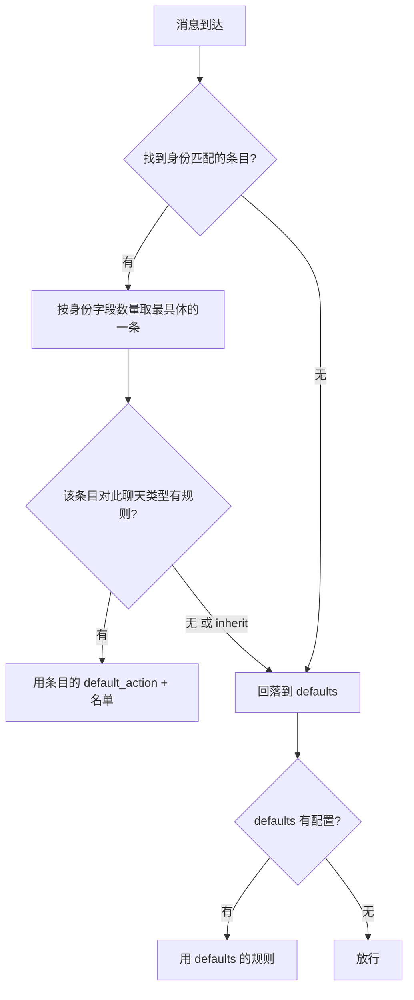

# 访问策略与账户路由

**适配器不带黑白名单，放行范围统一由 MaiBot 的 `config/adapter_policy.toml` 决定。** 排查"适配器明明连上了麦麦却不理人"时，这里是第一现场；同平台多账号、多客户端实例的归属也由同一套身份字段决定。

## 三个概念

**身份（identity）** — 一个适配器实例是谁。由最多六个字段描述：`adapter_id`、`plugin_id`、`gateway_name`、`platform`、`account_id`、`scope`。字段填得越多，这个条目越具体。

**条目（`[[adapters]]`）** — 针对某个身份写的一段策略，内部再按群聊 / 私聊分别给规则。

**动作** — 放行（`allow`）、拦截（`block`）、继承（`inherit`，只对条目内规则有效，表示继续用更宽的那一层）。

## 配置模板

文件缺失等于全部放行，所以这份配置是可选的；一旦要限制范围，照下面写：

::: code-group

```toml [adapter_policy.toml ~vscode-icons:file-type-toml~]
# 兜底规则：所有没被下面条目命中的适配器都走这里
[defaults.group]
default_action = "allow"   # allow 放行 / block 拦截（兜底层只允许这两个值）
deny_ids = ["123456"]      # 群号黑名单

[defaults.private]
default_action = "allow"

# 针对某个适配器实例的规则：命中身份字段越多，优先级越高
[[adapters]]
platform = "telegram"              # 只写 platform，就管住该平台的所有账号
account_id = "bot_1"               # 再加上账号，范围更窄
# adapter_id / plugin_id / gateway_name / scope 也是可选的身份字段

[adapters.group]
default_action = "block"           # 这个账号只服务白名单群
allow_ids = ["-1001234567890", "测试群ID"]
deny_ids = []                      # allow_ids 与 deny_ids 不能有交集

[adapters.private]
default_action = "inherit"         # 不单独限制私聊，沿用 defaults.private

# 临时停掉一个适配器：不看聊天类型，直接全部拦截
[[adapters]]
platform = "telegram"
account_id = "bot_2"
disabled = true
```

:::

::: fields
- **`default_action`** — 兜底层（`[defaults.*]`）只能写 `allow` / `block`；条目层（`[adapters.*]`）还可以写 `inherit`。
- **`allow_ids`** — 允许的群号 / 用户号列表。
- **`deny_ids`** — 拒绝的群号 / 用户号列表；与 `allow_ids` 有交集会直接报错。
- **`disabled`** — 写在 `[[adapters]]` 条目上，等于把这个适配器整个停用。
:::

身份字段全部留空的条目永远不会命中——至少要写一个。

## 匹配与优先级



### 举个例子

配置长这样：

::: code-group

```toml [adapter_policy.toml ~vscode-icons:file-type-toml~]
[defaults.group]
default_action = "allow"
deny_ids = ["123456"]

[[adapters]]
platform = "telegram"
account_id = "bot_1"

[adapters.group]
default_action = "block"
allow_ids = ["-1001234567890"]
```

:::

三条消息的判定结果：

::: fields
- **来自 `telegram` / `bot_1`，群 `-1001234567890`** — 命中第 2 条（身份字段 2 个），群在白名单 → **放行**。
- **来自 `telegram` / `bot_1`，群 `99999`** — 同样命中第 2 条，不在白名单 → **拦截**。
- **来自 `telegram` / `bot_2`，群 `123456`** — 没有匹配的条目，回落到 `defaults.group`，命中 `deny_ids` → **拦截**。
:::

- **条目优先于兜底**，且**更具体的条目优先**：命中身份字段多的条目胜出。
- 条目里写 `default_action = "inherit"` 表示"这一层不管"，继续往外层走。
- 兜底层也没配就放行——`config/adapter_policy.toml` 不存在时等同于全部放行。

## 身份字段从哪来

适配器在入站消息的 `additional_config` 里上报 `account_id` 与 `scope`，MaiBot 用它拼出运行时身份：

- **`platform`** — 平台名，握手时就确定了，且会被规范化为小写。
- **`account_id`** — 账号标识。适配器用 `platform_io_account_id`（或 `account_id`、`self_id`、`bot_account`）上报。
- **`scope`** — 连接作用域。适配器用 `platform_io_scope`（或 `route_scope`、`adapter_scope`、`connection_id`）上报。
- **`plugin_id` / `gateway_name`** — 只有插件网关路线才有；`adapter_id` 会自动拼成 `gateway:<plugin_id>:<gateway_name>`。

字段的完整约定见[消息协议参考](./protocol.md#路由字段)。

## 出站路由怎么选连接

入站策略解决"要不要理你"，出站路由解决"回复从哪条连接发出去"。MaiBot 按 **最具体优先** 的顺序查找发送驱动：

1. `platform` + `account_id` + `scope` 全匹配；
2. `platform` + `account_id`；
3. `platform` + `scope`；
4. 只匹配 `platform`；
5. 一条都没命中时，回退到该平台的经典（legacy）发送通道。

::: warning 显式绑定会挤掉回退
只要有一条更具体的发送绑定命中，MaiBot 就不会再走经典通道。装了插件网关却发现消息发不出去时，先确认是不是这条规则在起作用。
:::

已注册的账号可以在 WebUI 看到，也可以直接查：

::: endpoint GET /api/webui/bot-accounts
列出所有见过的平台账号，含 `online`、`last_adapter_id`、`last_plugin_id`、`last_gateway_name` 等字段，用来确认某个账号到底被哪个适配器接管。

::: fields
- **`platform`** — 平台名。
- **`account_id`** — 账号标识。
- **`online`** — 当前是否在线。
- **`last_source` / `last_adapter_id` / `last_plugin_id` / `last_gateway_name`** — 最近一次是哪个适配器 / 插件 / 网关在用它。
:::
:::

## 用 WebUI 或接口改策略

日常改动用 WebUI 的**适配器设置**最省事，入口见[适配器管理](/manual/webui/adapter-management)。要写进自动化脚本时，用这几个接口（都需要登录 Cookie，见[程序化对接](../webui-api/)）：

::: fields
- **`GET /api/chat/adapters/policy/defaults`** — 读兜底规则。
- **`PUT /api/chat/adapters/policy/defaults`** — 改兜底规则。
- **`GET /api/chat/adapters/plugins/{plugin_id}/policy`** — 读某个适配器的有效策略，同时返回 `global_defaults`、`active_identity`、`has_entry`。
- **`PUT /api/chat/adapters/plugins/{plugin_id}/policy`** — 写某个适配器条目的群聊 / 私聊规则；适配器没在运行时返回 404。
- **`PUT /api/chat/sessions/{session_id}/adapters/policy`** — 对单个会话打补丁，`action` 取 `allow` / `block` / `inherit`。
:::

## 验证与排错

**验收动作** — 改完策略后在测试群发一条消息：麦麦有回复说明放行成功；把该群加进 `deny_ids` 再发一条，应当完全无响应且日志里能看到被拦截。

- **适配器连上了但麦麦不理人** — 按序检查：策略文件是否放行了该群 / 该用户 → 条目的身份字段是否与适配器上报的一致（尤其 `account_id`）→ `disabled` 是否被置为 `true`。
- **改了文件没生效** — 检查语法：`allow_ids` 与 `deny_ids` 不能有交集；兜底层的 `default_action` 只能是 `allow` / `block`。
- **回复发不出去或发到了错误的账号** — 查 `/api/webui/bot-accounts` 确认该账号被谁接管，再回看上面的出站路由顺序。
- **同平台只允许一个账号在线的假设不成立** — 经典服务下同 `platform` 只有一条连接，多账号必须用不同 `platform`、API 服务器的 `x-uuid`，或插件网关的 `account_id` / `scope`。
- **平台名大小写不一致** — 平台名会被规范化为小写，策略里也用小写写。
