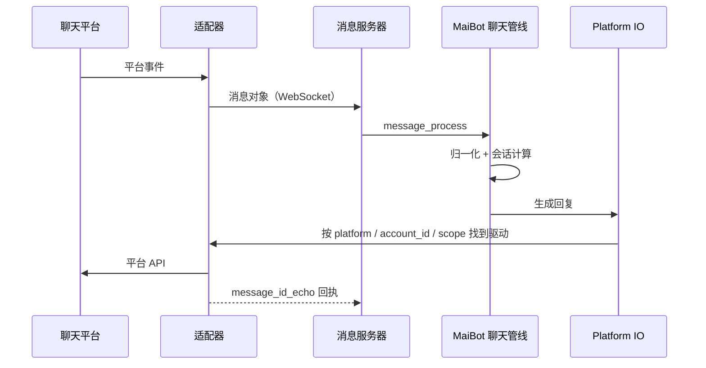

# 消息协议参考

**MaiBot 只认一套统一消息格式，适配器的全部工作就是把平台消息翻译成它、再把回复翻译回去。** 这一页是写适配器时的对照表：连接怎么握、报文长什么样、字段哪些必填、哪些地方会静默失败。

MaiBot 同时提供两套 WebSocket 服务，报文格式不同，先确认你要接哪一套。

## 两套服务的区别

**经典消息服务器（Legacy）** — 默认开启。报文就是一条消息对象本身，没有外层信封；认证靠 `authorization` 头。现有适配器几乎都走这条。

**API 服务器（Additional API Server）** — 需要显式开启。报文外面多一层信封（`msg_id`、`type`、`meta`、`payload`），支持多连接、ACK 确认与断线重发。

::: endpoint WS /ws（经典）
经典消息服务器的连接端点。地址取自 `config/bot_config.toml` 的 `maim_message.ws_server_host` 与 `maim_message.ws_server_port`，默认 `ws://127.0.0.1:8000/ws`。

::: fields
- **握手头 `platform`** — 必填。平台名，决定消息归属哪个平台；缺省时库会写成 `unknown`，MaiBot 侧无法路由。
- **握手头 `authorization`** — 仅在 `maim_message.auth_token` 非空时校验；值是**令牌原文**，不做 `Bearer` 解析。
- **认证失败** — 服务端以关闭码 `1008`（原因 `无效的令牌`）断开。
- **同平台唯一** — 同一个 `platform` 只保留最新一条连接，旧连接被关闭码 `1000`（原因 `新的连接已建立`）顶掉。
- **心跳** — WebSocket 协议层 PING/PONG，没有 JSON 心跳报文。服务端 30 秒发一次、10 秒无响应即断开。
- **单帧上限** — 100 MB。
:::
:::

::: endpoint WS /ws（API）
API 服务器的连接端点，地址取自 `maim_message.api_server_host` 与 `maim_message.api_server_port`，默认 `ws://0.0.0.0:8090/ws`。需要先把 `maim_message.enable_api_server` 设为 `true`。

::: fields
- **`x-apikey`** — API Key，可放请求头，也可放查询串 `?api_key=`。**查询串优先**。
- **`x-platform`** — 平台名，同样支持 `?platform=`，查询串优先。
- **`x-uuid`** — 连接标识，不传则服务端生成。用它区分同平台的多条连接。
- **认证失败** — 关闭码 `1000`，原因里带说明。
- **白名单** — `maim_message.api_server_allowed_api_keys` 为空表示**不校验**；默认监听 `0.0.0.0`，对外暴露前务必先填白名单。
- **心跳** — 同为协议层 PING/PONG，间隔走 uvicorn 默认值。
:::
:::

## 经典报文：一条消息对象

经典路径直接发一条消息对象，两个顶层字段：

**`message_info`** — 消息元信息。`platform`、`message_id`、`time` 必填；`group_info`、`user_info`、`additional_config` 是路由与业务的关键。

**`message_segment`** — 消息正文，形如 `{"type": "...", "data": ...}`；`type` 为 `seglist` 时 `data` 是分段数组。

::: code-group

```json [群消息 ~vscode-icons:file-type-json~]
{
  "message_info": {
    "platform": "telegram",
    "message_id": "114514",
    "time": 1750000000.0,
    "group_info": {
      "platform": "telegram",
      "group_id": "-1001234567890",
      "group_name": "摸鱼群"
    },
    "user_info": {
      "platform": "telegram",
      "user_id": "10086",
      "user_nickname": "阿岚",
      "user_cardname": "岚"
    },
    "additional_config": {
      "platform_io_account_id": "bot_1"
    }
  },
  "message_segment": {
    "type": "text",
    "data": "麦麦在吗"
  }
}
```

:::

::: warning `user_info` 和 `group_info` 一个都不能少
MaiBot 在归一化时会直接断言 `user_info.user_id`、`user_info.user_nickname` 是非空字符串，群消息还要求 `group_info.group_id`、`group_info.group_name` 是非空字符串。缺少这些字段会触发断言异常，消息会被丢弃。
:::

## 分段类型

`message_segment.type` 决定 `data` 的类型，入站支持以下取值：

::: fields
- **`text`** — `string`。纯文本。
- **`image`** — `string`。图片的 base64 内容。
- **`emoji`** — `string`。表情图片的 base64 内容。
- **`voice`** — `string`。语音的 base64 内容。
- **`file`** — `object`。文件信息。
- **`at`** — `string` 或 `object`。被 @ 的用户 ID，OneBot 风格的字典也接受。
- **`reply`** — `string`。被回复消息的 ID。
- **`dict`** — `object`。自定义结构化载荷。
- **`seglist`** — `Seg[]`。分段数组，用于图文混合；出站几乎都是这个形态。
:::

出现其它类型会直接抛 `NotImplementedError`。类型和 `data` 对不上（例如 `text` 传了数字）同样会崩，**发之前先 `str()` 一遍**。

## 出站消息怎么看

MaiBot 回复时推给适配器的还是一条消息对象，但正文通常是 `seglist`，并且要自己按 `type` 逐个翻译成平台操作：

::: code-group

```json [出站 ~vscode-icons:file-type-json~]
{
  "message_info": {
    "platform": "telegram",
    "message_id": "1750000000.123",
    "time": 1750000000.0,
    "group_info": { "platform": "telegram", "group_id": "-1001234567890", "group_name": "摸鱼群" },
    "user_info": { "platform": "telegram", "user_id": "0", "user_nickname": "MaiBot" },
    "additional_config": { "platform_io_target_user_id": "" }
  },
  "message_segment": {
    "type": "seglist",
    "data": [
      { "type": "text", "data": "在的，" },
      { "type": "at", "data": "10086" },
      { "type": "text", "data": " 怎么了" }
    ]
  }
}
```

:::

私聊出站依赖 `additional_config.platform_io_target_user_id` 找收件人——它是 MaiBot 从会话上继承下来的，适配器只要读，不要改。

## API 报文：信封 + 载荷

API 服务器在消息对象外再包一层信封，五个字段固定：

::: fields
- **`ver`** — 整数，固定 `1`。收发双方都不校验。
- **`msg_id`** — 字符串。消息唯一标识，服务端出站形如 `msg_<12位十六进制>_<秒级时间戳>`；ACK 用 UUID。
- **`type`** — 字符串。`sys_std` 标准消息、`custom_*` 自定义消息、`sys_ack` 确认、其它 `sys_*` 由服务端静默忽略。
- **`meta`** — 对象。出站含 `sender_user`、`target_user`、`platform`、`timestamp`；入站没有 `target_user`，且 `sender_user` 装的是 **API Key**。
- **`payload`** — 对象。`sys_std` 时是消息对象；`custom_*` 时是任意业务载荷。
:::

载荷在 API 路径下用 `APIMessageBase`，比经典格式多一个 `message_dim`，并把群/用户信息收进 `sender_info` / `receiver_info`：

::: fields
- **`message_info.platform`** — 必填。
- **`message_info.message_id`** — 必填。
- **`message_info.time`** — 必填，float 秒。
- **`message_info.sender_info`** — 发送者，内含 `group_info` 与 `user_info`。
- **`message_info.receiver_info`** — 接收者，结构同上，出站时用于定位收件人。
- **`message_segment`** — 同上，`{type, data}`。
- **`message_dim.api_key`** — 必填。出站路由靠它决定投给谁。
- **`message_dim.platform`** — 必填。
:::

`payload` 里若同时缺 `message_info` 与 `message_segment`，整段载荷会被当成一条文本消息塞进 `text` 分段——这是个很容易掩盖 bug 的兜底行为。

### ACK 与可靠性

收到带 `msg_id` 且类型不是 `sys_ack` 的消息时，服务端会立刻回一条确认：信封 `type` 为 `sys_ack`，`meta.acked_msg_id` 指向被确认的消息，`payload` 形如 `{"status": "received", "server_timestamp": 1750000000.0}`。

**`sys_ack` 不会进入业务分发**，它只用于可靠性投递：发送失败或连接不在时消息按 `msg_id` 进缓存（默认 300 秒、最多 1000 条），连接恢复后自动重发，收到 ACK 即移出缓存。断线超过 5 分钟的出站消息会被丢弃。

服务端按 `msg_id` 去重，窗口 **1 小时**：同一个 `msg_id` 一小时内重发会被静默丢弃。所以**重试必须换 `msg_id`**。

## 消息 ID 回执

平台真正发出的消息 ID 通常要等发送成功才知道，而 MaiBot 在排队发送时已经生成了自己的 ID。回执机制就是把两者对上：

发送成功后，适配器发一条自定义消息，载荷形如：

::: code-group

```json [回执载荷 ~vscode-icons:file-type-json~]
{
  "type": "echo",
  "echo": "1750000000.123",
  "actual_id": "114515"
}
```

:::

- **`echo`** — MaiBot 出站消息的 `message_id`。
- **`actual_id`** — 平台返回的真实消息 ID。

这两个调用分属两个类，参数个数不同，不要混用：

**适配器侧 —— `MessageClient.send_custom_message(message_type_name, message)`（2 个参数）** — 适配器连上 MaiBot 后是客户端，`platform` 由连接身份决定，不需要传；类型名单独作为第一个参数。

**MaiBot 服务端侧 —— `MessageServer.send_custom_message(platform, message_type_name, message)`（3 个参数）** — 第一个参数是目标平台名，服务端用它把自定义消息回发给对应适配器的连接；适配器侧不会用到这个签名。

类型名按你连的那套服务取：**经典服务**用 `"message_id_echo"`，类型名是独立字段，不需要前缀；**API 服务器**的信封 `type` 必须是 `custom_` 开头的完整名字，即 `"custom_message_id_echo"`（API 客户端在类型名缺少 `custom_` 前缀时会自动补上），接收端按这个前缀分发。

MaiBot 找不到对应消息时只记一条调试日志，不影响主流程。

## 路由字段

出站要找到"该走哪个驱动"，靠三个路由维度：

::: fields
- **`platform`** — 平台名。会被 `strip().lower()` 规范化，大小写不一致会导致路由不到。
- **`account_id`** — 账号。多账号同平台时用它区分。
- **`scope`** — 作用域。同一账号下的多连接（如多个客户端实例）用它区分。
:::

旧 WebSocket / `maim_message` 适配器通过 `additional_config` 上报账号和作用域，键名有多个候选写法，任选其一：

**账号** — `platform_io_account_id`、`account_id`、`self_id`、`bot_account`

**作用域** — `platform_io_scope`、`route_scope`、`adapter_scope`、`connection_id`

它们可以放在消息顶层、`message_info` 里，或 `message_info.additional_config` 里。

### 插件适配器的正式消息归属

插件网关通过 `ctx.gateway.update_state(ready=True, platform=..., account_id=..., scope=...)` 声明路由。每条消息在顶层填写非空 `account_id` 和可选 `scope`，Host 校验消息的 `platform/account_id/scope` 与所属网关声明一致。单账号同样需要明确填写消息归属。

- **网关声明** — 决定接入哪些机器人身份。账号发现只发生在网关就绪上报中，普通消息不会新增账号或改写网关声明。
- **消息归属** — 决定这条消息由哪个机器人账号处理，与 `message_info.user_info.user_id` 表示的发送者分开。正式字段贯通内部消息、Hook、聊天流、消息存储和出站消息。
- **多账号接入** — 当前每个网关声明一条路由，一个插件可分别声明多个网关，并将消息提交给匹配的网关。
- **空作用域** — 消息 `scope` 可省略或填写 `None`；网关的空字符串会归一化为空作用域。若声明了作用域，消息必须填写相同值。

旧消息中的 `additional_config.self_id`、`platform_io_account_id` 等归属别名，以及 `route_metadata` 中的旧归属格式暂时兼容，使用时打印 WARNING，提示下个版本移除。新适配器应直接填写正式字段；提供顶层 `account_id` 后，旧字段不再参与选择，也不会在正式字段为空时兜底。

旧 WebSocket / `maim_message` 接口仍走其兼容消息格式，不应把该格式当作新插件网关的开发规范。完整字典示例与迁移规则见[消息网关](../../plugin/message-gateway.md#消息归属)。

::: warning 不要占用 `webui` 这个平台名
`webui` 由 Platform IO 隐式注册为内置平台，`bot_console`、`maisaka_cli` 也是保留名。适配器用一个自己的名字，例如 `telegram`。
:::

## 一次收发的完整路径



入站顺序不保证：服务端收到消息后是并发处理的。需要严格顺序的适配器要自己串行化。

## 验证与排错

**最小验证** — 用 `maim_message` 的客户端连上服务端，发一条 `text` 消息到测试群，MaiBot 控制台应出现入站日志。

- **连接被立刻关闭、关闭码 1008** — `auth_token` 配了但令牌不对；注意值是原文，加了 `Bearer ` 前缀会认证失败。
- **连接上了但 MaiBot 没有任何反应** — 大概率是 `platform` 缺失或与策略里的记录不一致；先确认握手头/`message_dim` 里的平台名。
- **报文发出后报断言错误** — 检查 `user_info.user_id`、`user_info.user_nickname`、`group_info.group_id`、`group_info.group_name` 是否都是非空字符串，`text` 分段的 `data` 是否是字符串。
- **回复发不出去** — 确认出站消息能路由到你的驱动：`platform` 拼写一致、`account_id` / `scope` 与入站上报的一致。
- **消息重复或丢失** — API 路径下同一 `msg_id` 一小时内重发会被丢弃，重试要换新 ID；出站消息断线超过 5 分钟会被丢弃。
- **被反复顶下线** — 同一个 `platform` 起了两条经典连接，停掉多余的那条。
