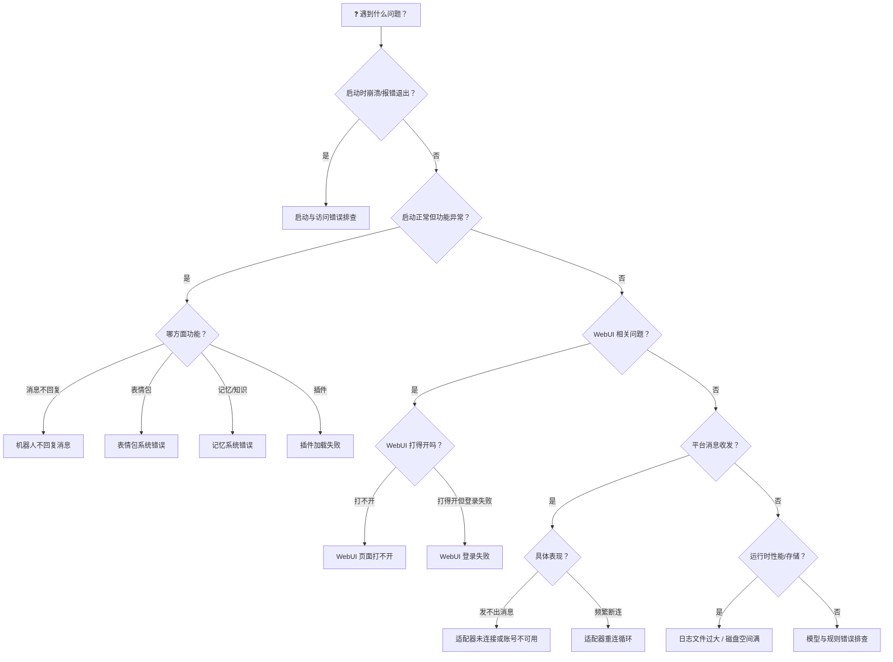

# 🔧 错误排查 FAQ

> ⚠️ **网络是 80% 问题的根源** — API 连不上、Git 拉不下来、插件装不了，大概率都是网络问题。
> 遇到任何报错，先检查能不能访问外网（`curl -I https://www.baidu.com`），不行就换网络/开代理。

> 错误排查已按主题拆分为下面的专题页。遇到问题时，先按「按主题分流」找到对应页面；日志里已有明确错误代码或关键词时，直接用「⚡ 错误代码速查表」定位；不确定问题属于哪一类，就看文末的「📋 错误排查流程图」。

## 按主题分流

**[启动与访问错误排查](./troubleshooting-startup.md)** — MaiBot 起不来、WebUI 打不开或登录不上：配置文件、MCP、端口、WebUI 访问与登录、WebUI 里的 Git 操作。

**[模型与规则错误排查](./troubleshooting-model.md)** — 机器人行为不符合预期：API Key 与余额、网络超时、正则表达式、关键词规则。

**[运行与数据错误排查](./troubleshooting-runtime.md)** — 运行期异常与数据问题：不回复消息、数据库、表情包、记忆、磁盘空间、人物与用户数据。

**[插件与适配器错误排查](./troubleshooting-plugins-adapters.md)** — 插件与适配器：插件加载失败、适配器未连接或账号不可用、WebSocket 重连循环。

**[获取帮助](./getting-help.md)** — 提问前自查、提交 Issue 的信息清单、社区支持渠道和获取日志的方法。

## ⚡ 错误代码速查表

> 按错误日志中常见的关键词快速定位到对应场景。

### HTTP 状态码速查

**HTTP 400 Bad Request** 🟧 严重 → [适配器未连接或账号不可用](./troubleshooting-plugins-adapters.md#适配器未连接或账号不可用) — 请求参数错误，消息发送失败

**HTTP 401 Unauthorized** 🟥 致命 → [API Key 错误/余额不足](./troubleshooting-model.md#api-key-错误-余额不足) — API Key 无效或缺失

**HTTP 401 Unauthorized** 🟧 严重 → [WebUI 登录失败 / Token 过期](./troubleshooting-startup.md#webui-登录失败-token-过期) — Session 过期或 Token 失效

**HTTP 402 Payment Required** 🟧 严重 → [API Key 错误/余额不足](./troubleshooting-model.md#api-key-错误-余额不足) — 账户余额不足

**HTTP 403 Forbidden** 🟥 致命 → [API Key 错误/余额不足](./troubleshooting-model.md#api-key-错误-余额不足) — API Key 权限不足

**HTTP 429 Too Many Requests** 🟧 严重 → [网络超时/连接失败](./troubleshooting-model.md#网络超时-连接失败) — 请求频率过高被限流

**HTTP 500 Internal Server Error** 🟧 严重 → [网络超时/连接失败](./troubleshooting-model.md#网络超时-连接失败) — API 服务端内部错误

**HTTP 502 Bad Gateway** 🟧 严重 → [网络超时/连接失败](./troubleshooting-model.md#网络超时-连接失败) — 网关错误，上游服务不可达

**HTTP 503 Service Unavailable** 🟧 严重 → [网络超时/连接失败](./troubleshooting-model.md#网络超时-连接失败) — 服务暂时不可用（过载/维护）

### 常见错误关键词索引

**`Address already in use`** / **`[Errno 98]`** / **`[Errno 10048]`** 🟧 严重 → [端口被占用](./troubleshooting-startup.md#端口被占用) — 端口已被其他进程占用

**`APIConnectionError`** 🟧 严重 → [网络超时/连接失败](./troubleshooting-model.md#网络超时-连接失败) — API 连接失败

**`Connection refused`** / **`无法访问此网站`** 🟥 致命 → [WebUI 页面打不开](./troubleshooting-startup.md#webui-页面打不开) — WebUI 服务未启动或端口不可达

**`database is locked`** 🟧 严重 → [数据库错误](./troubleshooting-runtime.md#数据库错误) — 数据库被多进程锁定

**`DatabaseError`** / **`OperationalError`** 🟧 严重 → [数据库错误](./troubleshooting-runtime.md#数据库错误) — 数据库操作异常

**`FileNotFoundError`** 🟥 致命 → [配置文件找不到或格式不对](./troubleshooting-startup.md#配置文件找不到或格式不对) — 配置文件不存在

**`Host 版本不兼容`** / **`SDK 版本不兼容`** 🟧 严重 → [插件加载失败](./troubleshooting-plugins-adapters.md#插件加载失败) — 插件声明的版本区间不覆盖当前版本

**`ImportError`** / **`ModuleNotFoundError`** 🟧 严重 → [插件加载失败](./troubleshooting-plugins-adapters.md#插件加载失败) — 插件依赖缺失

**`No space left on device`** 🟧 严重 → [日志文件过大 / 磁盘空间满](./troubleshooting-runtime.md#日志文件过大-磁盘空间满) — 磁盘空间不足

**`PluginConfigVersionError`** 🟧 严重 → [插件加载失败](./troubleshooting-plugins-adapters.md#插件加载失败) — 插件配置版本不受支持

**`re.error`** / **`bad escape`** 🟨 警告 → [正则表达式无效](./troubleshooting-model.md#正则表达式无效) — 正则语法错误

**`TimeoutError`** 🟧 严重 → [网络超时/连接失败](./troubleshooting-model.md#网络超时-连接失败) — 请求超时

**`Token expired`** 🟨 警告 → [WebUI 登录失败 / Token 过期](./troubleshooting-startup.md#webui-登录失败-token-过期) — 登录 Session 已过期

**`TOML syntax error`** 🟥 致命 → [配置文件找不到或格式不对](./troubleshooting-startup.md#配置文件找不到或格式不对) — 配置文件格式错误

**`ValueError`** 🟥 致命 → [MCP 配置错误](./troubleshooting-startup.md#mcp-配置错误) — MCP 服务器配置参数无效

**表情注册失败** 🟨 警告 → [表情包系统错误](./troubleshooting-runtime.md#表情包系统错误) — 超出数量限制或 `data/emojis/` 不可写

**记忆加载失败** 🟧 严重 → [记忆系统错误](./troubleshooting-runtime.md#记忆系统错误) — 记忆索引损坏或记忆目录不可写

**Session 过期** 🟨 警告 → [WebUI 登录失败 / Token 过期](./troubleshooting-startup.md#webui-登录失败-token-过期) — 浏览器 Session 已失效

## 📋 错误排查流程图

> 不确定问题属于哪一类？按流程图指引找到对应章节。

