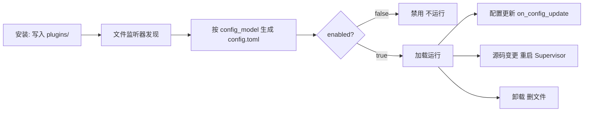

# 管理插件

安装只是第一步。插件写入后，你需要在 WebUI 的「插件管理」里**启用、配置、更新或卸载**它。本章讲清这些操作，以及背后的运行时机。

## 查看插件

插件列表会显示：

- 📋 **名称**与简介
- 🔧 **版本号**与作者
- ✅ **启用状态**（绿色=启用，灰色=禁用）
- 📖 **使用说明**（点击展开）
- 🏷️ **版本来源与锁定状态** — 按发布版本安装、且勾选了「锁定此版本」的插件会标出已锁定；这类插件不会出现在「可更新」提示里

## 启用 / 禁用

- 开关打开 → 运行时加载该插件
- 开关关闭 → 调用卸载生命周期并停用插件
- 正常情况下**立即生效，无需重启整个 MaiBot**

## 配置插件

部分插件支持自定义设置：

1. 点击插件的「设置」按钮；
2. 修改配置项（如 API Key、触发词、功能开关）；
3. 保存后，运行时调用插件的 `on_config_update`。

## 更新插件

页面提示有新版本时：

1. 点击「更新」；
2. 等待下载安装；
3. 源码变化会触发插件 Supervisor 重启并重载。

「更新」走的是**自动更新**：装到与当前麦麦、SDK 都兼容的最新稳定版。它只往新版本走，不会自动降级，也不会覆盖你锁定的版本。

同一个插件不能同时执行安装 / 更新 / 卸载；不同插件之间可并行处理。

### 装指定版本 / 降级

要装某个具体版本（包括比现在更旧的版本），去插件市场或插件管理里打开该插件的**详情页**，在「安装版本」卡片里选版本后安装：

- 版本下拉里禁用的是与当前麦麦 / SDK 不兼容的版本，括号后附带原因（如「需要麦麦 ≥ 1.4.0」）
- 「· 推荐」是兼容性判定下的最新稳定版，默认选中
- 切换版本会备份旧目录、保留 `config.toml` / `config_back/` / `data/`，但**不会回滚插件数据**

### 锁定版本

版本下拉下方的「安装后锁定此版本，阻止自动更新」勾选后：

- 该插件不再参与自动更新，页面也不会提示有新版本
- 想恢复自动更新，回详情页重新选一次版本并**取消**勾选

已锁定的插件点「更新」会返回「该插件已锁定版本，请在插件详情中选择版本并解除锁定后更新」。

### 分支安装的插件怎么更新

用「从 Git 安装」装进来的插件仍是普通分支插件，直接「更新」即 `git pull`。而按发布版本安装的插件不能再 `git pull`，会提示「该插件按发布版本安装，请通过版本选择更新」——换版本只能走详情页的版本选择。

## 卸载插件

1. 点击「卸载」并确认；
2. 插件文件被删除。

⚠️ 卸载前确认插件是否把用户数据放在自身目录——卸载后这些数据可能丢失。按发布版本安装的插件，卸载同时会删掉 `.maibot-release.json` 安装记录。

## 生命周期与重启边界

- **安装** — 文件写入 `plugins/` 后被监听器发现；Runner 按 `config_model` 默认值生成 `config.toml`；`enabled=false` 需手动启用
- **启用 / 禁用** — 运行时加载或卸载插件，**无需重启 MaiBot**
- **修改配置** — 已加载插件收到 `on_config_update`；设为禁用则卸载，设为启用则加载
- **更新源码** — `.py` / `plugin.py` / `_manifest.json` 变化重启插件 Supervisor，期间短暂不可用，核心无需重启
- **卸载** — 先禁用卸载再删文件

::: warning 重启只是故障兜底
只有当日志明确显示文件监听、加载、卸载或配置回调失败时，才完整重启 MaiBot。正常插件管理不应把重启核心当作必需步骤。
:::

## 使用技巧

**冲突** — 功能重复的插件只启用需要的，必要时联系作者更新。

**性能** — 插件过多可能影响性能，及时卸载不用的。

**安全** — 只装可信源、查看权限要求、定期更新。

**版本** — 兼容的插件保持「推荐」版本即可；暂时只有旧版可用时，在详情页锁定版本，避免自动更新把它顶掉。

## 常见问题

**Q: 安装失败？** 检查网络与地址是否正确，查看错误提示；按发布版本安装时先看版本下拉里该版本是否兼容、是否依赖缺失。
**Q: 点了「更新」提示已锁定版本？** 该插件勾选了「锁定此版本」。回详情页重新选版本并取消勾选即可恢复自动更新。
**Q: 想退回旧版本却提示「不会自动降级」？** 自动更新只往新版本走。打开插件详情页，在「安装版本」里手动选中旧版本安装。
**Q: 提示「该插件按发布版本安装，请通过版本选择更新」？** 这个插件由版本索引管理，不能再 `git pull`；换版本请走详情页的版本选择。
**Q: 切版本后配置和数据还在吗？** `config.toml`、`config_back/`、`data/` 会保留；但降级不会回滚插件在数据文件里写过的新内容。
**Q: 装了没反应？** 确认已启用、配置正确、看 MaiBot 日志。
**Q: 能自己开发吗？** 能！参见[插件开发文档](/plugin/)。
