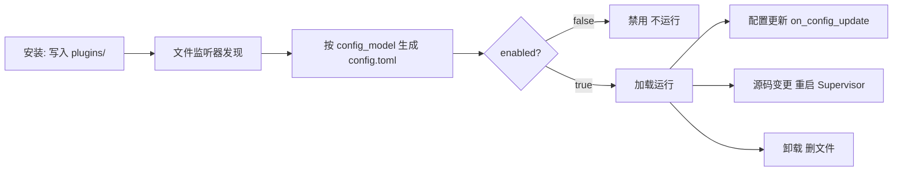

# 管理插件

安装只是第一步。插件写入后，你需要在 WebUI 的「插件扩展」里**启用、配置、更新或卸载**它。本章讲清这些操作，以及背后的运行时机。

## 查看插件

插件列表可查看已安装插件及其运行状态。**锁定版本**的插件不参与自动更新，也不会提示可更新。

## 启用 / 禁用

- 开关打开 → 运行时加载该插件
- 开关关闭 → 调用卸载生命周期并停用插件
- 正常情况下**立即生效，无需重启整个 MaiBot**

## 配置插件

在插件设置中修改 API Key、触发词和功能开关等配置。保存后，运行时调用插件的 `on_config_update`。

## 自定义页面

装了带 `webui.json` 的插件后，插件可以带来自己的页面入口，不需要你装 Node 或改主程序：

- **侧边栏入口** — 放在工作区侧边栏「扩展集成 → 插件扩展」分组里，条目文字与图标由插件自己声明
- **顶部工作区入口** — 插件也可以声明自己的顶部工作区；同一插件有多个工作区页面时第一个是默认页，其余收进「更多插件工作区」
- **页面地址** — 形如 `/extensions/{plugin_id}/{page_id}`，插件不能自定义路由或覆盖内置入口

**调整顺序或隐藏**：进「插件扩展」页（侧边栏「扩展集成 → 插件扩展」，地址 `/plugin-config`），页面最下方是「管理插件页面」区域，在那里拖动排序，或整个隐藏某个插件的入口。这套偏好只保存在当前浏览器里，只影响你的展示，换浏览器或清缓存后会恢复默认。

**改完没生效？** `webui.json` 改过后要**重载插件**才生效。重载后浏览器最多 30 秒刷新入口，也可以手动刷新页面。

更多细节（字段清单、组件类型、限制与排错）见 [WebUI 页面](/plugin/webui-pages)。

## 从 ZIP 安装

手上只有一个插件压缩包（朋友发的、自己打包的、还没上架市场的）时，不用手动解压到 `plugins/`：

1. 进「插件扩展」页，点右上角的「更多操作」按钮；
2. 选「从 ZIP 安装插件」，选中你的 `.zip` 文件；
3. 点「安装插件」，等提示「安装成功」；
4. 安装完成后**无需重启麦麦**：文件监听器会发现新插件并按 `config_model` 生成 `config.toml`，`enabled` 默认为 `false` 的插件到列表里手动启用即可。只有日志明确报出监听或加载失败时，才用同一个菜单里的「重启麦麦」兜底。

压缩包要满足这几条，否则会被拒绝：

- **大小** — 压缩包不超过 100 MB，解压后不超过 300 MB、文件不超过 10000 个
- **结构** — `_manifest.json` 和 `plugin.py` 放在压缩包根目录，或者放在唯一的一层插件文件夹里；一个包只能装一个插件
- **内容** — 不能加密，不能带 `.git` 目录、快捷方式（符号链接）或 `../` 这类跳出目录的路径
- **没装过** — 同 ID 的插件已经装了的话，先卸载再装

::: warning 只装信得过的包
ZIP 安装不经过插件市场的收录，麦麦只检查包的结构是否合规，不检查代码干了什么。来源不明的包不要装。
:::

## 更新插件

页面提示有新版本时：

1. 点击「更新」；
2. 等待下载安装；
3. 源码变化会触发插件 Supervisor 重启并重载。

「更新」走的是**自动更新**：装到与当前麦麦、SDK 都兼容的最新稳定版。它只往新版本走，不会自动降级，也不会覆盖你锁定的版本。

同一个插件不能同时执行安装 / 更新 / 卸载；不同插件之间可并行处理。

### 装指定版本 / 降级

要装某个具体版本（包括比现在更旧的版本），去插件市场或插件扩展里打开该插件的**详情页**，在「安装版本」卡片里选版本后安装：

- 版本下拉里禁用的是与当前麦麦 / SDK 不兼容的版本，括号后附带原因（如「需要麦麦 ≥ 1.4.0」）
- 「· 推荐」是兼容性判定下的最新稳定版，默认选中
- 切换版本会备份旧目录、保留 `config.toml` / `config_back/` / `data/`，但**不会回滚插件数据**
- 如果所选版本影响其他已安装插件的依赖要求，不会阻止安装：会弹出「插件依赖提醒」提示哪个插件可能无法运行

### 锁定版本

版本下拉下方的「安装后锁定此版本，阻止自动更新」勾选后：

- 该插件不再参与自动更新，页面也不会提示有新版本
- 想恢复自动更新，回详情页重新选一次版本并**取消**勾选

已锁定的插件点「更新」会返回「该插件已锁定版本，请在插件详情中选择版本并解除锁定后更新」。

### 分支安装的插件怎么更新

用「从 Git 安装」装进来的插件仍是普通分支插件，直接「更新」即 `git pull`。而按发布版本安装的插件不能再 `git pull`，会提示「该插件按发布版本安装，请通过版本选择更新」——换版本只能走详情页的版本选择。

## 卸载插件

1. 点击「卸载」并确认；
2. 插件文件被删除。

⚠️ 卸载前确认插件是否把用户数据放在自身目录——卸载后这些数据可能丢失。按发布版本安装的插件，卸载同时会删掉 `.maibot-release.json` 安装记录。

## 生命周期与重启边界

- **安装** — 文件写入 `plugins/` 后被监听器发现；Runner 按 `config_model` 默认值生成 `config.toml`；`enabled=false` 需手动启用
- **启用 / 禁用** — 运行时加载或卸载插件，**无需重启 MaiBot**
- **修改配置** — 已加载插件收到 `on_config_update`；设为禁用则卸载，设为启用则加载
- **更新源码** — `.py` / `plugin.py` / `_manifest.json` 变化重启插件 Supervisor，期间短暂不可用，核心无需重启
- **卸载** — 先禁用卸载再删文件

::: warning 重启只是故障兜底
只有当日志明确显示文件监听、加载、卸载或配置回调失败时，才完整重启 MaiBot。正常插件管理不应把重启核心当作必需步骤。
:::

## 使用技巧

**冲突** — 功能重复的插件只启用需要的，必要时联系作者更新。

**性能** — 插件过多可能影响性能，及时卸载不用的。

**安全** — 只装可信源、查看权限要求、定期更新。

**版本** — 兼容的插件保持「推荐」版本即可；暂时只有旧版可用时，在详情页锁定版本，避免自动更新把它顶掉。

## 常见问题

**Q: 安装失败？** 检查网络与地址是否正确，查看错误提示；按发布版本安装时先看版本下拉里该版本是否兼容、是否依赖缺失。
**Q: 提示「插件依赖提醒」？** 其他已安装插件的依赖要求与该版本不一致。安装 / 更新会照常完成，但提醒里的插件可能无法运行；如果确实出现异常，装回满足要求的版本即可。
**Q: 点了「更新」提示已锁定版本？** 该插件勾选了「锁定此版本」。回详情页重新选版本并取消勾选即可恢复自动更新。
**Q: 想退回旧版本却提示「不会自动降级」？** 自动更新只往新版本走。打开插件详情页，在「安装版本」里手动选中旧版本安装。
**Q: 提示「该插件按发布版本安装，请通过版本选择更新」？** 这个插件由版本索引管理，不能再 `git pull`；换版本请走详情页的版本选择。
**Q: 切版本后配置和数据还在吗？** `config.toml`、`config_back/`、`data/` 会保留；但降级不会回滚插件在数据文件里写过的新内容。
**Q: 装了没反应？** 确认已启用、配置正确、看 MaiBot 日志。
**Q: 能自己开发吗？** 能！参见[插件开发文档](/plugin/)。

## 验证与排错

**验收动作** — 用「从 ZIP 安装插件」装一个测试插件：列表里出现它（开关默认关闭），打开开关后日志出现加载成功、`plugins/<插件名>/config.toml` 生成，再改一次插件配置能保存生效——安装、启用、配置三条链路就都通了。

- **ZIP 直接被拒，提示包结构不对** — `_manifest.json` 和 `plugin.py` 必须放在压缩包根目录，或放在唯一的一层插件文件夹里；一个包只能装一个插件，包里混进外层目录、第二个插件目录、`.git` 或 `__MACOSX` 都会被拦。
- **提示「ZIP 解压后超过 300 MB 或文件数量超过 10000」/「ZIP 文件不能超过 100 MB」** — 打包前精简包内文件，别把测试数据、虚拟环境、日志打进去；确实超限就改用插件市场或 Git 安装。
- **提示「插件校验失败：…」** — `_manifest.json` 没过校验：按提示改 `id`、版本号、URL、依赖声明等字段，注意 `manifest_version` 必须是 `2`、`version` 是 `X.Y.Z`；同 ID 插件已存在时会提示先卸载，卸载后再装。
- **装完插件在列表里，机器人却没反应** — 新装插件的 `enabled` 默认 `false`，要手动打开开关；禁用状态不会加载，也不会有任何运行日志。
- **开关已打开仍不运行** — 看日志定位：加载失败、依赖装不上、生命周期方法缺失都会在日志里点名。只有日志明确显示文件监听、加载、卸载或配置回调失败时，才用「更多操作 → 重启麦麦」兜底，且先把日志里的第一条报错解决掉。
